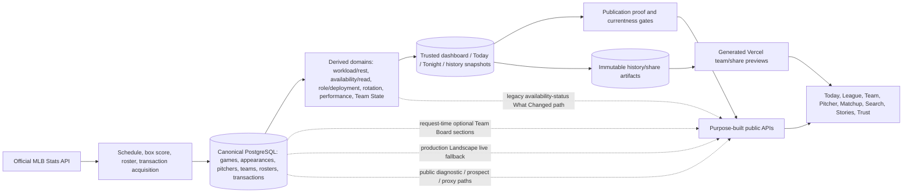

# BaseballOS Full Platform Audit

**Audit window (UTC):** 2026-09-01T20:46:14Z–2026-09-01T22:11:55Z  
**Production URL:** https://baseballos.app  
**Repository:** `D:\Programming\baseballos`  
**Checkout:** `feat/postgame-distribution-handoff` at `aead55f5d1e0610d31f7292bf744a89f5aa6b5ca` (`v4.0.0-1248-gaead55f5`)  
**Audit mode:** audit-only with ordinary anonymous public GET requests. No mutating endpoint was invoked and no code, configuration, infrastructure, tracked documentation, branch, pull request, issue, or deployment was changed. This report is the only local file created. **Limitation:** code inspection later established that the public Today GET can upsert a cache entry on a miss (F-035); whether any audit GET took that server-side write path is unverified, so this report does not claim that production data was certainly untouched.

## Evidence labels used in this report

- **Observed** — directly returned by the live public site or a public crawler during the audit.
- **Measured** — produced by a repeatable request, calculation, trace, comparison, test, or timing.
- **Code-proven** — established by the active checkout implementation or an enforceable test/configuration contract.
- **Documented** — stated by a governing source, without being treated as implementation proof.
- **Inferred** — a conclusion drawn from named evidence; the inference and uncertainty are stated.
- **Unverified** — material but not provable with the available access or tools.

Passing tests, HTTP 200 responses, UI labels, documentation, and roadmap status are never used alone as end-to-end production proof.

---

# 1. Executive Verdict

## Overall grade: **C**

The grading rubric used here is: **A** = exceptional, coherent, independently checkable, accessible, fast, and ready for broad use; **B** = strong product with only bounded non-blocking gaps; **C** = a real and useful product with a sound core but material P1 blockers; **D** = important parts exist but the primary promise is unreliable or difficult to reach; **F** = unsafe, fundamentally incorrect, or unusable. BaseballOS earns a **C** because its canonical baseball substrate, product focus, and Team Board depth are materially better than a prototype, but the current product has high-severity claim, latency, publication-handoff, accessibility, privacy, and route-separation failures that should be closed before broad distribution.

**How good is BaseballOS today as a complete bullpen product?** **Observed/Measured/Code-proven:** BaseballOS is already a distinctive and genuinely useful bullpen product. It explains the category in plain language, represents all 30 clubs, joins team state to named arms, rest, recent use, rotation transfer, transactions, pitcher receipts, matchup context, and history, and stays descriptive rather than trying to pick winners. Seven sampled relievers, three final games, one doubleheader, and one option transaction reconciled exactly to official public MLB records. The same audit also found that the public Daily Edition can compose a causally contradictory conclusion, the central Team Board required 8.5–15.1 seconds in current samples, and What Changed can call raw internal availability transitions “Arm Read” movement. **Observed:** both valid share URL forms serve the same unconditional replace script; **Inferred/Unverified:** that mismatch may cause a browser reload loop. The product is valuable enough to retain; it is not yet reliable enough to distribute without supervision.

| Executive item | Verdict |
|---|---|
| Strongest product advantage | **S-005 — Team Board depth around one practical question.** It can name the arms driving a bullpen picture and place workload, rest, role, roster, recent game work, rotation effect, change, and evidence in one team destination. |
| Largest user-facing weakness | **F-002 — Team Board latency.** The center-of-gravity route took 8.5–15.1 seconds in this audit. |
| Largest data/trust risk | **F-001/F-005/F-006/F-007 — semantic and snapshot integrity at serving time.** A contradictory Daily Edition, a raw-status What Changed render path in the checkout, a two-lookup Board snapshot race, and a production Landscape live fallback can each weaken one coherent public truth even while canonical facts are correct. F-005's deployed rendered occurrence is unverified. |
| Largest engineering/operational risk | **F-002/F-004 — request-time monoliths.** The Team Board composes deep domains sequentially, while a 5.54 MB dashboard response is reused across Home, Dashboard, Stories, and Trust. |
| Controlled outreach | **Not Ready today.** First close the public semantic-publication blockers F-001/F-005/F-007 and prove the share handoff F-008. After that, a small guided/preflighted learning cohort can be conditionally ready while performance and recovery proof remain open. |
| Broad distribution | **Not Ready.** Blockers are public claim coherence, Team Board/Finder latency, broad dashboard overfetch, share/deep-link handoff and metadata behavior, the unreadable global crash fallback, email/privacy gaps, and anonymously reachable internal/legacy diagnostic paths. |

### Five highest-value actions

1. **Seal public semantic integrity before outreach** (F-001, F-005, F-007): suppress contradictory narrative, require claim-driving relievers, publish only governed arm-read transitions, and remove the Landscape production live fallback.
2. **Build one answer-first, single-snapshot Team Board delivery slice** (F-002, F-006, F-018): return state, named arms, current read, rest/workload, one explanation, and publication identity quickly; lazy-load deeper sections by the same snapshot identity.
3. **Repair and prove the distribution handoff end to end** (F-008, F-016, F-019): non-JavaScript preview, trailing-slash behavior, exact canonical URL, named evidence, artifact-to-app navigation, real not-found response, and timely deployment.
4. **Replace broad convenience reads with purpose-built delivery** (F-003, F-004, F-017): intent-gate the Reliever Finder, split route code, introduce snapshot-keyed response caching, and stop loading the dashboard where only a small domain is needed.
5. **Close public exposure and human-safety gates** (F-010, F-011, F-012, F-014, F-022, F-023): readable crash recovery, real keyboard/table/menu semantics, rate limiting and internal-route authorization, email consent/unsubscribe ownership, privacy disclosure, and standard response headers.

No P0 was found. **Severity calibration:** P0 includes wrong or unsafe public baseball truth, corrupted history, serious security/privacy exposure, or an unusable primary product. F-001 remains P1 because the retained evidence is one sampled interpretive draft with correct inspectable underlying facts, no demonstrated persistence into immutable cited history, and no demonstrated materially unsafe reliance. F-005 remains P1 because it is a bounded vocabulary/meaning edge over correct underlying transition values, not a demonstrated corrupt public fact. Elevate either to P0 if it is shown to be systemic, persisted or externally cited as authoritative history, or materially unsafe public truth. This is not a claim that no P0 exists: production database contents, private logs, cloud dashboards, backup restoration, browser rendering, and hostile security testing were outside the available evidence.

---

# 2. Audit Scope, Environment, and Limitations

## Environment and version evidence

| Item | Evidence |
|---|---|
| Audit start | **Measured:** `2026-09-01T20:46:14.548Z`. |
| Production frontend | **Measured:** Vercel; root `ETag "cd834e3c6ec278efb2cda8d2439c9c51"`, `Last-Modified: Tue, 01 Sep 2026 15:53:10 GMT`, JS `/assets/index-COD1wwaf.js`, CSS `/assets/index-DI6W9iDu.css`. |
| Production API | **Measured:** `https://baseballos-api.onrender.com/api`; Render/Gunicorn behind Cloudflare. `/api/health` returned `environment=production`, `debug=false`, and `status=ok`. |
| Production deployment identity | **Unverified:** no public frontend commit, backend commit, release, or deployment ID was exposed. Request IDs are not release IDs. The checkout's local JS asset fingerprint differed from the deployed JS fingerprint; the matching CSS fingerprint is not enough to prove source identity. |
| Repository branch/SHA | **Measured:** `feat/postgame-distribution-handoff`; `aead55f5d1e0610d31f7292bf744a89f5aa6b5ca`. |
| Existing workspace state | **Measured:** three pre-existing untracked files were present and untouched: `BASEBALLOS_DATA_ENGINEERING_INTERVIEW_AUDIT.md`, `artifacts/production-accuracy-1753.json`, and `artifacts/production-roster-authority-1753.json`. |
| Audit host | **Measured:** Windows/PowerShell, America/Indianapolis local timezone. All report timestamps use UTC. |

## Governing sources read in full

**Documented:** all 29 rendered pages across the seven August 17, 2026 DOCX sources were inspected, including body text and tables. They were supplied in a retained external source folder outside the Git checkout; no governing DOCX files were present under `D:\Programming\baseballos`. No tracked changes, comments, footnotes, endnotes, or hidden text were found.

1. `01_BaseballOS_Constitution_v2.0_2026-08-17(1).docx` — D1, 4 pages.
2. `02_BaseballOS_Bullpen_Intelligence_Standard_v2.0_2026-08-17(1).docx` — D2, 5 pages.
3. `03_BaseballOS_Product_Experience_Standard_v2.0_2026-08-17(1).docx` — D3, 5 pages.
4. `04_BaseballOS_Platform_Architecture_and_Operations_Manual_v2.0_2026-08-17(1).docx` — D4, 4 pages.
5. `05_BaseballOS_Product_Roadmap_and_Decision_Ledger_v4.0_2026-08-17(2).docx` — D5, 4 pages.
6. `06_BaseballOS_Editorial_and_Distribution_Standard_v2.0_2026-08-17(1).docx` — D6, 3 pages.
7. `07_BaseballOS_Frontend_Design_and_Migration_Specification_v2.0_2026-08-17(1).docx` — D7, 4 pages.

**Code-proven/Documented:** current repository canonical documents, current setup and runbooks, migrations, models, workflows, API routes, frontend routes, tests, dependency policies, and deployment files were also inspected. The requested DOCX set and repository authority library conflict; Section 12 and F-009 preserve that conflict instead of silently choosing a false merged history.

## Methods

- **Observed/Measured:** low-volume anonymous HTTPS requests to the public frontend and API, response headers and bodies, public static assets, generated team/share previews, robots/metadata routes, and public text extraction. The earlier unretained multi-fallback extraction is separately labeled Unverified (F-013).
- **Measured:** sequential and bounded route timings; raw versus compressed bytes were kept separate. No production load test was performed.
- **Measured:** official public MLB Stats API reconciliation for selected players, games, a doubleheader, and a roster transaction.
- **Code-proven:** route/data-flow tracing, schema/migration inspection, semantic-owner tracing, frontend rendering paths, CI/workflow inspection, static accessibility review, contrast calculation, and security-boundary inspection.
- **Measured:** repository tests and dependency audits listed in Appendix C.

## Viewports and browser limitation

The required browser-control workflow was initialized, but the environment returned `No browser is available` and no browser session. In accordance with the browser-control rules, no Playwright or alternate browser automation was substituted.

| Requested condition | Status |
|---|---|
| Clean anonymous/incognito rendered walkthrough | **Unverified.** Anonymous HTTP requests had no user state, but they do not prove rendered interaction. |
| 390 px mobile | **Code-proven only:** responsive rules/components inspected; rendered layout unverified. |
| 768 px tablet | **Code-proven only:** responsive rules/components inspected; rendered layout unverified. |
| 1440 px desktop | **Code-proven only:** density rules/components inspected; rendered layout unverified. |
| 200% zoom/reflow | **Unverified.** |
| Keyboard and screen-reader walkthrough | **Unverified:** static semantics inspected, manual operation unavailable. |
| Screenshots | **Unavailable:** no rendered browser. Precise code and response notes are used instead. |
| FCP/LCP/CLS/INP | **Unverified:** only network/server timing and delivery weight were measured. |

## Other material limitations

- **Unverified:** no production database credentials, Render/Vercel dashboards, cloud logs, alert policies, branch-protection settings, DNS control plane, backup console, cost data, or private monitoring traces were available.
- **Unverified:** no destructive, exploit, aggressive scan, credential, email, signup, or mutation check was attempted. Public POST endpoints were inspected in code only.
- **Unverified:** public Today GETs were intended and invoked as reads, but `intelligence_surface_snapshot.py` can persist a cache miss. No production write audit was available to determine whether that path ran during this audit.
- **Unverified:** no natural stale, suspended/resumed, official-correction, Limited Read, disaster-recovery, or failed-publication event occurred during the window.
- **Inferred:** source-code conclusions apply to the inspected checkout. Because no production-to-commit identifier was exposed and deployed JS differed, they are not blanket proof of production byte identity.

---

# 3. Evidence and Coverage Matrix

Legend: **Full** = enough evidence for a scoped verdict; **Sampled** = representative evidence only; **Code** = implementation inspection only; **Inaccessible** = required access/tool unavailable; **Unverified** = important conclusion remains open.

| Surface/system area | Live observed | Measured | Code inspected | Data reconciled | Coverage | Key limitation |
|---|---:|---:|---:|---:|---|---|
| Root/Today shell and public copy | Public HTTP + crawler | HTML/assets/API | Yes | Lead evidence sampled | Sampled | No rendered browser or timed comprehension. |
| Daily Edition | API/text extraction | Today endpoint | Yes | Game context sampled | Sampled | No direct visual click path; earlier multi-fallback signal unretained/Unverified. |
| Tonight | API | Cards/slate payload | Yes | Cross-surface dates/states | Sampled | Mobile/desktop composition unverified. |
| League Board | API | 30-team denominator | Yes | Three state samples | Full for contract; sampled for truth | Visual scanning unverified. |
| Team Board | Three live clubs plus NYM | Latency/bytes | Deep | Player/game/roster samples | Strong sample | No production SQL trace in this run; the prior 86-query audit profile was not reverified. |
| Pitcher | Kittredge and Senga API paths | Latency/bytes | Yes | Seven relievers total | Sampled | No screen-reader/visual journey. |
| Compare/matchup | BAL–COL and NYM–TB | Latency/contracts | Yes | State/domain agreement | Sampled | No current in-game interaction. |
| Search/discovery | Team/pitcher queries | Latency/results | Yes | Identity sampled | Sampled | Search quality not tested exhaustively. |
| What Changed | BAL adjacent dates; Home feed | Payload/labels | Deep | One transition | Sampled | Natural cross-version transition unavailable. |
| Team history | BAL and NYM | Latency/40 rows | Yes | Citation/date sample | Sampled | Full-season continuity not independently rebuilt. |
| Stories/observations | Dashboard feed API | Payload dependency | Yes | Lead sample | Sampled | Rendered browse quality unavailable. |
| Immutable share artifact API | BAL/NYM | Latency/provenance | Yes | Snapshot agreement | Strong sample | Correction/supersession natural event unavailable. |
| Static team/share preview | Direct public HTML | Metadata and transition timing | Yes | Snapshot/date agreement | Sampled | Social debugger/browser unavailable. |
| Methodology/How to Read/About | Public shell + source | API/code | Yes | Definitions traced | Code/full text | No user-comprehension study. |
| Data & Trust/status | Public APIs | Sync/slate state | Yes | Compared to published IDs | Sampled | HTTP success is not recovery proof. |
| Empty/quiet/partial/error states | Text extraction + partial sections | Status payloads | Yes | One partial case | Sampled/code | Natural stale/failed publish and rendered fallback states unavailable; earlier multi-fallback signal Unverified. |
| Responsive system | No | Token/breakpoint inspection | Yes | N/A | Code only | 390/768/1440 render unavailable. |
| Accessibility | No manual browser | Contrast calculations | Deep static | N/A | Code/sample | No axe, screen reader, zoom, or keyboard run. |
| Frontend delivery | Public assets | Bytes/HTTP wall-clock total | Yes | N/A | Full network sample | TTFB was not separately captured; no Core Web Vitals. |
| API contracts | Public GETs | Status/size/timing | Deep | Samples | Strong sample | OpenAPI absent; compatibility history sampled only. |
| Source ingestion | Public status | Run/coverage evidence | Deep | MLB sample | Sampled | No source logs/credentials. |
| Derived intelligence | Public reads | Recalculations | Deep | Diverse sample | Sampled | Threshold calibration population not fully rebuilt. |
| Publication/read models | Live snapshot 1784 | Cross-route IDs | Deep | Samples | Strong sample | Snapshot turnover race not induced. |
| Database/schema/migrations | No DB access | Static counts | Deep | N/A | Code only | Live constraints/query plans unverified. |
| Tests/CI/dependencies | Local read-only commands | Results recorded | Deep | Fixtures reviewed | Strong local | Remote branch protection and current PR CI unverified. |
| Schedulers/operations | Public sync status | Run IDs/cadence | Deep | Current slate | Sampled | Alerts, logs, cost, backup/restore inaccessible. |
| Security/privacy | Public headers | CORS/contrast/static review | Deep | N/A | Non-invasive | No exploit, pen test, or legal review. |
| Distribution/SEO | Public HTML/robots/previews | Metadata/routes | Yes | Artifact sample | Strong sample | External social-platform caches not inspected. |

---

# 4. Product Map and End-to-End Data Flow

## Public information architecture

**Code-proven:** the public product spine is Today (`/`), League Board (`/dashboard`), Team Board (`/bullpen?view=board&team=...`), Pitcher (`/pitcher/:id`), Matchup/Compare, Search, History, Stories, and supporting explanation/trust pages. **Observed:** generated `/team/:abbr` and `/share/:publicId` HTML form a second distribution entry layer before JavaScript navigation. **Code-proven:** internal reporting, share-operations, private posts, auth, old prospects, recommendation, and diagnostic APIs remain outside the visible primary product.



The solid path is the intended authority chain. The dotted paths are the principal competing or alternate truth paths found in this audit:

- **F-018:** Team Board v2 starts with a published snapshot but then builds relief work, game context, transactions, performance, and What Changed at request time.
- **F-007:** `/api/bullpen/landscape` can build a live view in production when the snapshot/landscape is missing, while `/dashboard` fails closed.
- **F-005:** `team_changes.py` compares raw availability statuses and the inspected checkout's frontend labels them “Arm Read movement,” while the newer delta substrate captures governed public read keys; production rendering is unverified because no browser/deploy SHA was available.
- **F-012/F-033:** internal diagnostics, legacy Prospect Pipeline, fatigue-era analysis, and raw proxy capabilities remain anonymously routable even though they are not part of the visible bullpen product.

## Inventory discrepancies

- **Observed/Code-proven:** visible navigation has no Prospect Pipeline; backend `/api/prospects/*` remains registered and public. This is dead product scope, not a missing UI feature.
- **Code-proven:** `/api/methodology/` exists, but the Methodology page uses static frontend content rather than this API.
- **Code-proven:** both legacy `/teams/:id/board` and current `/teams/:id/board-v2` exist.
- **Code-proven:** generated `/team/:abbr` pages are not React routes; they redirect into the Team Board.
- **Observed:** an arbitrary invalid frontend route returns the root shell with HTTP 200, then the client wildcard redirects home. There is no public not-found surface.
- **Documented/Code-proven:** the requested DOCX Roadmap describes Team Board, Tonight, Pitcher, Matchup, and History as a forward sequence; the repository Roadmap v5.15 says the core loop is substantially complete. Neither statement proves production quality.

---

# 5. Three Primary Persona Verdicts

## 5.1 First-time user

| Dimension | Verdict |
|---|---|
| Goal | Understand what BaseballOS is, whether it is for them, and where to begin. |
| Journey completed | **Code-proven/Observed:** root proposition → Daily Edition → Tonight → league picture → Explore links → Search/Team Board. Text extraction captured public copy and direct APIs; direct rendered clicks were unavailable. |
| What worked | **S-001:** “See which bullpens are fresh, stretched, or vulnerable,” public MLB workload context, and “No picks, no predictions” communicate category and boundary unusually quickly. Search is labeled, fast, and routes to teams, relievers, and games. |
| What failed | **F-028:** code order puts Daily Edition and Since Yesterday before Tonight, so the standard's pregame flagship is not the first baseball block. Primary navigation collapses below `xl`, while arbitrary-team entry appears later. An earlier unretained extraction appeared to show three home-domain fallbacks together, but that signal is Unverified and is not used as release evidence (F-013). |
| Unanswered questions | What should I open first for my team? Is “Daily Edition” yesterday's story or today's pregame answer? Why are Today and Tonight both primary concepts? |
| Trust level | **Medium.** Clear boundaries and dates help; the slow Team Board and public claim contradiction prevent High. The unretained fallback signal is not counted as evidence. |
| Return likelihood | **Medium.** The change loop and nightly slate create a reason to return, but speed and weak team-specific return cues reduce habit strength. |
| Ten-second verdict | **Inferred:** yes for category; no for a specific useful bullpen claim unless data loads and the user scans below the proposition. Actual timed comprehension is unverified. |
| Single most important improvement | Make the first live answer fast and coherent: one current pregame point, named arms, data-through, and one obvious Team Board/Search action. |

## 5.2 Baseball and bullpen fan

| Dimension | Verdict |
|---|---|
| Goal | Know what bullpen developments matter, investigate one club and reliever, compare a matchup, and see what changed. |
| Journey completed | **Measured:** Today Seattle lead → all-30 League Board → Fresh CLE, Stretched AZ, Vulnerable BAL/NYM boards → Kittredge/Senga pitcher detail → BAL–COL and NYM–TB comparisons → Search → BAL/NYM history → team/share artifact. |
| What worked | **S-002/S-005/S-006:** state, rested options, current reads, exact 7/14-day workload, recent appearances, role/deployment, rotation transfer, roster context, matchup comparison, and dated history are joined without selecting a winner. This is meaningfully more useful than reconstructing the picture from box scores alone. |
| What failed | **F-002/F-003:** current Team Board samples took 8.5–15.1 seconds and the Finder's bulk request took 14.8–16.6 seconds. **F-001:** the Daily lead failed to name the relievers who drove the lost-lead claim and ended with a causal sentence pointing in the wrong direction. **F-019:** a Since Yesterday share request was unavailable even though What Changed existed. |
| Unanswered questions | Which exact relief appearances drove the lead story? Why does What Changed use “Available/Monitor/Avoid/Limited” while the Board uses governed current-read names? Can the current answer arrive without waiting for performance/history? |
| Trust level | **Medium-High for sampled facts; Medium for public interpretation.** Exact MLB reconciliation and publication IDs are strong; narrative and semantic-serving defects lower the combined product trust. |
| Return likelihood | **High if speed is fixed.** Team Board and What Changed provide genuine bookmark value. At current latency, a fast public box score remains easier for a quick check. |
| Single most important improvement | Answer-first Team Board delivery with identical snapshot identity for every later section. |

## 5.3 High-end senior data analyst

| Dimension | Verdict |
|---|---|
| Goal | Reproduce units, windows, population, roster ownership, method/date identity, missingness, and narrative support. |
| Journey completed | **Measured/Code-proven:** source record → `GameLog`/appearance-team authority → workload windows → published dashboard/team packages → board/matchup/history/share response → frontend mapping; sampled official MLB reconciliation is in Section 8. |
| What worked | **S-003/S-004/S-007/S-008:** exact official-line reconciliation, current roster/transaction authority, explicit partial states, 30/30 denominator, snapshot/sync IDs, no-ranking flags, and immutable artifact metadata. |
| What failed | **F-006/F-007/F-018:** a response can be exposed to two latest-snapshot lookups or live/request-time adjuncts. **F-005:** the inspected frontend path presents raw availability transitions as a different semantic family; deployed rendering is unverified. **F-026:** public APIs expose broad nested carriers and internal operational fields; method identity is not consistently top-level on every composite. |
| Unanswered questions | Production query plans and p95; correction supersession in a natural event; suspended/resumed-game behavior; full-season population calibration; backup restore; cross-version delta behavior; exact production source SHA. |
| Trust level | **Medium.** The sampled facts deserve confidence, but no finite sample proves all teams/dates and the serving-boundary risks are real. |
| Return likelihood | **Medium-High** as an evidence source after the serving risks are sealed; current contracts are unusually inspectable for a public sports product. |
| Single most important improvement | Make snapshot/method identity atomic and mechanically enforce it across core, optional, history, and distribution responses. |

---

# 6. Live Product Audit by Surface

## 6.1 Global navigation and application shell

**Purpose and user question.** The shell must tell a cold visitor what the product is, expose the fastest path to a club or reliever, preserve context across deep links, and recover safely when a route or render fails.

- **First-time comprehension — strength:** **Observed/Code-proven (S-001):** the proposition “See which bullpens are fresh, stretched, or vulnerable” and the adjacent “No picks, no predictions” boundary give the product a recognizable category and responsible scope. Header destinations use baseball nouns rather than implementation vocabulary.
- **Baseball usefulness and hierarchy — mixed:** **Code-proven:** Today, League, and Team Board form a sensible hierarchy. Search is an explicit destination. At widths below the `xl` breakpoint, primary navigation moves behind a menu; actual discoverability and tap behavior could not be rendered.
- **Responsive/visual quality — unverified with positive foundations:** **Code-proven:** shared tokens, constrained content widths, responsive grids, visible focus styles, and 44 px control targets exist. **Unverified:** 390/768/1440 composition, actual menu clipping, layout shift, and 200% reflow.
- **Accessibility — weakness:** **Code-proven (F-014):** there is no skip link or route-change focus/announcement mechanism. A keyboard or screen-reader user can therefore repeat the shell and may not be told that navigation changed the page. Manual confirmation was unavailable.
- **Performance — weakness:** **Code-proven for the checkout:** every route module is eagerly imported in `frontend/src/App.jsx:1-27`, and `useFetch()` has only in-flight protection rather than durable response caching (`frontend/src/hooks/useFetch.js:30-62`). **Measured separately in production:** the root referenced a 719,019-byte raw/196,237-byte gzip JavaScript entry asset and a 63,733-byte raw/12,002-byte gzip CSS asset. **Inferred, not proven:** the checkout's eager route graph contributes to that deployed entry weight; deployed JS differed from the local artifact and no browser waterfall established the complete production chunk graph.
- **Trust and consistency — mixed:** the shell repeats dates and non-predictive language well, but invalid routes return the SPA shell with HTTP 200 and then redirect home. This hides broken links and weakens crawler and user error recovery.
- **Complete strengths:** concise category statement; stable baseball-first destinations; consistent dark visual vocabulary; team/pitcher/search pathways; explicit non-predictive boundary; centralized API helper and global error boundary.
- **Complete weaknesses:** no skip link; no route-focus handling; soft-404 wildcard; eager bundle; no durable cache; no general request timeout; primary-navigation discoverability on small screens unverified; global crash recovery is unreadable in the worst case (F-010).

### Finding F-010 — the global crash fallback can be functionally unreadable

| Field | Detail |
|---|---|
| Classification / severity / confidence | **Weakness; P1 High; High.** |
| Lens and surface | Every persona; global render failure in `AppErrorBoundary`. |
| Evidence | **Code-proven/Measured:** `frontend/src/components/AppErrorBoundary.jsx:12-29` places `text-chalk` (`#18222e`) over `#0f1620`, approximately **1.13:1** contrast; faded text is approximately **1.07:1**. |
| Reproduction | Force any descendant render error in a non-production test environment, inspect the fallback, and calculate computed foreground/background contrast. No production mutation was attempted. |
| User/baseball consequence | At exactly the moment the application fails, users may be unable to read the explanation or recovery control, turning a recoverable section failure into an unusable product. |
| Likely technical cause | **Inferred:** a foreground token was used as if it were a light text token. |
| Governing relationship | Does not satisfy resilient system-state communication, accessibility, or trust-as-infrastructure. |
| Recommended action | Use normal high-contrast text/button primitives and keep the failed route/context visible; verify focus lands on the alert. |
| Future verification | Real-browser render, keyboard activation, screen-reader alert announcement, 200% reflow, and WCAG 1.4.3/1.4.11 contrast checks. |

## 6.2 Daily/home surface

**Purpose and actual question.** Home should answer “What bullpen development matters today, and where should I go next?” without making the visitor decode the system first.

| Cold-start interval | Evidence-bounded record |
|---|---|
| 5 seconds | **Inferred from observed first copy/code, not timed in a browser:** “MLB bullpen intelligence” plus fresh/stretched/vulnerable and no-predictions language should communicate the category if the static shell has painted. Actual FCP and comprehension are **Unverified**. |
| 10 seconds | **Inferred:** a visitor can likely restate “daily descriptive bullpen freshness/workload,” but cannot be guaranteed one specific current team claim because multi-request data and Board delivery can exceed this interval. |
| 30 seconds | **Measured/Inferred:** under the sampled healthy API timings, Today/Tonight/Landscape should be available and the user can choose a team. An earlier unretained extraction suggested three simultaneous fallbacks, but that is **Unverified** and not incident evidence (F-013). A direct rendered result remains **Unverified**. |

The bounded cold journey reached team, reliever, matchup, evidence/history, and methodology through public routes/API/code inspection. It did **not** prove that a first-time user can complete those clicks unaided, because no clean rendered session was available.

- **First-time comprehension — mixed:** **Observed:** the first copy block states the category and limits clearly. **Code-proven:** the content sequence is header/freshness → Daily Edition → Since Yesterday → Tonight → Landscape → Explore → email. A user must pass an editorial recap before the explicitly pregame slate, contrary to the Product Experience Standard's stated flagship order.
- **Baseball usefulness — material strength with a serious exception:** **Measured:** the Today response can join completed-game context, a bullpen consequence, club links, freshness, and onward navigation. **F-001:** the sampled Seattle lead did not name the relievers responsible for the late damage and concluded that a blown late lead left “more than one route” through a tight game. The morning brief similarly moved from “less margin” to “more margin.”
- **Hierarchy and visual quality:** **Code-proven:** the page uses narrative, compact rows, and restrained cards rather than a single giant table. It may be a strong editorial front door. **Unverified:** first-viewport dominance, actual line length, stacking, and whether repeated status blocks feel calm or card-heavy at 390/768/1440.
- **Accessibility:** headings and native links are present; the Since Yesterday tabs implement tab roles and arrow-key behavior. Route focus, compact low-contrast metadata, and rendered reading order remain concerns.
- **Performance:** **Measured:** root HTML 119 ms/2,423 raw bytes; Today 512 ms/17,727 raw; Tonight 149 ms/69,497 raw; Landscape 465 ms/5,223 raw; Teams 297 ms/2,761 raw. The page also requests the 5.54 MB raw Dashboard response, so its meaningful completion is governed by a much slower and larger dependency than the headline endpoints imply.
- **Trust/currentness:** dates and freshness are visible, and explicit unavailable states exist. An earlier unretained text extraction appeared to show Daily Edition, Tonight, and league picture unavailable together; later APIs were healthy. Because the earlier provider response, URL capture, timestamp, and body were not retained and a 2026-09-01 refresh exposed no usable rendered text, this is **Unverified**, not evidence of a production incident or current staleness (F-013).
- **Cross-surface consistency:** current Team State counts agreed across sampled Dashboard, Team Board, Pitcher, and Matchup responses. Landscape's fallback and Today's live coverage overlay mean that agreement is not mechanically guaranteed during a failure or publication turnover.
- **Complete strengths:** immediately recognizable proposition; currentness line; descriptive boundary; editorial reason to visit; Today/Tonight/Landscape/changes composition; direct team routes; explicit empty/error copy.
- **Complete weaknesses:** causally invalid sampled lead; missing claim-driving relievers; flagship order drift; broad Dashboard dependency; independent endpoint failure states; insufficient team-specific first action; rendered habit loop and mobile first viewport unverified.

### Finding F-001 — Daily Edition can publish an unsupported or contradictory baseball consequence

| Field | Detail |
|---|---|
| Classification / severity / confidence | **Weakness/inconsistency; P1 High; High semantic confidence, Medium replayability.** The text-level contradiction was directly sampled, but the exact response identity was not retained. |
| Lens and surface | First-time user, fan, analyst; `/api/bullpen/intelligence/today` and Daily Edition. |
| Evidence | **Observed/Measured:** Seattle copy said a two-run lead reached the bullpen, “four late runs turned the game,” then concluded that this “leaves the late innings with more than one route through a tight game.” `key_relief_appearances` was empty, while displayed names were available arms rather than the relievers who surrendered the lead. **Code-proven:** `frontend/src/components/home/IntelligenceSurface.jsx:789-821,2219-2255` renders the selected draft. `backend/story_writers/base_story_writer.py:1045-1055` can prepend the negative event and then append a positive generic consequence chosen in `backend/services/editorial_voice_contract_v1.py:37-47`. **Reproducibility limitation:** the sampled response's `generated_at`, data-through, snapshot/publication identity, completed-game `game_pk`, full body, and hash were not retained. The mutable Today endpoint may now return another draft; the contradiction is retained, but its exact production occurrence is not independently replayable from this report alone. |
| Reproduction | Do not treat a later GET as reproduction of the original. Use a read-only Today snapshot/write audit record or wait for a natural comparable story, then retain UTC, release, `generated_at`, data-through, snapshot/publication ID, completed `game_pk`, full response/hash, `lead_story`, `drafts.team_story`, `key_relief_appearances`, rendered paragraph, and official completed-game evidence. |
| User/baseball consequence | The headline product can tell a coherent factual setup followed by the wrong causal takeaway, weakening trust more than a blank state would. |
| Likely cause | **Inferred:** independently selected event and consequence templates are not checked for directional compatibility, and claim-driver presence is not a publication gate. |
| Governing relationship | Violates answer-before-interface, named-arm support, claim/evidence integrity, and trust-as-infrastructure; it does not violate the non-predictive boundary. |
| Recommended action | Add a semantic publication gate: consequence direction must agree with the event, and any personnel-dependent claim must carry the responsible relief appearances. Withhold the story when the gate cannot pass. |
| Future verification | Fixture with lost-lead late damage; end-to-end snapshot/API/render assertion; editorial review of all template pairings; natural production story with named evidence and stable citation. |

### Finding F-013 — an unretained extraction suggested simultaneous home-domain fallback

| Field | Detail |
|---|---|
| Classification / severity / confidence | **Unverified operational signal; P2 Medium; Low.** The original extraction response, provider metadata, URL capture, timestamp, and body were not retained, so it cannot support an incident claim. |
| Lens and surface | Cold visitor; Daily Edition, Tonight, League picture. |
| Evidence/reproduction | **Unverified:** an earlier text extraction appeared to show lead unavailable, Tonight reads unavailable, and league picture unavailable. **Measured:** later direct API requests returned current snapshot 1784 and a complete 30-team publication. A read-only refresh of `https://baseballos.app/` on 2026-09-01 returned no usable rendered lines and neither confirmed nor refuted the earlier state. Reproduce only by opening the root from a clean real browser during a naturally occurring incident while retaining UTC, URL, release/publication IDs, HAR, screenshot, and response bodies. |
| Consequence | If real, a cold visitor could receive no baseball answer while portions of the backend remain available; that consequence is plausible but not established by the retained audit evidence. |
| Likely cause | **Inferred/Unverified:** a transient API, hydration, deployment, or multi-request coordination failure. HTTP evidence cannot select among them. |
| Governing relationship | Would conflict with graceful degradation, answer-first delivery, and outreach reliability if reproduced. It is not used as a readiness blocker here. |
| Recommended action | Preserve explicit fallback copy and add reproducible client/server correlation so any future multi-domain failure can be proved or dismissed quickly. This evidence gap does not justify a product change by itself. |
| Future verification | Real-browser outage-state trace with UTC, URL, HAR, screenshot, release/publication IDs, correlated backend request IDs/logs, stale/cache behavior, and recovery without full reload. |

## 6.3 League Board / dashboard

**Purpose and actual question.** “What is the operating shape of every MLB bullpen, and which club deserves inspection?”

- **Comprehension and baseball usefulness — strength:** **Observed/Measured (S-002):** the response names all 30 teams, uses Fresh/Stretched/Vulnerable as descriptive team shape, supplies counts and state reasons, and supports scanning without ranking clubs as good/bad.
- **Hierarchy/visual:** **Code-proven:** state groups, team identity, rested/worked/back-to-back counts, and routes support a league-to-team drilldown. Desktop density is purposeful in source. **Unverified:** actual scan efficiency, table/card wrapping, sticky behavior, and 200% reflow.
- **Accessibility:** native links/headings are present. The state color system also uses text labels. Rendered table semantics and focus sequence could not be manually verified.
- **Performance — high-severity weakness:** **Measured (F-004):** `/api/bullpen/dashboard` returned **5,543,982 raw bytes** and about **459 KB compressed**, taking 2.63–6.88 seconds in bounded requests. The same carrier is fetched by Dashboard, Stories, Trust, and Home even when those routes need only a subset.
- **Trust/currentness — strength:** snapshot 1784 carried sync/publication/data-through identity and exactly 30 teams; counts were Fresh 5, Stretched 14, Vulnerable 11. **Code-proven:** publication requires an exact 30-team proof.
- **Consistency — risk:** Dashboard fails closed in production when its trusted snapshot is unavailable, but adjacent Landscape can recompute live (F-007).
- **Complete strengths:** all-league denominator; descriptive state language; direct drilldown; coherent sampled state/counts; snapshot and data-through metadata; fail-closed dashboard path.
- **Complete weaknesses:** giant multi-domain response; under-specialized consumers; slow cold/warm delivery; no response contract version namespace; production Landscape exception; rendered density and keyboard scanning unverified.

### Finding F-004 — a 5.54 MB raw Dashboard carrier sits on multiple core journeys

| Field | Detail |
|---|---|
| Classification / severity / confidence | **Weakness/risk; P1 High; High.** |
| Lens and surface | All personas; Home, League Board, Stories, Trust; `/api/bullpen/dashboard`. |
| Evidence | **Measured:** 5,543,982 raw bytes, ~459 KB transferred compressed, 2.63–6.88 seconds. **Code-proven:** multiple routes consume the shared dashboard carrier; Home fetches it alongside Today, Tonight, Landscape, and Teams. |
| Reproduction | Cold GET with `Accept-Encoding: gzip`, record wall-clock total/raw/transfer and, in a future trace, separate TTFB; then trace each consumer's used fields. Repeat warm without changing snapshot. |
| User/baseball consequence | The user waits for deep, unused data before scanning a league or editorial surface; mobile data and failure exposure expand unnecessarily. |
| Likely cause | **Inferred:** a convenient comprehensive read model became a cross-product API rather than a purpose-built delivery contract. |
| Governing relationship | Conflicts with deep-underneath/simple-on-top, preassembled purpose-built reads, mobile-first delivery, and solo-founder efficiency. |
| Recommended action | Preserve one canonical snapshot underneath, but expose small snapshot-keyed League, Home, Stories, and Trust projections with explicit contract/version fields. |
| Future verification | Per-consumer field-use audit, raw/transfer budgets, identical publication identity, cold/warm mobile timings, and contract tests proving no semantic rederivation. |

### Finding F-007 — Landscape can bypass the production fail-closed boundary

| Field | Detail |
|---|---|
| Classification / severity / confidence | **Inconsistency/risk; P1 High; High.** |
| Lens and surface | Cold visitor and analyst; Home Landscape and Dashboard. |
| Evidence | **Code-proven:** Dashboard honors the production fallback switch and emits explicit snapshot-unavailable content at `backend/api/bullpen.py:3299-3320`; Landscape falls through to `current_availability_records()`, `build_landscape()`, and `canonical_team_state` at `:3323-3356`. Home fetches both independently at `frontend/src/components/home/IntelligenceSurface.jsx:2597-2602`. |
| Reproduction | In an isolated non-production database, remove/invalidate the current snapshot and call both routes; do not induce this in production. |
| User/baseball consequence | Adjacent home sections can describe different publication moments during an incident, even though each sentence looks authoritative. |
| Likely cause | **Inferred:** Landscape predates or escaped the current public-serving enforcement layer. |
| Governing relationship | Does not conform to one coherent public truth or fail-closed publication. |
| Recommended action | Serve Landscape only from the selected publication; otherwise expose the same previous/unavailable state as Dashboard. |
| Future verification | Absent-snapshot and mid-publication tests asserting identical snapshot/date/method or coherent failure across Home domains. |

## 6.4 Team Board

**Purpose and actual question.** “How fresh or constrained is this bullpen, which arms drive that picture, and what evidence explains it?” This is the product's center of gravity.

- **Comprehension/usefulness — strongest surface:** **Measured (S-005):** CLE, AZ, BAL, and NYM boards joined team state, rested options, worked-yesterday/back-to-back counts, active bullpen, governed arm reads, 7/14-day workloads, recent appearances, roles/deployment, rotation transfer, transactions, performance availability, recent relief work, and What Changed.
- **Analytical integrity — strong sample:** CLE Fresh showed 8/8 rested and six Clean Options; AZ Stretched showed six rested but only three Clean Options; BAL Vulnerable showed three rested and two Clean Options. The differing counts demonstrate that the UI need not and should not force distinct concepts to match. Sampled underlying official facts matched.
- **Hierarchy/visual — promising but unverified:** **Code-proven:** answer card precedes deep domains and sections have explicit partial/unavailable states. **Unverified:** whether the answer is actually visible before late network completion, mobile card order, horizontal overflow, table/chart density, and desktop use of space.
- **Accessibility:** Workload Trend uses a figure, labeled range control, and live exact-value text. Other tabular and row interactions inherit global and component findings in Section 10.
- **Performance — largest user-facing defect:** current sampled boards took 8.5–15.1 seconds and 225–400 KB raw. The frontend awaits the whole Board response.
- **Trust/currentness — mixed:** the core carries snapshot/date/method information, but the server reselects “latest” for freshness and then attaches request-time optional domains (F-006/F-018).
- **Consistency:** Team State and counts matched other sampled routes. The checkout's What Changed render path labels a competing status family as Arm Read movement; deployed rendering is unverified (F-005).
- **Complete strengths:** best integrated bullpen answer; named players; rest and workload receipts; roster/transactions; rotation context; honest partial performance; history/change; evidence and method affordances; non-predictive language.
- **Complete weaknesses:** blocking monolith; sequential domain assembly; overfetch; narrow snapshot race; mixed frozen/request-time authority; semantic What Changed drift; 7/14-day performance depth incomplete by current phase; rendered mobile and chart usability unverified.

### Finding F-002 — Team Board blocks its answer behind a request-time monolith

| Field | Detail |
|---|---|
| Classification / severity / confidence | **Weakness; P1 High; High.** |
| Lens and surface | Every persona; `/api/bullpen/teams/<id>/board-v2`; `TonightsBullpenBoard`. |
| Evidence | **Measured current:** 8.5–15.1 seconds in this audit. **Code-proven:** `backend/api/team_board_v2.py:32-103` builds relief work, game context, transactions, performance, and What Changed sequentially after the published board; `frontend/src/components/bullpen/board/TonightsBullpenBoard.jsx:57-87` waits on the single promise. |
| Reproduction | Cold/warm GET the same Board, record server total/raw/gzip; locally capture SQL count and section timings against PostgreSQL. |
| User/baseball consequence | The one page worth bookmarking feels broken before it answers the simple question the product promises. |
| Likely cause | **Inferred:** request-time multi-domain composition and overfetch, especially What Changed/performance—not one missing index or JSON serialization. |
| Governing relationship | Does not conform to answer-before-interface, Team Board center-of-gravity, preassembled read models, or mobile-first speed. |
| Recommended action | Publish/serve a snapshot-identified answer core first and defer optional deep sections; every deferred contract must reject snapshot/date/method mismatch. Preserve semantics and historical identity exactly. |
| Future verification | Core/deep latency and payload budgets; query trace; cold/warm 390/1440 runs; publication-race test; no mixed-version test; visual loading-stability check. |

### Finding F-006 — Team Board core and freshness can select two different “latest” snapshots

| Field | Detail |
|---|---|
| Classification / severity / confidence | **Risk; P1 High because it affects public truth; High code confidence, Low occurrence frequency.** |
| Lens and surface | Analyst and fan; Team Board header/currentness. |
| Evidence | **Code-proven:** `build_published_team_board()` selects snapshot A at `backend/services/public_serving_authority.py:717-725`; `_trusted_board_freshness()` calls the zero-argument latest selector at `:677-685`; `backend/services/board_freshness.py:150-160` selects latest again. |
| Reproduction | In an isolated transactional test, publish snapshot B between the two reads and assert the returned core/freshness identities. Production turnover was not manipulated. |
| User/baseball consequence | A narrow race can label one Board's baseball facts with another publication's freshness, making an otherwise checkable claim internally false. |
| Likely cause | **Code-proven design gap:** a selected snapshot object is not passed into the freshness builder. |
| Governing relationship | Violates atomic snapshot identity and checkable currentness. |
| Recommended action | Pass snapshot A through every freshness/read constructor; never reselect latest within a response. |
| Future verification | Deterministic interleaving test and production telemetry asserting one snapshot ID per response. |

### Finding F-018 — Team Board mixes a frozen core with mutable request-time domains

| Field | Detail |
|---|---|
| Classification / severity / confidence | **Risk/inconsistency; P2 Medium; High.** |
| Lens and surface | Fan and analyst; performance, recent work, transactions, context, What Changed. |
| Evidence/reproduction | **Code-proven:** trace `backend/api/team_board_v2.py:32-103` from published core into current database builders; compare every section's identity fields during a publication turnover in an isolated test. |
| Consequence | A Board can be internally time-skewed even when each section is individually plausible; the user cannot tell which parts are frozen. |
| Likely cause | **Inferred:** progressive feature addition around a trusted core without an enforced composite contract. |
| Governing relationship | Partially conforms to snapshot serving; does not fully conform to one baseball truth. |
| Recommended action | Either preassemble the complete read or make deep sections explicit snapshot-keyed resources that fail on identity mismatch. |
| Future verification | Cross-section identity assertion, no-live-read production mode test, and natural turnover trace. |

## 6.5 Pitcher / reliever detail

**Purpose and actual question.** “What has this reliever done recently, how much work have they carried, and what role/read is supported?”

- **Comprehension/usefulness — strength:** **Measured:** the sampled pages exposed identity, current team, 7/14-day appearances and pitches, per-appearance dates/opponents/outs/pitches/results, governed current read and reasons, availability status as a separate family, and observed role.
- **Data quality — strength:** seven diverse relievers reconciled exactly to official MLB public lines; Kittredge exposed `pitcher_labels.read=Limited Rest` separately from availability `Limited`, preserving two meanings rather than forcing equality.
- **Hierarchy/visual/responsive:** **Code-proven:** receipt-first sections and linked evidence are present; responsive composition uses shared patterns. **Unverified:** chart readability, first-viewport usefulness, horizontal behavior, tooltips, and 200% reflow.
- **Accessibility:** figures/range semantics are a positive; exact table/row relationships and tooltip alternatives require browser confirmation.
- **Performance:** **Measured:** sampled pitcher responses were ~50 KB raw/~6 KB gzip and generally 1.2–1.3 seconds, with one bounded request at 3.83 seconds. Better than Team Board, but not instant.
- **Trust/consistency:** current reads, availability, and role are labeled separately; state/count samples matched Team Board. Method/version placement is less uniform than share/history.
- **Complete strengths:** detailed workload receipts; exact sampled official agreement; separate semantic families; role evidence; team/player identity; no prediction; bounded payload relative to Board.
- **Complete weaknesses:** 1–4 second server variability; terminology requires explanation; rendered chart/table accessibility unverified; general API error/version envelope is uneven; correction behavior not naturally observed.

**Recommendation:** preserve the receipt and semantic separation. Add a short “why this read” sentence tied to the same method/snapshot identity, make the exact values the accessible alternative to any chart, and keep pitcher delivery independent of Team Board deep payloads. Verification: official-line regression fixtures, correction/supersession sample, real-browser keyboard/chart checks, and cold/warm timings.

## 6.6 Matchup / compare

**Purpose and actual question.** “How do two bullpens enter the same game context?”—not “who will win?”

- **Comprehension/usefulness — strength:** **Measured/Code-proven (S-006):** BAL–COL and NYM–TB responses aligned both sides to one snapshot/domain and explicitly disclaimed ranking, selection, or prediction. State, rested, and workload counts matched the source Boards.
- **Hierarchy/visual/responsive:** side-by-side comparison is the right desktop form; source contains stacked responsive fallbacks. **Unverified:** 390 px order, label repetition, equal-column pressure, and 200% reflow.
- **Accessibility:** text labels accompany state colors; comparable group semantics and reading order require manual verification.
- **Performance:** **Measured:** comparison ~1.2–1.4 seconds/2.68 KB raw; matchup ~1.0 second/3.12 KB raw. Small payloads indicate a purpose-built read model.
- **Trust/currentness/consistency:** one selected snapshot and non-predictive flags are exemplary. Upcoming/current-game alignment and postponed/suspended cases were not naturally observed.
- **Complete strengths:** compact contract; same-publication comparison; no winner; explicit context; direct team drilldowns; fast relative to Board.
- **Complete weaknesses:** richer named matchup drivers required by the end-state DOCX are phase-gated/unimplemented; mobile visual proof absent; edge-game states and corrections unverified.

**Recommendation:** preserve the non-predictive, same-snapshot contract. Next, add only evidence-backed named drivers already present in each Team Board, not a score or winner. Verify same-snapshot rejection, doubleheader/game identity, postponed/suspended behavior, 390 px reading order, and independent source receipts.

## 6.7 Search and discovery

**Purpose and actual question.** “Take me directly to a club, reliever, or game from a cold start.”

- **Comprehension/usefulness:** **Observed/Measured:** explicit Search navigation and team/pitcher queries returned useful results in 0.23–0.37 seconds. Team and person identity keys routed to the correct product pages.
- **Hierarchy/visual/responsive:** code uses a labeled search input and grouped results. Actual empty-result, typo tolerance, mobile keyboard, and result-density behavior were not rendered.
- **Accessibility:** a programmatic label exists; status announcement for result count/loading and full keyboard path need real-browser verification.
- **Trust/currentness/consistency:** identities were sampled, not exhaustive. Search can find the primary product objects without exposing predictions.
- **Complete strengths:** fast, direct, predictable object types, useful from a cold start.
- **Complete weaknesses (F-028):** discovery is a destination rather than a persistent team-first action; no exhaustive duplicate/name-suffix/trade/off-active test; result announcements and mobile UX unverified.

**Recommendation:** keep Search lightweight and server-authoritative. Surface a single compact “Find your team or reliever” action in the first home viewport; test traded players, duplicate surnames, diacritics, retired/off-active records, zero results, keyboard selection, and screen-reader status.

## 6.8 What Changed and team history

**Purpose and actual question.** “What is different since the last comparable publication, so I do not have to reread the whole Board?”

- **Usefulness — strong concept:** **Observed/Measured:** BAL adjacent dates showed rested options falling 5→3 with named changes, and BAL/NYM history exposed 40 dated rows from July 23 through August 31 with explicit partial states and citation/publication IDs.
- **Analytical validity — mixed:** history only serves retained, published, integrity-verified artifacts and never silently fills gaps (`backend/services/team_state_history.py:1-7,87-131,549-655`). The public delta API returned raw availability transitions such as “Available to Monitor” and “Avoid to Limited” (`backend/services/team_changes.py:291-339,570-623`); the inspected frontend path labels them “Arm Read movement” (`frontend/src/components/bullpen/board/TeamBoardWhatChanged.jsx:53-65`). The production-render occurrence is unverified.
- **Hierarchy/visual/responsive:** timeline and concise deltas are well matched to the task. Rendered scan density, touch targets, and 390 px date wrapping were unavailable.
- **Accessibility:** dated text lists are potentially robust; exact interactive semantics and focus restoration remain unverified.
- **Performance:** history first request ~4.04 seconds, repeats ~1.3 seconds, ~60.5 KB raw. The request-time What Changed composition was code-inspected; its separate production query count was not measured in this audit.
- **Trust/currentness/consistency:** explicit gaps and comparable-snapshot requirements are strengths. The code-proven semantic label defect is material pending deployed-render proof, and Since Yesterday sharing can be unavailable even when comparison exists (F-019).
- **Complete strengths:** saves rereading; immutable dated basis; explicit gaps/partials; citations; method/render/payload versions; adjacent-date contract.
- **Complete weaknesses:** raw-status/public-read conflation; expensive request-time delta; inconsistent share availability; cross-version natural event unverified; phase-gated richer explanation.

### Finding F-005 — the inspected render path labels raw availability as governed “Arm Read” movement

| Field | Detail |
|---|---|
| Classification / severity / confidence | **Inconsistency; P1 High; High implementation confidence; deployed rendered occurrence Unverified.** |
| Lens and surface | Fan and analyst; Team Board What Changed and Home Since Yesterday. |
| Evidence | **Observed:** the public BAL delta response returned “Available to Monitor” and “Avoid to Limited.” **Code-proven in the checkout:** `backend/services/team_changes.py:291-339,570-623` compares raw availability statuses; `frontend/src/components/bullpen/board/whatChangedView.js:49-60` forwards `from_status`/`to_status`; `TeamBoardWhatChanged.jsx:53-65` calls the result “Arm Read movement.” A newer `backend/services/team_board_delta_substrate.py:241-256,1446-1475` captures and compares governed public read keys but is not the inspected presentation path. No deployed SHA or rendered browser trace tied this exact frontend path to production. |
| Reproduction | GET adjacent-date Team Board changes and compare transition vocabulary with each player's `pitcher_labels.read`; inspect the checkout mapping. In a real production browser, retain the release ID and verify the rendered heading before claiming live occurrence. |
| User/baseball consequence | **If the inspected path is deployed**, users are told that one governed concept changed when a different internal status changed; a technically real delta becomes semantically false. The repository path is unsafe to ship even though live rendered occurrence remains unverified. |
| Likely cause | **Inferred:** legacy availability comparison remained connected after the public terminology hierarchy changed. |
| Governing relationship | Does not conform to Clean Option/Watch Arm/Limited Rest/Unavailable/Limited Read meanings or frontend-format/backend-semantics ownership. |
| Recommended action | Serve public-read-to-public-read changes from the governed delta substrate; either rename any intentionally separate availability change or keep it internal. Never map terms just to make numbers agree. |
| Future verification | Fixture where raw availability and public read differ; backend contract test; frontend heading test; adjacent-date production sample; cross-version fail-closed test. |

### Finding F-019 — Since Yesterday could not create a share artifact for an available comparison

| Field | Detail |
|---|---|
| Classification / severity / confidence | **Inconsistency; P2 Medium; High for sample.** |
| Lens and surface | Returning fan, creator; Home/History sharing. |
| Evidence/reproduction | **Measured:** BAL What Changed was available for adjacent dates, while the corresponding share request returned `comparison_dates_invalid`. Repeat with the same team, dates, and publication IDs and compare eligibility rules. |
| Consequence | The best habit-forming delta cannot reliably travel to another user, breaking the return/share loop. |
| Likely cause | **Inferred:** the rendering contract and artifact eligibility select/validate dates differently. |
| Governing relationship | Partially violates distribution integrity and one source-of-truth for comparable snapshots. |
| Recommended action | Share the exact already-rendered comparison identity; return an explicit reason only when that identity is not artifact-eligible. |
| Future verification | API-to-artifact contract test, direct independent open, date/method preservation, and historical replay. |

## 6.9 Stories / observations

**Purpose and actual question.** “Show me noteworthy bullpen developments in readable editorial form.”

- **Usefulness:** the editorial layer can make a dense league product approachable and provide a repeat-visit loop. It is valuable only when each sentence remains tethered to named evidence.
- **Comprehension/hierarchy:** **Code-proven:** stories use dates, teams, compact headlines, and detail links. **Unverified:** actual scanning and whether story volume overwhelms the answer.
- **Performance:** **Measured:** Stories consumes the same 5.54 MB Dashboard response even though it displays a smaller editorial projection (F-004).
- **Accessibility/responsive:** text-forward content should reflow well; actual headings, focus flow, truncation, and 390 px presentation were not rendered.
- **Trust/currentness:** Daily Edition's sampled contradiction applies directly. Generic story copy can be selected independently of evidence-driver availability.
- **Complete strengths:** approachable prose; dated team context; human-readable distribution surface; non-predictive framing.
- **Complete weaknesses:** claim/evidence publication gate is insufficient; broad carrier; rendered truncation and history navigation unverified; observation/recommendation backend paths add unused competing scope.

**Recommendation:** make every editorial card a projection of a validated evidence object: one claim, named drivers, date/publication, and direct receipt. Withhold rather than fill with generic causal copy. Verify template compatibility and all claim-to-receipt links.

## 6.10 Share artifacts and independent deep links

**Purpose and actual question.** “Does this bullpen claim remain understandable, historically stable, and navigable when opened outside its original page?”

- **Core artifact quality — strength:** **Measured/Code-proven (S-008):** sampled BAL and NYM artifacts froze team/state/date, snapshot/sync/published identity, named relievers, routes, payload/render/schema versions, citations, and integrity. Public reads verify integrity and do not consult current state (`backend/services/share_artifact_public.py:108-167`).
- **Independent landing — high-severity risk:** generated `/share/:id` HTML contains `window.location.replace("/share/:id/")`; both slash and non-slash URLs returned the same generated HTML/ETag, so the replacement targets the same resource shape and creates a plausible repeated-reload risk. The verifier asserts script presence but does not prove browser navigation (`backend/scripts/verify_generated_share_previews.py:106-138`).
- **Timeliness/metadata:** a sampled artifact published around 10:09Z still had generic SPA metadata in a 21:03 observation; specialized metadata appeared around 21:09. This is an approximately 11-hour observed distribution lag, but the cause and normality are unverified. Generated team metadata worked. Specialized share HTML retained a generic image and no named-arm text in the static body.
- **Visual/responsive:** immutable API contents are strong; actual social-card render, browser-loop behavior, 390 px artifact composition, and app-navigation result could not be directly observed because the browser service was unavailable.
- **Accessibility:** `role=table` is placed on the evidence wrapper but body divs lack row/cell roles; generated static content depends on script for onward navigation. Focus and screen-reader behavior are unverified.
- **Performance:** share APIs were ~0.18–0.22 seconds. Static handoff, not artifact read time, is the problem.
- **Complete strengths:** immutable identity; integrity check; historical stability; named evidence; bounded public field whitelist; cache policy; independent public ID.
- **Complete weaknesses:** self-referential trailing-slash handoff; delayed specialized metadata sample; generic social visual; weak static evidence body; soft-404/canonical weaknesses; share evidence-table semantics; comparison share inconsistency.

### Finding F-008 — generated share URL forms serve the same replace script, creating an unverified reload-loop risk

| Field | Detail |
|---|---|
| Classification / severity / confidence | **Weakness/risk; P1 High; High** for the server-path mismatch, **Medium** for the interactive consequence and lag cause because no browser trace was available. |
| Lens and surface | Recipient, creator, outreach; `/share/:publicId` and `/share/:publicId/`. |
| Evidence | **Observed/Measured:** both URL forms returned the same specialized static HTML and ETag; that HTML executes `window.location.replace()` to the slash URL. Specialized metadata transitioned from generic at ~21:03Z to present at ~21:09Z for an artifact published ~10:09Z. **Code-proven:** `frontend/vercel.json:23-33`; generator `backend/services/share_artifact_previews.py:154-157,206-253`; verifier `backend/scripts/verify_generated_share_previews.py:106-138`. |
| Reproduction | GET both URL forms without JavaScript and compare ETag/body; in a real browser record navigation/reload entries; publish a natural artifact and poll immutable HTML/metadata at a respectful cadence. |
| User/baseball consequence | **Inferred:** the self-targeting handoff may fail to enter the application; that browser outcome is unverified. **Observed:** the sampled link showed generic context for roughly 11 hours before specialized metadata appeared. Together, the unresolved navigation risk and measured metadata lag directly block unguided distribution. |
| Likely cause | **Inferred:** generator assumes the trailing-slash URL falls through to the SPA, while the static host serves the generated file for both variants; preview deployment/retry behavior is unverified. |
| Governing relationship | Does not conform to independent-open, preserved-meaning, or distribution handoff requirements. |
| Recommended action | Make one canonical static URL render meaningful no-script evidence plus an ordinary app link; prove host routing for both slash forms; make deployment coverage durable and monitored. |
| Future verification | Browser no-loop trace, no-JS inspection, social debugger, canonical/OG validation, named-arm content, publish-to-live SLO, retry ledger, and independent onward navigation. |

## 6.11 Methodology, How to Read, and Data & Trust

**Purpose and actual question.** “What do these terms mean, what is the data-through point, and can I check the claim without reading an engineering manual?”

- **Comprehension/usefulness — strength:** **Observed/Code-proven:** state/read definitions, non-predictive scope, freshness, evidence, and methodology destinations exist. They support self-correction without placing repetitive disclaimers on every card.
- **Analytical weakness:** public methodology says play-by-play is not ingested (`backend/api/methodology.py:73-86`; `backend/services/fatigue.py:12-18,38-42`), while the active MLB client fetches it and game-driven ingestion persists the foundation (`backend/services/mlb_api.py:657-674`; `backend/services/game_driven_ingestion.py:1065-1074,1118-1143`). The substantive limitation—that PBP is not used for leverage/workload scoring—remains correct. Methodology also names removed/stale stack elements such as Recharts.
- **Hierarchy/visual/responsive:** dedicated explanatory surfaces are preferable to defensive boilerplate. **Code-proven:** the Methodology page is static and does not consume its backend methodology endpoint, creating duplicate ownership. Actual long-form line length, mobile anchors, and return-to-context behavior are unverified.
- **Accessibility:** heading structure exists in source; current-context return and table semantics need manual confirmation.
- **Performance:** methodology API ~0.061 seconds; Trust nonetheless consumes the large Dashboard payload.
- **Trust/currentness:** current sync/publication/date fields are strong. `/api/health` is process/config liveness rather than baseball readiness, and pipeline metadata failure can still return HTTP 200 (F-036; F-025 covers the wider recovery gap).
- **Complete strengths:** governed glossary; non-predictive explanation; visible data-through; separate trust surface; evidence/citation model; explicit partial/unknown language.
- **Complete weaknesses:** documented lineage drift; duplicate static/API method content; health/readiness ambiguity; broad Trust payload; no public production release identity; rendered context-return journey unverified.

**Recommendation:** generate one public method contract from the governed backend definitions, say “PBP is ingested but not used for leverage or workload scoring,” expose method/version uniformly, and separate liveness from publication readiness. Verify by source-to-page contract test and an analyst journey that returns to the exact baseball claim.

## 6.12 About / start-here and audience capture

**Purpose and actual question.** “Who is this for, why is it different, and how can I return or follow it?”

- **Comprehension/product personality:** the About/How-to-Read content reinforces a calm, baseball-operational, descriptive identity. The product avoids betting, fantasy, health, and private-intent promises.
- **Habit and audience:** Home includes an email signup and followed-team/auth substrate. **Code-proven:** signup persists an address and sends a welcome email (`backend/api/audience.py:15-33`; `backend/services/audience_signup.py:86-125`). The model offers only a subscribed status and no user-facing unsubscribe path (`backend/models/audience_subscriber.py:5-43`). No privacy route, consent explanation, retention description, or tested throttling boundary was found.
- **Responsive/accessibility:** the form has an input/button structure; actual labels, validation announcement, mobile keyboard, error focus, and target size require a browser.
- **Performance:** About itself is lightweight in source; the broader return loop depends on current Home/Board performance.
- **Complete strengths:** clear restraint; approachable explanation; creator/fan return mechanisms; no invasive demographic profile in the inspected model.
- **Complete weaknesses:** no visible privacy ownership or unsubscribe path; anonymous email-triggering endpoints lack application throttling/body limits; traffic pseudonyms persist without a public privacy explanation; controlled outreach must supervise signup behavior.

### Finding F-011 — audience and magic-link email flows lack complete public safety/ownership controls

| Field | Detail |
|---|---|
| Classification / severity / confidence | **Risk; P1 High for broad distribution; High code confidence; legal consequence Unverified.** |
| Lens and surface | Returning user, outreach recipient; signup and sign-in. |
| Evidence | **Code-proven:** anonymous magic-link requests can create a user and send email (`backend/api/auth.py:45-60`); audience signup persists and emails (`backend/api/audience.py:15-33`; `backend/services/audience_signup.py:86-125`); no rate-limiter package, inbound 429 policy, `MAX_CONTENT_LENGTH`, public unsubscribe route, privacy route, or retention/deletion contract was found. |
| Reproduction | Static route/package/config inspection only. Do not send unsolicited mail or stress production. In staging, exercise bounded duplicate, invalid, oversized, and throttled requests. |
| User/baseball consequence | A trust-oriented product asks for contact information without a complete visible ownership path and exposes mail/DB resources to simple abuse. |
| Likely cause | **Inferred:** growth/auth foundations shipped before distribution/privacy operations were completed. |
| Governing relationship | Does not satisfy broad-distribution operational trust and solo-founder abuse resistance. Regulatory compliance is **Unverified**, not asserted. |
| Recommended action | Establish consent copy, privacy/retention ownership, unsubscribe/delete workflows, idempotency, bounded bodies, and per-IP/per-address throttling before scaling acquisition. |
| Future verification | Legal/product review, staging abuse tests, delivery/unsubscribe receipts, production rate/WAF proof, retention audit, and accessible form/error flow. |

---

# 7. Cross-Product UX and Visual System

## System verdict

**Code-proven/Inferred:** BaseballOS has a coherent visual and linguistic foundation—dark, restrained, baseball-operational, and materially less promotional than typical sports products. The recurrent UX weakness is not aesthetic inconsistency; it is that deep system behavior leaks into task flow through latency, multiple freshness concepts, duplicated semantic families, and recovery states. Rendering could not be directly inspected, so the following separates foundations from confirmed visual outcomes.

| Area | What should be preserved | Material issue | Finding / direction |
|---|---|---|---|
| Navigation | Today → League → Team → Pitcher/Matchup/History is a coherent depth ladder. | No skip link; no route announcement; search/team action arrives late on Home; invalid routes soft-redirect. | F-014/F-016/F-028: add bypass and route-focus semantics, promote team search, return real not-found behavior. |
| Search | Fast labeled object search with team/player identity. | Destination-only, not a strong first-viewport team action; edge-name behavior unverified. | Preserve server identity; add compact home entry and test traded/duplicate/diacritic cases. |
| Responsive system | Shared tokens, grids, stacks, target-size rules, and mobile breakpoints exist. | Actual 390/768/1440 and 200% results unavailable; navigation collapses below `xl`; deep Board density could overwhelm. | Treat responsive claims as Unverified until real-browser matrix passes. |
| Typography | Clear display/body/metadata hierarchy in tokens; baseball labels are terse. | Some 10–12 px metadata combines amber/chalk with opacity too low for normal text. | F-015: minimum small-text contrast and size contract. |
| Color | State colors always have text names; base surface contrasts are strong. | Amber at 60% is ~3.33–3.38:1; at 70% ~4.07–4.20:1; crash text ~1.13:1. | F-010/F-015: reserve translucent accents for non-text or raise contrast. |
| Spacing/density | Compact rows and tables suit operational baseball reading. | Home and Board have many independently boxed domains; effective density cannot be proven without rendering. | Prefer answer/row/section hierarchy; visually validate rather than standardize every domain into cards. |
| Components | Reusable state pills, team/player identity, receipts, partial/error patterns. | Semantic wrappers drift: clickable table rows, share evidence div-table, menu roles, and route focus. | F-014: build behavior into primitives rather than patch per page. |
| Tables | League and workload data benefit from rows/columns. | Finder puts `role=button` and `aria-sort` on `<th>`, compromising column-header semantics; clickable rows lack a link/button role. | Restore `<th scope>`/sortable button pattern and native destination links. |
| Charts | Workload Trend exposes a figure, range control, and exact live text. | Axes/tooltips/keyboard/mobile overflow unverified; charts must not become the only evidence. | Preserve exact textual/table alternative and test browser/AT behavior. |
| System states | Explicit partial, withheld, unavailable, no-change, and stale language is unusually strong. | A prior unretained extraction suggested multiple primary-domain fallbacks but is Unverified; global crash fallback is unreadable; status-only monitoring can false-green. | F-010/F-013/F-036: preserve coherent fallbacks and make incidents reproducible and recovery accessible. |
| Terminology | Team State and public arm reads have governed meanings; non-predictive scope is clear. | Rested/Clean ambiguity remains in one requested DOCX; the inspected What Changed path exposes raw availability as Arm Read, with deployed render unverified; Today/Tonight can blur temporal purpose. | F-005/F-009/F-028: preserve distinct concepts and one public glossary authority. |
| Dates/currentness | Data-through, availability-reference, product date, snapshot, sync, and published-at are available. | Not every surface exposes the same fields, and Board freshness can reselect latest. | F-006/F-026: a compact common currentness contract plus expandable detail. |
| Personality | Calm, credible, descriptive, team-oriented, no betting/fantasy theater. | Trust language can become infrastructure-forward before the baseball answer; generic causal copy can sound authoritative without support. | Keep restraint; make every narrative sentence evidence-derived. |

### Finding F-014 — repeated semantic and focus gaps weaken keyboard/screen-reader journeys

| Field | Detail |
|---|---|
| Classification / severity / confidence | **Weakness; P2 Medium; High static confidence, manual impact Unverified.** |
| Lens and surface | Product/UX and all keyboard/screen-reader users; shell, Finder, share menu/evidence. |
| Evidence | **Code-proven:** no skip link or route-focus announcer; Finder uses `role=button`/`aria-sort` on `<th>` and clickable `<tr>` without native link/button semantics; share menu declares menu roles without full arrow/Home/End/focus management; share evidence wrapper has `role=table` while body divs do not form row/cell relationships. Positive counterevidence: labels, landmarks, visible focus rules, 44 px targets, tab keyboard handling, and exact chart values exist. |
| Reproduction | Inspect DOM; then keyboard-only: bypass shell, enter Finder, sort, open a result, operate share menu, navigate route, and read evidence table with NVDA/VoiceOver. Browser execution was unavailable here. |
| User/baseball consequence | Non-pointer users may not know what changed, cannot efficiently bypass navigation, or receive a broken table model; important baseball evidence becomes slower or ambiguous. |
| Likely cause | **Inferred:** visual table/menu patterns were given ARIA roles without a complete interaction primitive. |
| Governing relationship | Partially conforms to mobile/accessibility foundations; likely implicates WCAG 2.2 AA 1.3.1, 2.1.1, 2.4.1, 2.4.3, and 4.1.2 if confirmed. |
| Recommended action | Use native links/buttons inside semantic headers/rows, implement a tested menu primitive, add skip link and route-title focus/announcement, and use true table markup or complete ARIA structure. |
| Future verification | axe plus manual keyboard, NVDA/VoiceOver, focus order, route announcement, mobile touch, and 200% reflow. |

### Finding F-015 — small muted text falls below normal-text contrast requirements

| Field | Detail |
|---|---|
| Classification / severity / confidence | **Weakness; P2 Medium; High.** |
| Lens and surface | Low-vision users; compact metadata throughout. |
| Evidence/reproduction | **Measured:** amber at 60% on field/dugout backgrounds is ~3.38/3.33:1, 70% ~4.20/4.07:1, and 75% ~4.72/4.53:1. Inspect 10–12 px uses of `/60` and `/70`, compute final composited colors, and compare to 4.5:1 WCAG normal-text threshold. Base primary/secondary/tertiary/state tokens otherwise measured 6.0–16.24:1. |
| Consequence | Dates, statuses, or evidence qualifiers can become the least legible text even though they carry the product's trust context. |
| Likely cause | **Inferred:** opacity is reused as hierarchy without accounting for small-size contrast. |
| Governing relationship | Does not conform where meaningful normal text falls below WCAG 1.4.3. |
| Recommended action | Define tested metadata tokens by background and size; use opacity only where the composed contrast remains compliant. |
| Future verification | Computed-style inventory at all themes/states, browser zoom/reflow, contrast tool, and manual low-vision review. |

### Finding F-016 — crawler and not-found contracts do not support reliable discovery

| Field | Detail |
|---|---|
| Classification / severity / confidence | **Weakness; P1 High for broad distribution; High.** |
| Lens and surface | Cold recipient, search/social crawler; deep links and shell. |
| Evidence | **Observed/Measured:** generic deep frontend routes inherit root title/canonical metadata unless they have a generated preview; `/sitemap.xml`, manifest candidates, and `/favicon.ico` returned SPA HTML; invalid paths return HTTP 200 then client-home redirect. `robots.txt` allows public crawling and blocks private posts. |
| Reproduction | GET route, invalid route, sitemap, manifest, and favicon with redirects disabled; inspect status, content type, canonical/title/description/OG. |
| User/baseball consequence | Search/social systems can index weak or misleading pages, broken links look valid, and recipients lose route-specific context. |
| Likely cause | **Inferred:** SPA fallback precedes an explicit static asset/404/metadata contract; generated previews cover only a subset. |
| Governing relationship | Does not conform to distribution, canonical URL, or independent-deep-link quality. |
| Recommended action | Provide real sitemap/manifest/icon assets, route-aware metadata or generated landing pages, and true 404 handling without breaking SPA navigation. |
| Future verification | crawler fetches, Search Console equivalent, social debuggers, status/content-type assertions, and route-by-route canonical tests. |

### Finding F-017 — delivery is eager and repeat navigation is not snapshot-cached

| Field | Detail |
|---|---|
| Classification / severity / confidence | **Weakness/opportunity; P2 Medium; High for checkout delivery code, Medium for the production-bundle inference.** |
| Lens and surface | Mobile and returning users; all routes. |
| Evidence | **Code-proven for the checkout:** all route modules are statically imported in `frontend/src/App.jsx:1-27`; `useFetch()` protects stale completions but has no abort, retry, durable cache, or revalidation; shared request timeout defaults to zero in `frontend/src/utils/api.js:309-340`. **Measured separately in production:** root HTML referenced a ~719 KB raw JavaScript entry asset. **Inferred:** the eager checkout graph may contribute to deployed entry weight, but production/local JS fingerprints differed and no browser waterfall proved the deployed route-chunk graph. |
| Reproduction | Load root cold, navigate to Board/Pitcher/History and back, inspect asset chunks and repeated network calls; simulate a hanging endpoint in test. |
| Consequence | Users repeatedly repay stable snapshot costs and can wait indefinitely for one stalled dependency. |
| Likely cause | **Inferred:** correctness work accumulated inside one SPA and simple hook before delivery policy was centralized. |
| Governing relationship | Partially conflicts with mobile-first speed and practical solo operation. |
| Recommended action | Route-level lazy modules; snapshot-keyed cache with explicit staleness; abort on route change; endpoint budgets/timeouts; retry only safe reads. |
| Future verification | cold/warm bundle waterfall, repeat-route request count, offline/error behavior, stale-while-revalidate identity test, and interaction metrics. |

---

# 8. Baseball Intelligence and Analytical Validity

## Analytical verdict

**Measured/Code-proven:** BaseballOS's strongest engineering achievement is that its public baseball concepts are mostly explicit, source-identifiable, and conservative under missing data. The sampled official records were exact, Team State is status-based rather than a hidden “worst arm wins” score, comparison refuses to rank teams, and history/share preserve publication identity. **The principal analytical risk is at the last mile:** raw status vocabularies, live fallbacks, request-time adjuncts, and narrative composition can change or misdescribe the meaning of otherwise correct canonical facts.

### Exact Team State contract and workload-window boundaries

**Code-proven — Team State Contract A.** The trust/data gate runs first and withholds Team State for non-current freshness, low/unknown trust confidence or non-fresh trust data, insufficient general/handedness coverage only when trust has not already qualified coverage, or an empty active population (`backend/team_operations/bullpen_readiness.py:519-561`). Unknown-status arms do **not** automatically withhold the state. For a qualified active-bullpen population, the internal partition is `C = Available`, `M = Monitor + Limited`, `S = Avoid + Unavailable`, and `U = Unknown`, with `N = C + M + S + U` (`backend/team_operations/bullpen_readiness.py:494-512`). Contract A's internal `clean_count` is therefore the raw availability **Available** bucket; it is not the governed public **Clean Option** count and it is not team-level **Rested Options**. The ordered rule is:

1. **Vulnerable** when `C <= 2` **or** `S/N >= 1/3`.
2. Otherwise **Fresh** when `C/N >= 3/5` **and** `C >= 5` **and** `S <= 1`.
3. Otherwise **Stretched**.

Vulnerable is evaluated before Fresh, ratios use exact fractions rather than rounded display values, and `U` remains in `N` while never becoming `C` (`backend/team_operations/bullpen_readiness.py:563-644`; `backend/tests/test_team_state_vnext_contract_a.py:208-219,460-467`). The public evidence includes the partition, shares, decisive rule/inputs, thresholds, trust, freshness, and limitations (`backend/team_operations/bullpen_readiness.py:654-763`). This is why one difficult arm cannot mechanically make the whole bullpen Vulnerable: the result depends on team-level Available coverage, severe share, unknown-inclusive population, and the ordered thresholds—not on a public Clean Option or Rested Options count.

**Code-proven — 7/14-day boundary equivalence.** The stored pitcher workload carrier uses inclusive predicates `[availability_reference_date - 7 days, availability_reference_date]` and `[availability_reference_date - 14 days, availability_reference_date]` (`backend/services/fatigue.py:172-180`). Production defines `availability_reference_date = data_through + 1 day` and has no canonical workload after `data_through` (`backend/services/availability_reference_date.py:78-91`; `backend/services/sync_metadata.py:557-575`; `backend/services/sync.py:4593-4640`). Therefore its effective observed-date intervals are exactly `[data_through - 6 days, data_through]` and `[data_through - 13 days, data_through]`: seven and fourteen calendar dates, matching the governed team-relief carrier's `anchor - (window_days - 1)` rule (`backend/services/public_team_relief_work.py:332-357,882-929`). Tests enforce the canonical plus-one anchor, deterministic recalculation, and agreement among scheduled/manual/admin paths (`backend/tests/test_fatigue_reference_authority.py:108-207`). The seven sampled player reconciliations support the current result; they do not replace the anchor invariant. Preserve it with an explicit boundary fixture: a log on `data_through - 7 days` is excluded from the 7-day window but remains in the 14-day window, and publication refuses any workload dated on the availability-reference day. Elevate this from invariant to defect only if a live consumer bypasses the canonical anchor or admits same-reference-day workload.

## Domain-by-domain review

| Domain | Definition/unit/authority | Evidence and verdict | Edge treatment and remaining gap |
|---|---|---|---|
| Team State | Team-level operating shape over the active bullpen; Fresh/Stretched/Vulnerable with exact rule/evidence, not a good/bad rank. | **Code-proven/Measured:** exact rational thresholds and precedence at `backend/team_operations/bullpen_readiness.py:563-707`; 30/30 current publication; sampled state/count agreement. **Conforms in the canonical path.** | Publication edge exceptions F-006/F-007/F-018 prevent a blanket cross-surface guarantee. Population calibration over a full season was not independently rebuilt. |
| Public arm reads | Clean Option, Watch Arm, Limited Rest, Unavailable, Limited Read are pitcher-level governed readings with reasons/trust. | **Code-proven:** status-only contract and unknown-not-clean behavior in `backend/team_operations/contracts.py:67-85`; sampled read/reason payloads. **Partially conforms** because the checkout's What Changed path exposes a raw availability family as Arm Read; deployed rendering is unverified (F-005). | Natural Limited Read and cross-method transition were unavailable. Kittredge proved read and availability are intentionally separate. |
| Workload/rest | Player appearances/pitches/outs across stated 7- and 14-day windows plus rest/yesterday/back-to-back. | **Measured:** seven-player exact reconciliation, per-appearance exactness, three final games, one doubleheader. Product day uses `America/New_York` (`backend/services/availability_reference_date.py:34-75`). **Strong sampled conformance.** | Full season, west-coast late corrections, suspended/resumed, postponed/cancelled, and official correction lag remain unverified. |
| Active-bullpen population | Roster/date authority determines club membership separately from appearance-team ownership. | **Measured/Code-proven:** Arizona active count and Mitch Bratt option matched official records; appearance team comes from official game-side evidence, not current mutable team (`backend/services/appearance_team_authority.py:1-30,140-195`). | Production unresolved/conflict population, trade-at-boundary, IL/recall timing, and roster-source lag need a broader natural sample. |
| Appearance identity and game ownership | Stable `(pitcher_id, mlb_game_pk)` plus official game side; outs are integer thirds. | **Code-proven:** constraints at `backend/models/game_log.py:47-86`; correction-aware plan/apply reuse at `backend/services/game_driven_ingestion.py:1054-1116`. **Measured:** exact selected games/doubleheader. | Position-player pitching and opener/bulk classifications were not naturally sampled; source corrections were not observed. |
| Deployment/role | Descriptive observed usage, not private manager intent or a next-reliever prediction. | **Observed/Code-proven:** role labels and reasons are separated from availability; product copy remains non-predictive. | Richer threshold/recency explanation and role movement are incomplete in the current phase; private-intent language was not found. |
| Performance | Contextual bullpen/reliever performance with explicit sample/window; not a replacement for workload. | **Observed:** sampled Team Boards honestly marked ERA/WHIP available while K-BB%, HR, and inherited-runner depth were partial/withheld. | The requested end-state Standard expects a fuller bundle and consistent comparison windows. Current phase is incomplete, not evidence that partial values are wrong. |
| Rotation transfer | Descriptive starter-innings/recent rotation workload context that affects bullpen burden. | **Observed:** NYM Board showed 21.7 innings of rotation transfer context; route is backend-derived. | Independent recalculation and doubleheader/suspended-game boundary were not completed. |
| Schedule/recovery | Rest and slate context use separate product/reference dates and game identity. | **Code-proven:** membership slate date and availability date are intentionally distinct at `availability_reference_date.py:117-143`. | Off-day/quiet-day render, postponed/suspended, extra-inning recovery, and future-slate timezone boundary were code-inspected or unverified, not live-observed. |
| What Changed | Difference between adjacent comparable published snapshots, preserving method/identity. | **Measured:** BAL 5→3 rested delta. **Code-proven:** history comparison fails closed on gaps/incompatible authority. **Does not fully conform in the checkout:** the render path mislabels raw availability transitions; deployed rendered occurrence is unverified (F-005). | Natural method-version transition unavailable; current request-time path is expensive. |
| History | Retained published artifacts only; missing dates explicit; no silent backfill. | **Measured/Code-proven:** 40 BAL/NYM rows with partials and citations; `team_state_history.py` verifies integrity. **Strong.** | Retention completeness, superseding correction, and full-season reproducibility were not independently proven. |
| Matchup | Same-publication descriptive alignment, no winner/rank/prediction. | **Measured/Code-proven:** sampled matchup fields matched both Boards; `current_bullpen_comparison.py:251-355` checks alignment and disclaims prediction. **Conforms for sample.** | End-state named matchup drivers remain phase-gated; game-state edges unverified. |
| Missing/late/partial data | Unknown must remain unknown; incomplete evidence lowers confidence and cannot produce a clean public read. | **Code-proven:** `availability.py:91-98,184-198,330-365`; anonymous raw scoring is stripped at `public_fatigue_view.py:155-182`. **Partial:** internal composite substitutes zero for one missing component (F-020). | Natural Limited Read/public stale event unavailable. |
| Method/version identity | Snapshot, method, schema/render/payload versions should make claims reproducible and reject incompatible comparison. | **Observed:** strongest on share/history; present in core reads. | Not uniform at the top level of every composite API; deployed source SHA unavailable; method copy has drift (F-024/F-026/F-031). |
| Narrative/non-predictive boundary | Claims must be supported by visible facts and remain descriptive. | **Observed:** no betting/fantasy/winner/next-reliever claims. **Does not fully conform:** sampled Daily causal conclusion was unsupported/contradictory (F-001). | Narrative template compatibility needs exhaustive and natural-production proof. |

## Sampled read-only reconciliation

Official expected values came from the public MLB Stats API for the same game/player/date identity. “Exact” means the listed fields matched; it is not a claim about unlisted fields, all teams, or all dates.

| Sample | Expected value from authoritative public source | BaseballOS observed value | Source/trace | Result | Discrepancy | Consequence |
|---|---|---|---|---|---|---|
| Cade Smith, MLB 671922 | 7d: 2 appearances/35 pitches; 14d: 6/98; exact dated appearance lines | 2/35; 6/98; dates/opponents/pitches/outs/H/R/BB/K/hold/save matched | MLB Stats API → pitcher/Board receipt | **Exact** | None in checked fields | Supports workload and receipt trust. |
| Logan Allen, MLB 671106 | 7d 2/76; 14d 3/85 plus lines | 2/76; 3/85; lines exact | Same | **Exact** | None | Supports high-workload case. |
| Brandyn Garcia, MLB 805299 | 7d 3/50; 14d 5/82 plus lines | 3/50; 5/82; lines exact | Same | **Exact** | None | Supports ordinary multi-appearance case. |
| Juan Morillo, MLB 666661 | 7d 3/62; 14d 5/106 plus lines | 3/62; 5/106; lines exact | Same | **Exact** | None | Supports heavier 14-day window. |
| Cam Sanders, MLB 676742 | 7d 2/55; 14d 4/82 plus lines | 2/55; 4/82; lines exact | Same | **Exact** | None | Supports cross-team sample. |
| Alex Hoppe, MLB 695380 | 7d 4/43; 14d 6/66 plus lines | 4/43; 6/66; lines exact | Same | **Exact** | None | Supports high-frequency/low-pitch shape. |
| Andrew Kittredge, MLB 552640 | 7d 4/59; 14d 6/84 plus lines | 4/59; 6/84; lines exact; public read Limited Rest and availability Limited kept separate | MLB API → canonical receipt → pitcher payload | **Exact; semantic separation preserved** | None | Demonstrates separate public-read and availability families. |
| CLE–KC, game 824393 | Three relief appearances, 9 outs, 43 pitches | 3/9/43; appearance lines exact | Official box/game feed → GameLog → Team Board | **Exact** | None | Supports game-ledger completeness sample. |
| AZ–PHI, game 825040 | Three relief appearances, 9 outs, 59 pitches | 3/9/59 | Same | **Exact** | None | Supports second final-game sample. |
| BAL–COL, game 824314 | Four relief appearances, 12 outs, 51 pitches | 4/12/51 | Same | **Exact** | None | Supports third final-game sample. |
| AZ doubleheader, games 823176/823177 on Aug 29 | Separate game identities; combined 7 relief appearances/17 outs/139 pitches | Both game IDs retained; combined 7/17/139 | Official schedule/boxes → canonical logs | **Exact** | None | No doubleheader collapse in sample. |
| Mitch Bratt option, transaction 940153 | Optioned Aug 30; not on active roster | Transaction present; AZ authority: 9 active, 4 forty-man inactive, 5 IL, 0 unknown; Bratt excluded active | Official transaction/roster → roster authority → Board | **Exact for sampled state** | None | Supports roster movement/off-active handling. |
| CLE Fresh team | 8/8 rested; low recent burden | 8 rested, 0 yesterday, 0 B2B; 18 apps/321 pitches over 7d; 6 Clean/2 Watch | Dashboard ↔ Board ↔ official player lines | **Consistent** | None | Fresh is team shape, not “all arms Clean.” |
| AZ Stretched team | Mixed-rest/high repeat work | 6/9 rested, 3 yesterday, 3 B2B; 23 apps/419 pitches; 3 Clean/2 Watch/4 Limited | Same | **Consistent** | Rested count differs from Clean count by design | Confirms governed concepts must not be forced to match. |
| BAL Vulnerable team | Few rested, four worked yesterday/B2B | 3/7 rested, 4 yesterday, 4 B2B; 25 apps/385 pitches; 2 Clean/5 Limited | Same | **Consistent** | None | Supports Vulnerable sample. |
| BAL–COL matchup, game 824313 | Each side should equal its selected Board snapshot; no winner | Team State/rest/workload matched both sides; explicit no-ranking/no-prediction | Board responses ↔ comparison response | **Exact in compared fields** | None | Demonstrates coherent compact matchup read. |
| BAL Aug 30→31 | Rested options 5→3; named changes should use governed public-read vocabulary | Rested delta exact; raw `Available→Monitor`, `Avoid→Limited` mapped by the checkout under Arm Read movement | Public history/changes API + checkout frontend mapping | **Numeric pass; implementation semantic fail; deployed render Unverified** | Wrong vocabulary/meaning if rendered | F-005 can mislead despite correct underlying state. |
| Seattle Daily lead | Late relief damage should reduce/complicate options and name responsible appearances | Negative event followed by “more than one route”; no key relief appearances | Today API → story writer → rendered draft | **Fail** | Direction and evidence-driver mismatch | F-001 is a public baseball-meaning failure. |

## Edge-case disposition

- **Doubleheaders:** **Measured:** selected Arizona doubleheader identities and combined relief ledger were exact.
- **Extra innings:** **Code-proven/sample-limited:** outs are integer thirds and game identity is stable; no dedicated natural extra-inning recalculation was included.
- **Suspended/resumed games:** **Unverified:** requires a natural official case plus source/canonical/publication trace.
- **Postponed/cancelled games:** **Code-inspected/Unverified live:** schedule-final and accepted-final gates are distinct, but no natural public state was observed.
- **Opener/bulk and position-player pitching:** **Code-inspected/Unverified sample:** classification paths exist; no selected natural sample was independently reconciled.
- **Trades/options/recalls/IL:** **Measured for one option; Unverified broadly.** Appearance ownership does not follow mutable current team; current population uses roster authority.
- **Official corrections:** **Code-proven correction-aware; Unverified live:** no natural superseding correction occurred.
- **Missing pitches/partial box:** **Code-proven:** public evidence becomes incomplete/low-confidence; internal composite issue F-020 remains.
- **Quiet/off-day:** **Code-proven only:** explicit states exist; no rendered natural quiet-day browser observation.

### Finding F-020 — an internal workload composite converts a missing component to zero

| Field | Detail |
|---|---|
| Classification / severity / confidence | **Risk/inconsistency; P2 Medium; High.** |
| Lens and surface | Analyst; fatigue/workload derivation. |
| Evidence | **Code-proven:** `backend/services/fatigue.py:187-207` makes `pitches_last_7` and `pc_score` null when any pitch count is unknown, then calculates the raw composite with `(pc_score or 0.0)`. `backend/tests/test_fatigue.py:222-242` asserts null component fields but not raw-composite propagation. Public mitigation at `availability.py:184-198,330-365` forces incomplete evidence low-confidence and prevents a clean Available read; anonymous scoring is stripped. |
| Reproduction | In an isolated fixture, combine one known and one unknown-pitch appearance; assert component, raw composite, public availability, and anonymous route outputs. |
| User/baseball consequence | No sampled public wrong read was found, but the internal number embeds false certainty and could leak into a future consumer or ordering. |
| Likely cause | **Code-proven:** arithmetic convenience default inside the composite. |
| Governing relationship | Partially violates “unknown is never zero”; public safety layers reduce present severity. |
| Recommended action | Propagate unknown or explicitly withhold the raw composite; assert every consumer. |
| Future verification | Mixed-known/unknown domain fixtures, route tests, absence of sorting/scoring use, and natural Limited Read observation. |

### Finding F-021 — several end-state analytical domains remain partial by current phase

| Field | Detail |
|---|---|
| Classification / severity / confidence | **Opportunity/current-phase gap; P2 Medium; High.** |
| Lens and surface | Fan/analyst; performance, role movement, matchup, history. |
| Evidence | **Observed/Documented:** performance withheld K-BB%, HR, and inherited-runner depth; matchup lacks the DOCX end-state named-driver richness; history/role movement is present but not the complete envisioned hierarchy. Repository roadmap phase-gates several of these. |
| Reproduction | Inspect a current Board, pitcher, matchup, and history response against D2/D3 end-state requirements; distinguish explicit partial from absent/wrong. |
| User/baseball consequence | A serious user can verify workload and state, but cannot yet answer every performance/deployment follow-up in one place. |
| Likely cause | **Documented:** deliberate sequencing, not necessarily a defect. |
| Governing relationship | “Not implemented by design/current phase” or “Partially conforms,” not failure where the product is honest. |
| Recommended action | Do not expand until semantic/publication/performance blockers are fixed. Then add only receipt-backed fields with disclosed windows and populations. |
| Future verification | Accepted domain contracts, diverse official reconciliation, mobile hierarchy, and proof that new depth does not delay the core answer. |

---

# 9. Performance Audit

## Method and limitations

**Measured:** timings are low-volume anonymous HTTPS wall-clock totals from one audit host on 2026-09-01, not lab Core Web Vitals and not a load test. “First” and “repeat” indicate the first and subsequent bounded requests in this session; they do not prove CDN, application, or database coldness. Raw body bytes and gzip transfer bytes are kept separate. Browser FCP, LCP, CLS, INP, main-thread tasks, CPU throttling, and rendered cache behavior are **Unverified** because no browser was available.

## Route-by-route measurements

| Public route/API | HTTP/network total | Repeat range | Raw body | Gzip/transfer | Delivery interpretation |
|---|---:|---:|---:|---:|---|
| Frontend `/` HTML | 119 ms | Not sampled | 2,423 B | 808 B | Shell is small; not meaningful-content time. |
| Production JS entry asset | Asset fetch not isolated | Cached by immutable filename expected, not browser-proven | 719,019 B | 196,237 B | Entry weight measured; route-chunk graph and whether all route code is inside it remain unverified. |
| Production CSS | Asset fetch not isolated | Same limitation | 63,733 B | 12,002 B | Modest. |
| Today API | 512 ms | Not sampled | 17,727 B | — | Headline endpoint itself is acceptable; narrative validity failed sample. |
| Tonight API | 149 ms | — | 69,497 B | — | Purpose-built and fast in sample. |
| Landscape API | 465 ms | — | 5,223 B | — | Small, but authority fallback is unsafe. |
| Teams API | 297 ms | — | 2,761 B | — | Small lookup carrier. |
| Dashboard API | 2.63–6.88 s | Variable | 5,543,982 B | ~459,442 B | P1 payload/latency and broad dependency. |
| Team States API | 596 ms | — | 13,102 B | — | Better purpose-built league contract. |
| CLE Team Board | ~8.5 s | — | ~400 KB | — | Core answer blocked by deep composition. |
| AZ Team Board | ~9.27 s | — | ~383 KB | — | Same pattern. |
| BAL Team Board | 8.75–15.1 s | — | ~337 KB | — | Same current pattern. |
| NYM Team Board | 10.01 s | 14.64 s | 225,459 B | 21,149 B | Repeat was slower; no useful warm benefit. |
| Reliever Finder (`limit=750`) | 16.63 s | 14.82 s | 323,437 B | 16,208 B | P1 eager discovery cost. |
| Pitcher | ~1.21–1.31 s | one request 3.83 s | ~50 KB | ~5.99 KB | Moderate and variable. |
| Compare | ~1.2–1.4 s | — | 2.68 KB | — | Small purpose-built read. |
| Matchup | ~1.01 s | — | 3.12 KB | — | Small purpose-built read. |
| Search | 0.233–0.374 s | — | Small | — | Fast. |
| History | 4.04 s | ~1.3 s | 60.5 KB | — | First cost material; repeat improved. |
| Share artifact APIs | 0.18–0.22 s | — | Small | — | Artifact read is not bottleneck. |
| Sync/status | 0.439 s | — | Small | — | HTTP 200 does not prove readiness. |
| Backtest | 0.146 s | — | Small | — | Diagnostic only. |
| Methodology API | 0.061 s | — | Small | — | Fast but not the page's source. |

## Waterfall and root-cause findings

1. **The shell is not the answer.** Root HTML is fast, but Home independently requests Today, Tonight, Landscape, Dashboard, and Teams. A late 5.54 MB Dashboard controls full usefulness and multiplies partial-failure combinations.
2. **Team Board serializes domain work.** `team_board_v2.py:32-103` constructs optional domains after core; the client exposes none until `getTeamBoardV2()` resolves. Query count and section work, not the core snapshot index, dominate.
3. **Reliever Finder preloads intent it does not yet have.** The route requests up to 750 rows before the user has filtered or selected a reliever.
4. **The inspected checkout front-loads product breadth.** `App.jsx:1-27` imports all route modules, including large internal/private paths; `IntelligenceSurface.jsx` alone is ~100 KB source/2,486 nonblank lines. Production served a large entry asset, but its complete chunk graph was not browser-traced and its JS fingerprint did not match the local artifact.
5. **Cache policy is implicit.** In-flight duplicate suppression helps simultaneous requests, but stable snapshot reads are not durably keyed/reused. Most API requests have no abort/timeout.
6. **Compression helps bandwidth, not server wait.** Dashboard compresses from 5.54 MB to ~459 KB and Board from hundreds of KB to tens of KB, but current Board wall time remains 8.5–15.1 seconds. Transfer optimization alone cannot solve it.
7. **Good counterexamples exist.** Team States, Tonight, Matchup, Compare, Search, share, and methodology show that small purpose-built contracts can deliver quickly without client-side semantic derivation.

### Finding F-003 — Reliever Finder eagerly loads 750 records before user intent

| Field | Detail |
|---|---|
| Classification / severity / confidence | **Weakness; P1 High; High.** |
| Lens and surface | Fan/mobile user; `/bullpen` Finder and `/api/bullpen/fatigue?limit=750...`. |
| Evidence/reproduction | **Measured:** first 16.632 seconds, repeat 14.818 seconds, 323,437 raw/16,208 gzip bytes. Open Finder from a clean session and inspect the initial request before entering a query/filter. |
| User/baseball consequence | The direct route to a named reliever feels unavailable even though Search can return an identity in under 0.4 seconds. |
| Likely cause | **Inferred:** client-side filtering over a full carrier was chosen for convenience. |
| Governing relationship | Conflicts with answer-first, mobile-first, and purpose-built read models. |
| Recommended action | Start with team/search/filter intent; paginate or query server-side; return compact rows; never derive governed semantics in the client. |
| Future verification | No pre-intent bulk request; bounded result size; typing latency; keyboard/AT behavior; cold/warm mobile timing; semantic equality to source player reads. |

## Prioritized performance corrections

| Priority | Correction | Finding IDs | Acceptance proof |
|---|---|---|---|
| 1 | Answer-first Team Board core plus snapshot-matched deferred domains | F-002/F-006/F-018 | Separate core/deep timings, query and payload budgets, same-identity rejection, 390/1440 cold/warm render. |
| 2 | Purpose-built Home/League/Stories/Trust projections | F-004/F-007 | No consumer fetches 5.54 MB unless it needs it; all projections share snapshot/date/method; absent snapshot fails coherently. |
| 3 | Intent-driven Finder | F-003 | No 750-row first request; server query/pagination; correct player identity and reads. |
| 4 | Route chunks and snapshot-keyed client cache | F-017 | Initial JS reduction; revisit request reduction; explicit staleness/revalidation; abort and bounded timeouts. |
| 5 | History/What Changed preassembly | F-002/F-005/F-019 | Delta no longer accounts for dozens of Board queries; comparison artifact and page use the same identity. |

No numeric performance target is invented here. The implementation phase should set budgets from a real 390 px constrained-network baseline, but acceptance must at least show that the headline answer no longer waits for optional sections and that repeat navigation benefits from immutable snapshot identity.

---

# 10. Accessibility Audit

## Scope and assurance level

No automated browser audit, screen reader, keyboard run, zoom session, or touch-device test could be performed because the required browser service was unavailable. Therefore there are **no axe/Lighthouse “passes” to report**. Findings below are confirmed in source or by exact color calculation; real user impact and any additional runtime barriers remain to be measured.

## Confirmed/static barriers and warnings

| ID | Evidence type | Barrier/warning | Affected journey | Likely WCAG 2.2 AA relationship | Severity | Remediation direction |
|---|---|---|---|---|---|---|
| F-010 | Measured color + code | Global crash copy ~1.13:1, faded ~1.07:1 | Any render failure/recovery | 1.4.3 Contrast; 1.4.11 Non-text Contrast | **P1** | Use standard text/button tokens; alert/focus test. |
| F-014a | Code-proven | No skip link | Every keyboard route | 2.4.1 Bypass Blocks | **P2** | First-focus skip link to `<main>`. |
| F-014b | Code-proven | No route-change focus or announcement | SPA navigation | 2.4.3 Focus Order; 4.1.3 Status Messages (context dependent) | **P2** | Announce title and focus main heading without stealing ordinary interaction. |
| F-014c | Code-proven | Finder sortable `<th>` is changed into a button role; clickable rows lack native link/button | Finder sorting/opening pitcher | 1.3.1 Info and Relationships; 2.1.1 Keyboard; 4.1.2 Name, Role, Value | **P2** | Keep `<th scope>`; put a named button inside; use a native link for each destination. |
| F-014d | Code-proven | Share menu roles lack complete focus/arrow/Home/End behavior | Share action | 2.1.1; 2.4.3; 4.1.2 | **P2** | Use tested menu or simple button/link list. |
| F-014e | Code-proven | Evidence wrapper says table while body divs lack row/cell structure | Reading share evidence | 1.3.1; 4.1.2 | **P2** | Native table for tabular content or complete ARIA table hierarchy. |
| F-015 | Measured color | Small amber at 60/70% is ~3.33–4.20:1 | Metadata, dates, qualifiers | 1.4.3 | **P2** | Compliant size/background-specific metadata tokens. |
| F-014 | Code-proven warning | No global `prefers-reduced-motion` policy was found | Animated menus/transitions/charts | 2.3.3 Animation from Interactions (if motion is material) | **P2** | Inventory motion, disable nonessential motion under reduced preference. |
| F-014 | Unverified runtime behavior | 200% zoom, text resize, reflow, overflow, sticky elements, tooltip access | All dense routes | 1.4.4 Resize Text; 1.4.10 Reflow; 1.4.13 Content on Hover/Focus | **P2** | Real-browser matrix required. |

## Positive foundations to preserve

- **Code-proven:** semantic page landmarks and primary headings exist across major routes.
- **Code-proven:** inputs and controls generally have accessible labels; visible focus rules and 44 px target conventions are present.
- **Code-proven:** state is communicated by text as well as color.
- **Code-proven:** Since Yesterday tabs implement roles, selection state, and arrow-key movement.
- **Code-proven:** Workload Trend uses a figure, a named range input, and a live exact-value representation rather than requiring visual interpretation alone.
- **Measured:** primary, secondary, tertiary, withheld, brand, gold, and state text tokens on normal surfaces measured approximately 6.0:1–16.24:1.

## Required manual verification suite

At 390, 768, and 1440 px, plus 200% zoom: traverse Home → Search → Team Board → Pitcher → Matchup → History → Share using keyboard only; repeat with NVDA/Chrome or VoiceOver/Safari; run axe after the DOM settles; inspect loading and partial states; operate every menu/tab/sort/range control; verify focus on errors; check tables and charts in the accessibility tree; test reduced motion and forced text resize. A passing static unit suite cannot substitute for this evidence.

---

# 11. Under-the-Hood Architecture and Code Audit

## 11.1 H1 — Architecture and boundaries

**Verdict: Partially conforms.** The intended chain—MLB acquisition → canonical records → derived domains → trusted publication → public read models → formatting frontend—is real and substantially enforced. Backend services own Team State, reads, workload, roster population, comparison, history, and artifact semantics. Production installs centralized public-serving and anonymous-score boundaries in `backend/app.py:233-252`, and comparison selects one snapshot for both clubs.

The public edge is less coherent than the core. Board v2 couples a frozen core to request-time optional domains; freshness can reselect latest; Landscape can bypass the fail-closed dashboard; Today combines persisted story content with a live coverage overlay and may rebuild on GET; legacy and explicitly diagnostic APIs remain registered. The shared root cause is **authority fragmentation at route composition**, not absence of a canonical model.

Key code locations:

- API composition/registration: `backend/app.py:174-252`; 86 statically discovered route decorators.
- Trusted Board and freshness: `backend/services/public_serving_authority.py:677-756`; `backend/services/board_freshness.py:150-160`.
- Board v2 composite: `backend/api/team_board_v2.py:32-103`.
- Dashboard/Landscape split: `backend/api/bullpen.py:3299-3356`.
- Today snapshot/build overlay: `backend/services/intelligence_surface_snapshot.py:26-55,79-128,215-254,293-314`.
- Frontend routes: 20 entries at `frontend/src/App.jsx:29-50`, all eagerly imported at `:1-27`.

**Preserve:** backend semantic ownership; publication identity; comparison alignment; anonymous score stripping. **Correct:** make one selected publication object mandatory through every public projection and explicitly separate frozen from runtime-only metadata.

## 11.2 H2 — Source ingestion and canonical correctness

**Verdict: strong in code and sampled public reconciliation; production populations remain unverified.**

- `backend/services/mlb_api.py:103-310` implements request timeouts, transient/non-transient classification, capped exponential backoff with jitter, `Retry-After`, persistent sessions, and metrics.
- Game identity and appearance identity are stable; `GameLog` protects natural uniqueness, outs arithmetic, role bit, and appearance-team status/team agreement (`backend/models/game_log.py:47-86`).
- Appearance team is established from official game-side evidence and fails closed on conflict/ambiguity rather than using a pitcher's current club (`backend/services/appearance_team_authority.py:1-30,140-195`).
- Game-driven ingestion reuses the same box score for plan/apply, persists PBP foundation, and is correction-aware/idempotent (`backend/services/game_driven_ingestion.py:1054-1143`). Work-item completion proof has database checks (`backend/models/game_ingestion_work_item.py:81-126`).
- **Measured:** all selected player/game/doubleheader/transaction facts in Section 8 matched official public MLB records.

**Unverified:** current production duplicate/unresolved/conflict counts; source rate-limit episodes; current correction latency; all opener/bulk/position-player cases; production replay/idempotency against the current database; roster-source staleness across all teams.

## 11.3 H3 — Derived intelligence

**Verdict: strong semantic contracts with two material last-mile defects.**

- Product/availability date authority uses `America/New_York` with an explicit fallback limitation (`backend/services/availability_reference_date.py:34-75`), and membership slate date is intentionally separate (`:117-143`).
- Incomplete evidence is low-confidence and cannot remain a clean public Available read (`backend/services/availability.py:91-98,184-198,330-365`).
- Team State is status-only, treats unknown as non-clean, uses exact rational thresholds/precedence, and emits counts, shares, decisive rules, thresholds, trust, freshness, and limitations (`backend/team_operations/contracts.py:67-85`; `bullpen_readiness.py:563-763`).
- Comparison enforces aligned domain identity and no ranking/prediction (`backend/services/current_bullpen_comparison.py:251-355`).
- **F-020:** one internal fatigue composite still substitutes zero for a missing pitch component.
- **F-005/F-001:** the checkout mislabels a raw availability delta as an Arm Read (deployed rendering unverified), and the observed Daily narrative composition can contradict the underlying event.

Role, performance, rotation, and schedule domains are useful and descriptive, but several end-state measures remain explicit partials (F-021). That honest withholding is a strength; it must not be “fixed” by inventing values.

## 11.4 H4 — Publication, history, and consistency

**Verdict: unusually strong transactional core; inconsistent edge enforcement and eventual artifact coverage.**

- `backend/services/dashboard_snapshot.py:328-445` applies slate/appearance-ledger gates, removes the prior pointer, publishes the candidate, updates `SyncRun`, generates mandatory Team State proof, and commits or rolls back as one transaction.
- `backend/services/team_state_vnext_production_proof.py:864-940` requires exactly 30 clubs and mandatory invariants.
- Share artifacts freeze authority, payload, evidence, and versions (`backend/models/share_artifact.py:31-40,126-148,168-228`); public read verifies integrity before exposing a whitelist (`backend/services/share_artifact_public.py:108-167`; `backend/api/share_artifacts_public.py:26-64`).
- History serves retained/published/integrity-verified artifacts, exposes missing dates, and fails closed on gaps or incompatible authority (`backend/services/team_state_history.py:1-7,87-210,549-655`).
- **F-034:** share/history generation is post-commit, nonfatal, and never unpublishes the trusted dashboard (`dashboard_snapshot.py:459-525`). Preserving the baseball publication is correct, but artifact lag must have a durable retry/coverage ledger and alert.
- **F-006/F-007/F-018/F-035:** freshness reselection, Landscape live fallback, request-time Board adjuncts, and Today's mutable overlay weaken atomicity at public serving.

### Finding F-034 — published truth can temporarily lack its history/share artifacts

| Field | Detail |
|---|---|
| Classification / severity / confidence | **Risk; P2 Medium; High code confidence, production frequency Unverified.** |
| Lens/surface | Returning fan, creator, analyst; publication → history/share. |
| Evidence/reproduction | **Code-proven:** artifact work runs after the dashboard commit and failures are nonfatal at `dashboard_snapshot.py:459-525`. In an isolated test, force artifact generation failure after a valid publication and inspect coverage/retry state. |
| User consequence | The current Dashboard can be correct while its historical/share evidence is unavailable, creating a temporary trust/distribution gap. |
| Likely cause | **Intentional tradeoff:** do not roll back trusted baseball truth for a distribution-edge failure; missing durable completion proof is the gap. |
| Governing relationship | Partially conforms; publication safety is preserved, complete artifact continuity is not proven. |
| Recommended action / future verification | Keep post-commit isolation, add durable per-publication coverage/retry/alert state; prove eventual exact artifact set without rewriting existing artifacts. |

### Finding F-035 — Today GET can rebuild/write and mix frozen prose with live coverage

| Field | Detail |
|---|---|
| Classification / severity / confidence | **Risk/inconsistency; P2 Medium; High.** |
| Lens/surface | First-time user/analyst; Today. |
| Evidence | **Code-proven:** fingerprint list `backend/services/intelligence_surface_snapshot.py:42-55` omits the principal imported builder; cache miss rebuilds with `persist=True` at `:79-128`; public GET upserts/commits at `:215-254`; `_public_response()` recomputes slate coverage at `:293-314`. |
| Reproduction | In isolated test storage, change a builder dependency without listed fingerprint change, call GET after cache miss, and compare persisted prose identity with live coverage timestamp. |
| Consequence | Old narrative can survive a semantic deploy; a read request mutates state; frozen editorial content can appear to carry current live completeness. |
| Likely cause | **Inferred:** warming, persistence, and runtime overlay responsibilities converged in one read service. |
| Governing relationship | Does not fully conform to immutable/versioned public reads or read-only API expectations. |
| Recommended action / future verification | Fingerprint the entire semantic dependency set; move writes to publication jobs; freeze coverage or label it as a separate runtime overlay; assert GET is read-only and version changes invalidate. |

## 11.5 H5 — Data model and database

**Verdict: mature critical invariants, uneven lifecycle constraints.** Static inventory found 48 ORM table declarations and 63 Alembic revisions with one root (`3b06397ddc6b`) and one head (`d5a8c2f7e1b4`). Major domains cover canonical games/appearances/schedules/rosters/transactions/PBP/team-game splits; fatigue and Team State; snapshot/publication/proof/history/share; sync attempts/jobs/failures/corrections; evidence/editorial; and limited user/audience/traffic data.

Strong database guarantees include:

- GameLog natural identity, outs, role, and appearance-team agreement (`backend/models/game_log.py:47-86`).
- Ingestion work status/criticality/reason vocabulary, nonnegative counts, and exact completion proof (`backend/models/game_ingestion_work_item.py:81-126`).
- Progressive publication lifecycle/identity uniqueness (`backend/models/team_progressive_publication.py:54-73`).
- Team State proof uniqueness, foreign keys, and verdict vocabulary (`backend/models/team_state_publication_proof.py:7-28`).

Application-only or weak areas include nullable/unconstrained pitcher roster authority fields (`backend/models/pitcher.py:4-29`), unconstrained sync job/run vocabularies and counters (`backend/models/sync_job.py:8-46`; `sync_run.py:8-46`), no database partial-unique guarantee for exactly one current Dashboard (`backend/models/dashboard_snapshot.py:8-31`), and no FK on progressive publication source sync run (`team_progressive_publication.py:84-102`).

### Finding F-030 — critical unknown/lifecycle invariants are uneven and migrations include lossy transformations

| Field | Detail |
|---|---|
| Classification / severity / confidence | **Risk; P2 Medium; High.** |
| Lens/surface | Data/platform reviewer; schema and migrations. |
| Evidence | **Code-proven:** weak constraints above. `a83d4f6b9c21_add_pitcher_team_assignment_authority.py:27-33` maps null team IDs to sentinel zero on downgrade; `d6b8f3a1c9e7_add_unknown_safe_boxscore_fields.py:38-52` maps all zero→null on upgrade and null→zero on downgrade; `9f3c1a7b2d4e_enforce_game_log_uniqueness.py:29-71` deletes duplicates before adding uniqueness. CI runs upgrade-to-head, not downgrade/re-upgrade (`.github/workflows/ci.yml:18-56`). |
| Reproduction | Copy representative fixtures into a disposable PostgreSQL database; run target upgrade/downgrade/re-upgrade and compare null/zero/identity counts. Not run here because it mutates a database. |
| User consequence | A rollback or convention bypass can erase unknown semantics or admit impossible operating state, eventually corrupting public trust/history. |
| Likely cause | **Inferred:** evolving contracts were enforced first in application services; older reversible-migration conventions cannot preserve newly distinguished values. |
| Governing relationship | Partially conforms to durable canonical truth and recovery safety. |
| Recommended action / future verification | Add checks/FKs where vocabularies are closed; declare irreversible migrations explicitly; add data assertions and disposable upgrade/downgrade tests; require backup proof before destructive deduplication. |

Production schema head, actual constraints/indexes, table cardinalities, bloat, query plans, pool limits, and backup/PITR were **Unverified**.

## 11.6 H6 — API contracts

**Verdict: exemplary share contract, uneven general surface.** Share public IDs are bounded, lifecycle responses explicit, content integrity-verified, fields whitelisted, and caching intentional. Core snapshot APIs carry substantial currentness information. Elsewhere, raw lists and envelopes differ, null/error/partial/currentness fields vary, pagination/sorting are inconsistent, and there is no explicit version namespace. Broad legacy routes expose internal-shaped data and unbounded reads (`backend/api/prospects.py:77-116`).

### Finding F-026 — public API contracts are inconsistent and overbroad

| Field | Detail |
|---|---|
| Classification / severity / confidence | **Maintainability/trust risk; P2 Medium; High.** |
| Lens/surface | Frontend and external analyst; public API layer. |
| Evidence/reproduction | **Code-proven/Measured:** compare Dashboard, Team States, Board, Search, History, Share, methodology, health, and legacy Prospect responses for envelope, version, date, method, null, error, pagination, cache, and internal fields. Share is the positive reference. |
| User consequence | Frontend adapters must remember route-specific semantics; a missing field can mean unavailable, old contract, or server error, increasing drift and accidental public exposure. |
| Likely cause | **Inferred:** routes grew by domain/phase without one public contract kernel. |
| Governing relationship | Partially conforms to stable purpose-built read models and backend semantic authority. |
| Recommended action / future verification | Define a small common public envelope (contract version, publication identity/currentness, data/partial/error state) and purpose-built payloads; inventory and retire/gate nonproduct APIs; add compatibility/consumer tests. |

## 11.7 H7 — Frontend implementation

**Verdict: functional and semantically restrained, but delivery-heavy.** Positives include one API helper, stale-result protection, explicit partial/error views, no frontend admin secret, monitoring redaction of email/token/secret/auth/cookie/body/query data (`frontend/src/utils/errorMonitoring.js:1-71,143-174`), no sampled production `dangerouslySetInnerHTML`/`eval` sink, and centralized formatting/adapters.

Checkout weaknesses include eager route imports, very large modules (`IntelligenceSurface.jsx` ~100 KB/2,486 nonblank lines), no durable cache/revalidation, most requests lacking timeout/abort lifecycle, long-lived bearer storage/overattachment, and manually duplicated contract mapping. The deployed chunk graph is Unverified because production/local JS fingerprints differed. Semantic component issues are detailed in F-005/F-014; error contrast in F-010; delivery in F-017.

**Unverified:** actual hydration errors, render counts, long tasks, CLS, INP, focus movement, memory use, and mobile browser behavior.

## 11.8 H8 — Tests and quality gates

**Verdict: excellent backend breadth and dependency governance; insufficient browser assurance.**

- **Measured:** `python -B scripts/ci_shard.py verify` passed: 407 manifest/collected files, 9,247 node IDs, 0 missing/extra/duplicates across four shards (2,073; 2,087; 3,263; 1,824).
- **Measured:** `npm test` passed 1,214/1,214, 0 failed/skipped in 15.994 seconds, with repeated SSR `useLayoutEffect does nothing on the server` warnings.
- **Measured:** `pip-audit --strict` found no known vulnerability across 12 exactly pinned production requirement lines.
- **Measured:** production `npm audit --omit=dev` reported two affected package rows and three moderate React Router advisories; all are exact/time-bounded accepted exceptions through 2026-11-13 in `.github/dependency-audit-accepted.json:27-51`, with applicability/mitigation rationale at `docs/decisions/2026-08-13-react-router-v7-security-defer.md:30-95,155-190`. CI rejects unknown, stale, expired, or mismatched exceptions (`.github/workflows/ci.yml:237-408`).
- CI provisions four isolated PostgreSQL 16 shards, migrates to head, accounts for the complete collection, runs frontend unit/render tests and build, and audits dependencies (`.github/workflows/ci.yml:18-408`).

**Assurance shape and false-confidence boundary:** **Code-proven:** the test corpus does assert baseball invariants rather than mere execution—exact Team State thresholds/precedence and unknown handling, workload/reference-date behavior, idempotent ingestion/replay, exact-30 publication and rollback, comparable history, and immutable/integrity-checked share artifacts. **Measured limitation:** the 9,247 backend node IDs were collection/accounting-verified, not executed in this audit. Synthetic and mocked fixtures are extensive, but fixture realism and whether each fixture reaches the currently deployed production path were only sampled; the official live reconciliation in Section 8 is the independent counterweight, not blanket coverage. **Unverified:** remote CI results and wall-clock for this SHA, historical flakiness/retries/skips, branch-protection enforcement, required-check ordering, and exact CI-to-deployment coupling. A green local/frontend result or manifest-complete collection must not be read as proof that the production browser, database, scheduler, or publication path passed end to end.

### Finding F-027 — the passing suite cannot prove primary browser journeys

| Field | Detail |
|---|---|
| Classification / severity / confidence | **Risk; P2 Medium; High.** |
| Lens/surface | Product/UX and platform; CI. |
| Evidence | **Measured/Code-proven:** no real-browser E2E, automated accessibility, visual regression, or performance-budget gate was found; no lint/type/coverage gate; no migration downgrade/re-upgrade. SSR warnings show the frontend tests do not exercise layout/focus. |
| Reproduction | Inspect `.github/workflows/ci.yml` and package scripts; list browser/axe/visual/perf invocations. |
| User consequence | A fully green suite can ship an unverified-but-plausible share reload loop from a measured routing mismatch, an unreadable crash screen, broken focus/table semantics, or a 15-second current Board/16.6-second Finder request. |
| Likely cause | **Inferred:** correctness and database invariants were prioritized over rendered delivery gates. |
| Governing relationship | Partially conforms to reliability; does not prove first-class mobile/accessibility/performance. |
| Recommended action / future verification | Add a small production-like browser gate for Home/Search/Board/Pitcher/Matchup/History/Share, axe, 390/1440 screenshots, route focus, and explicit response/answer budgets; keep unit breadth. |

Full backend test shards were not run because they require a disposable PostgreSQL database and mutate schema/data. `npm run build` was not rerun because it writes `frontend/dist`; the existing CI contract was inspected. These are scope limitations, not failures.

## 11.9 H9 — Operations, reliability, and observability

**Verdict: good writer coordination and publication proof; independent alert/recovery assurance is incomplete.**

Strengths:

- Render primary and delayed GitHub fallback call one due-window coordinator; durable attempts distinguish already-satisfied work (`backend/services/sync_due.py:106-147,220-331`).
- A shared PostgreSQL writer lock prevents overlap; abandoned running rows are reclaimed only when lock authority proves no writer (`backend/services/sync_metadata.py:217-267`).
- Production startup migrates before Gunicorn and fails closed (`backend/scripts/render_start.sh:37-77`).
- Public sync errors are scrubbed (`backend/services/sync_metadata.py:1129-1165`).
- Current observed sync 2384 ran 10:05:39–10:07:13Z, made 1,158 source calls, covered 471 pitchers, and published snapshot 1784; current slate reported 12 final, 12 fully ingested, zero failure/incomplete/missing.

Weaknesses:

- The repository scheduler-health workflow is manual and independent alert routing is external (`docs/current/SYNC_PIPELINE.md:68-77`). Share-card scheduling/alerts/retries are deferred (`docs/current/SHARE_CARDS_OPERATIONS.md:186-198`).
- No general backup/restore/PITR/RPO/RTO/restore-drill runbook was found. Render/database configuration is dashboard-managed (`docs/current/SYNC_PIPELINE.md:105-124`).
- Pipeline metadata failure returns an honest `metadata_unavailable` body but HTTP 200 (`backend/api/system.py:43-76`); `/api/health` checks process/config and exposes environment/debug, not database/publication readiness (`backend/app.py:268-275`).
- 25 workflow files total 7,257 lines/~361 KB, including many one-off 2026 repair/diagnostic paths. This is real operational capability and real solo-founder review burden.
- Static scan found 45 literal runtime environment reads; examples document 28 keys, leaving material timeouts, freshness, auth, URL, ledger, fallback, artifact, postgame, schedule, and traffic controls implicit. `DASHBOARD_SNAPSHOT_BUILD_TOKEN` is also absent from examples because it is read through a constant (`backend/api/bullpen.py:160-161,3138-3174`).

### Finding F-025 — alerting, readiness, backup, and restore cannot be proven

| Field | Detail |
|---|---|
| Classification / severity / confidence | **Operational risk; P1 High; Medium** because external Render/alert controls may exist. |
| Lens/surface | Owner and every user during failure; scheduler/publication/database. |
| Evidence/reproduction | **Documented/Code-proven:** manual watchdog and external alert dependencies; no restore runbook; HTTP-200 metadata failure; liveness-only health. Inspect external settings read-only, deliver a safe alert test, and review a restore-drill record. |
| User consequence | A stale or incomplete publication may go unnoticed, and the owner cannot prove how history/database truth would be recovered. |
| Likely cause | **Inferred:** operational controls exist partly outside the repo and incident-specific workflows accumulated faster than one readiness/recovery contract. |
| Governing relationship | Does not yet prove fail-safe operation or solo-founder recovery readiness. |
| Recommended action / future verification | Separate liveness/readiness; non-2xx unusable readiness; independently routed freshness/publication/artifact alerts; document managed backup/PITR/retention; perform one restore drill and stale-publication exercise. |

### Finding F-032 — operational surface area is costly for one founder

| Field | Detail |
|---|---|
| Classification / severity / confidence | **Maintainability risk; P2 Medium; High.** |
| Lens/surface | Solo founder; 25 workflows and runbooks. |
| Evidence/reproduction | **Measured:** 25 workflows, 7,257 lines, 360,874 bytes; largest `baseballos-sync.yml` ~80 KB and production maintenance ~31.7 KB. Classify each as recurring authority, manual recovery, obsolete diagnostic, or one-time history. |
| User consequence | More paths mean more places for cadence, secrets, gates, and recovery behavior to drift; incident diagnosis becomes slower. |
| Likely cause | **Inferred:** disciplined repairs were retained as callable workflow artifacts. |
| Governing relationship | Partially conflicts with practical solo-founder operation. |
| Recommended action / future verification | Preserve audit history, but retire/unregister obsolete execution paths, consolidate shared due-window logic, and publish one operator map; prove every active workflow's owner/trigger/kill switch. |

### Finding F-037 — deployment behavior depends on undocumented environment controls

| Field | Detail |
|---|---|
| Classification / severity / confidence | **Operational/configuration risk; P2 Medium; High static confidence.** |
| Lens/surface | Operator; backend runtime. |
| Evidence/reproduction | **Measured:** compare 45 literal environment reads plus constant-based reads against 28 documented example keys; inspect omitted controls listed above. |
| User consequence | A rebuild or incident can silently inherit wrong freshness, timeout, fallback, auth, or publication behavior from operator memory. |
| Likely cause | **Inferred:** environment contract grew across services without one generated registry. |
| Governing relationship | Partially violates explicit configuration and recoverability. |
| Recommended action / future verification | One authoritative environment contract: required/optional, environment, secret class, owner, default, and fail behavior; CI checks runtime reads against it without exposing values. |

## 11.10 H10 — Security, privacy, and abuse resistance

**Verdict: good secret/admin foundations; public abuse, browser hardening, privacy ownership, and route separation are incomplete. No P0 or code-proven exploitable P1 vulnerability was found.** This audit did not attempt exploitation.

Strengths:

- Production fails startup without strong `SECRET_KEY` and `ADMIN_API_TOKEN` (`backend/config.py:198-219`); admin comparison uses `hmac.compare_digest` (`backend/utils/auth.py:49-78`).
- Magic/bearer tokens use purpose-specific salts and expiry. CORS is allowlisted (`backend/app.py:112-126`); production origin succeeded, arbitrary/null origins were denied in safe checks.
- Anonymous raw fatigue scoring is centrally stripped; public errors and monitoring context are redacted.
- Traffic storage is pseudonymous rather than IP-based: visitor/session UUID, canonical route, bounded attribution, site host, device class, and automated-traffic classification (`backend/models/traffic_page_view.py:5-49`). Normalization rejects unexpected keys, IP referrers, sensitive UTM values, and noncanonical hosts (`backend/services/traffic_measurement.py:44-112,241-264`).
- Live root used TLS/HSTS. No obvious production raw-HTML/eval sink was found in the sampled frontend.

**Bounded threat-class review:** **Code-proven within the named static scope; full taint analysis and penetration remain Unverified.** A sink-oriented scan of `backend/api`, runtime `backend/services`, `backend/utils`, and `frontend/src` traced sampled public inputs toward database execution, outbound HTTP, filesystem access, process execution, and HTML/script sinks. Public query parameters are generally converted or allowlisted through `backend/api/query_params.py:24-92` and route-specific validators. The sampled request paths reached SQLAlchemy ORM filters/bound statements rather than request-built SQL; dynamic SQL found in runtime/audit helpers used constants or integer coercion, while f-string table SQL was confined to command-line proof/profiling scripts. Outbound runtime HTTP was limited in the sample to the configuration-owned MLB base with code-owned endpoint shapes (`backend/services/mlb_api.py:167-193`) and the fixed Resend endpoint (`backend/utils/email_delivery.py:23,108-116`); the public MLB passthrough uses an integer path converter and bounded season parser (`backend/api/bullpen.py:3404-3434`) rather than an arbitrary URL. No sampled public input was traced to a filesystem path, `subprocess`, shell invocation, or arbitrary outbound host. This is a scoped negative result—not proof that SQL injection, SSRF, path traversal, shell injection, or stored/reflected XSS is impossible. Input validation is also not a complete abuse boundary: global body-size and rate limits were not found, deeply nested/object-shape validation was not exhaustively reviewed, and no authorized SAST/DAST or full source-to-sink taint pass was run.

Weaknesses:

- No app-level rate limiter or general body limit was found for magic-link, audience, traffic, share-preview, or other anonymous persistence/email paths (F-011/F-012).
- Input length is unevenly bounded. **Measured locally without persistence:** a 406-character structurally plausible email survives `normalize_email()` unchanged even though `users.email` and audience email columns are `String(320)`; a one-million-character search query survives search normalization unchanged. Public search echoes the raw query and the pitcher owner scans all pitcher rows before ranking (`backend/utils/auth_tokens.py:23-40`; `backend/models/user.py:21-28`; `backend/models/audience_subscriber.py:26-29`; `backend/services/discovery_search.py:203-257`; `backend/services/pitcher_search.py:188-215`).
- Two anonymous, frontend-unused MLB passthroughs call the fixed official host on every request (`backend/api/bullpen.py:3404-3435`). Fixed host construction means this sampled path is not SSRF, but arbitrary integer player IDs plus the client's timeout/retry behavior can consume workers and upstream quota without a route cache/rate boundary (`backend/services/mlb_api.py:20-28,167-220`). External edge throttles remain Unverified.
- Bearer tokens are held in `localStorage`, default to 30 days, have no server revocation, and are attached by default to ordinary public API calls (`frontend/src/utils/api.js:15-110,309-368`; `backend/utils/auth_tokens.py:19-20,56-61,86-108`; client-only logout at `backend/api/auth.py:85-90`).
- Live root lacked CSP, `X-Content-Type-Options`, Referrer-Policy, Permissions-Policy, and an explicit clickjacking control; hosting/WAF controls beyond observed headers are unverified.
- Three routes explicitly described as internal/read-only have no admin guard: narrative memory (`backend/api/bullpen.py:2370-2478`), context diagnostic (`:2504-2568`), and role authority diagnostic (`:2573-2604`). System evidence routes correctly demonstrate `@require_admin_token` (`backend/api/system.py:31-45,79-81,209-211`).
- Legacy public prospects, fatigue-era, MLB proxy, recommendations, team-operations, and observation capabilities expand attack/maintenance surface without visible product value.
- Traffic identifiers/route/referrer/UTM/team/pitcher/evidence events persist in local storage/server records without a public privacy/retention/delete explanation (F-022).
- Some internal sync paths log/store raw exception strings; production access/retention remains unverified.

### Finding F-012 — anonymous persistence/email/diagnostic paths lack a proved abuse boundary

| Field | Detail |
|---|---|
| Classification / severity / confidence | **Security/availability risk; P1 High for distribution; High code confidence, exploitability Unverified.** |
| Lens/surface | All users and owner; public auth/audience/traffic/diagnostic endpoints. |
| Evidence | **Code-proven:** anonymous email/persistence routes above; no rate-limiter dependency, inbound 429 boundary, or Flask `MAX_CONTENT_LENGTH`; explicitly internal diagnostics have no admin decorator. `normalize_email()` does not cap length before 320-character database columns. `/api/search` and `/api/pitchers/search` do not cap `q`; pitcher search scans all pitcher rows. Anonymous `/api/bullpen/mlb/teams` and `/mlb/pitcher/<int>/logs` invoke fixed-host upstream calls with retry behavior and no route cache/auth/rate limit. **Measured locally without persistence:** a 406-character plausible email and one-million-character search string both survived normalization unchanged. |
| Reproduction | Static inspection plus pure normalization calls only. In staging, verify 321+/oversized email and query rejection, bounded JSON/body depth/bytes, request rates, anonymous 401/404 for diagnostics/passthrough retirement, upstream-call budgets, and email idempotency. Do not stress production. |
| User consequence | Simple automated traffic or oversized inputs can consume mail, database, MLB/upstream, memory, or worker capacity, trigger avoidable validation/database errors, and expose operational evidence not intended as product. |
| Likely cause | **Inferred:** route-by-route functionality preceded a shared anonymous-edge policy. |
| Governing relationship | Does not conform to public/internal separation, abuse resistance, or solo-founder operability. |
| Recommended action / future verification | Central endpoint classes for public read, bounded anonymous write, authenticated user, and operator; gate/unregister internal routes and unused live passthroughs; schema-aligned email/query/body/depth limits; upstream-call budgets/cache; body/rate controls; WAF/app proof; monitoring without secret logging. |

### Finding F-022 — pseudonymous traffic measurement lacks public privacy ownership

| Field | Detail |
|---|---|
| Classification / severity / confidence | **Privacy/transparency risk; P2 Medium; High technical confidence; legal status Unverified.** |
| Lens/surface | Every visitor; frontend traffic measurement and `/api/traffic`. |
| Evidence | **Code-proven:** `frontend/src/utils/trafficMeasurement.js:9-12,68-97,197-239` persists visitor/session IDs and sends canonical route/referrer/UTM/team/pitcher/evidence context; `backend/api/traffic.py:42-95` stores bounded events. No public privacy route, retention period, opt-out/delete contract, or consent explanation was found. No IP persistence was found. |
| Reproduction | Inspect local storage and network in a consented staging/browser session, then trace model fields and retention jobs. Browser run unavailable here. |
| User consequence | A trust-first product measures behavior without telling the visitor what is retained or how it is controlled. |
| Likely cause | **Inferred:** internal product measurement preceded public policy/product treatment. |
| Governing relationship | Partially conflicts with trust and distribution readiness; no claim of legal noncompliance is made. |
| Recommended action / future verification | Publish a plain-language inventory and retention/opt-out/delete policy aligned to actual fields; minimize storage and prove enforcement. |

### Finding F-023 — browser session and response-header defense is incomplete

| Field | Detail |
|---|---|
| Classification / severity / confidence | **Defense-in-depth risk; P2 Medium; High for code/live headers.** |
| Lens/surface | Signed-in user and public browser. |
| Evidence | **Code-proven/Observed:** localStorage bearer and broad attachment; no repository CSP/security-header policy in `frontend/vercel.json:1-35`; live root had HSTS but lacked the standard headers listed above. No sampled XSS sink was found. |
| Reproduction | Inspect storage/request headers from a signed-in staging session and GET every host/route header set; run a CSP report-only inventory. Do not inject production. |
| User consequence | Any future script injection would have a larger token impact, and browsers receive less protection against content-type, framing, referrer, and feature abuse. |
| Likely cause | **Inferred:** SPA token convenience and hosting defaults were not revisited as product scope grew. |
| Governing relationship | Partial security conformance; this is not proof of an exploitable vulnerability. |
| Recommended action / future verification | Attach tokens only to authenticated endpoints; consider shorter/revocable or HttpOnly session design; deploy and verify CSP, nosniff, referrer, permissions, and frame policy without breaking assets. |

### Finding F-033 — legacy and nonproduct APIs remain publicly routable

| Field | Detail |
|---|---|
| Classification / severity / confidence | **Dead weight/exposure risk; P2 Medium; High.** |
| Lens/surface | Operator and platform; `/api/prospects/*`, fatigue-era, MLB proxy, recommendations, team-operations, observations. |
| Evidence/reproduction | **Code-proven:** routes registered in `backend/app.py:174-252`; prospects list performs broad `.all()` reads at `backend/api/prospects.py:77-116`; no visible frontend route for generic prospects. Inventory anonymous GET behavior safely; do not bulk query. |
| User consequence | Unused paths increase attack surface, upstream cost, semantic drift, tests, and operator burden without improving the bullpen product. |
| Likely cause | **Inferred:** earlier experiments/capabilities remained registered after the product narrowed. |
| Governing relationship | Conflicts with baseball/bullpen focus, public/internal separation, and “do not build” discipline. |
| Recommended action / future verification | Confirm consumers, then gate, unpublish, or retire; preserve history in source rather than production routing. Prove no current UI/job/deep link depends on each path. |

### Finding F-024 — production cannot be tied to the inspected commit

| Field | Detail |
|---|---|
| Classification / severity / confidence | **Trust/operations risk; P2 Medium; High.** |
| Lens/surface | Analyst/operator; every code-to-production conclusion. |
| Evidence | **Measured:** `/api/health` exposes no release/SHA; frontend HTML has asset fingerprints but no commit. The deployed JS fingerprint differs from an existing local `dist` artifact while CSS matches, but that local artifact may be stale because no build was run during this audit. |
| Reproduction | Compare public release metadata and asset manifest with `git rev-parse HEAD` and deployment console. |
| User consequence | An owner cannot quickly prove which code produced a disputed public claim; an auditor must qualify every code-to-live conclusion. |
| Likely cause | **Inferred:** release identity is held only in platform dashboards or not injected. |
| Governing relationship | Partially violates reproducibility, incident diagnosis, and checkable trust. |
| Recommended action / future verification | Expose a nonsecret build/release identifier in health and public currentness metadata; map it to immutable deploy records and monitoring. |

---

# 12. Canonical-Standard Conformance Matrix

Document abbreviations: **D1** Constitution; **D2** Bullpen Intelligence; **D3** Product Experience; **D4** Architecture & Operations; **D5** Roadmap & Decision Ledger; **D6** Editorial & Distribution; **D7** Frontend Design & Migration. Statuses use only the required vocabulary. “Conforms” remains bounded to the cited evidence; it is not a blanket production guarantee.

### Finding F-009 — the requested and repository canonical libraries do not form one unambiguous authority

| Field | Detail |
|---|---|
| Classification / severity / confidence | **Governance inconsistency; P2 Medium; High.** |
| Lens/surface | Owner and every future implementer; seven DOCXs, `docs/canonical`, decision ledger. |
| Evidence | **Documented/Code-proven:** the requested August 17 set calls itself a seven-document “reworked canonical direction.” `docs/canonical/README.md:8-25` defines six living authorities; `docs/canonical/07_FRONTEND_DESIGN_MIGRATION_SPECIFICATION.md:7-32` says v2.1 is subordinate and not a seventh authority. DOCX D5 reuses D-053–D-057 for decisions different from `docs/canonical/05_PRODUCT_ROADMAP_DECISION_LEDGER.md:488-492` and adds D-058–D-060. D2/D3 DOCX wording can blur Rested Options with Clean Option, while the repository D2 explicitly separates the team supporting read from the pitcher read (`docs/canonical/02_BULLPEN_INTELLIGENCE_STANDARD.md:503-523,562-609`). |
| Reproduction | Read all seven DOCXs; compare manifest/authority declarations and each decision ID/meaning with the current Markdown library. Do not merge rows by ID. |
| User/baseball consequence | Two well-intentioned changes can each claim canonical support while implementing different semantics; a forced “rested = clean” repair would make public baseball truth worse. |
| Likely cause | **Inferred:** the DOCX rework and repository living library evolved in parallel without a single ratified supersession/crosswalk. |
| Governing relationship | The conflict prevents full conformance to a unique governance contract; roadmap text is intent, never production proof. |
| Recommended action | Ratify one versioned authority manifest, issue an explicit DOCX↔repository crosswalk, allocate unique decision IDs, and state that Rested Options and Clean Option are distinct. Do not edit history to hide the conflict. |
| Future verification | Owner-ratified manifest, immutable supersession record, collision-free ledger check, link checker, and a fixture where rested and clean counts differ. |

## 12.1 Product contract

| ID | Major requirement and source | Status | Live/code evidence and consequence |
|---|---|---|---|
| CAN-P01 | Definitive current MLB bullpen product; deep underneath, simple on top (D1 §§1–4). | **Partially conforms** | Clear public proposition and deep Team Board; 5.54 MB carriers and current 8.5–15.1-second Board responses expose the underneath before the simple answer (F-002/F-004). |
| CAN-P02 | Daily briefing, Team Board, reliever depth, game context, history (D1 §5). | **Partially conforms** | All surfaces exist and were sampled; Daily semantics, Board speed, partial performance, and share handoff prevent full conformance. |
| CAN-P03 | Not generic stats, betting, fantasy, prediction, broad MLB, or trust-first UI (D1 §§6,13–16). | **Partially conforms** | Visible product honors the boundary; public Prospect/diagnostic/fatigue-era routes retain generic/nonproduct backend scope (F-033). |
| CAN-P04 | Baseball answer and named arms precede controls/method/evidence (D1 §§7–8; D3 §2; D6). | **Does not conform** | Team Board depth supports it, but the sampled Daily lead had no claim-driving appearances and the core Board waits for deep sections (F-001/F-002). |
| CAN-P05 | Product spine Tonight → League → Team → Pitcher → History (D1 §9; D3 §1). | **Partially conforms** | Destinations/handoffs exist; Home places Daily/changes before Tonight and primary team entry is not first-viewport-proven. |
| CAN-P06 | Team Board is center of gravity and bookmark-worthy (D1 §10; D3 §§11–14; D5). | **Partially conforms** | It is the strongest and deepest surface, but latency and mixed authority make current bookmarking unreliable. |
| CAN-P07 | Tonight is a 60–90 second pregame habit; quiet days invent nothing (D3 §§5–8; D7). | **Partially conforms** | Tonight is fast and descriptive; it is not first in Home code order, quiet-day rendering was not observed, and an earlier fallback signal is Unverified rather than conformance evidence. |
| CAN-P08 | Trust is rigorous infrastructure but compact in public (D1 §12; D2 §21; D3 §4). | **Partially conforms** | Evidence/currentness/history are strong; methodology drift, broad Trust payload, and some infrastructure-heavy states weaken simplicity. |
| CAN-P09 | Success is utility, returns, bookmarks, pregame opens, citations, change engagement (D1 §§11,18–20; D5; D6). | **Unverified** | Traffic infrastructure exists, but no authorized analytics read established these outcome metrics or cohorts. |

## 12.2 Baseball semantics

| ID | Major requirement and source | Status | Live/code evidence and consequence |
|---|---|---|---|
| CAN-B01 | Observed record → derived facts → reads → game context → change/history (D2 §§1–2). | **Partially conforms** | End-to-end samples traced successfully; live/request-time serving branches can interrupt one authority chain. |
| CAN-B02 | Team State exactly Fresh/Stretched/Vulnerable; group shape, not worst arm (D2 §3). | **Conforms** | Exact backend rule/evidence and diverse current samples; counts demonstrate group shape. Full-season calibration remains an evidence limit. |
| CAN-B03 | Exact arm reads Clean/Watch/Limited Rest/Unavailable/Limited Read (D2 §4). | **Does not conform** | Core Board labels conform, but the checkout's What Changed path labels raw availability transitions as Arm Read movement; deployed rendering is unverified (F-005). |
| CAN-B04 | Workload/rest includes appearances, pitches, outs, BF, rest and multi-day windows (D2 §5). | **Partially conforms** | Seven-player, three-game, and doubleheader facts were exact; BF visibility and all edge/time boundaries were not fully observed. |
| CAN-B05 | Role is observed deployment, reproducible/retrospective, not depth chart (D2 §§6,14–15). | **Partially conforms** | Current role/reasons are descriptive; full movement/history depth and thresholds remain phase-gated. |
| CAN-B06 | Active composition owns membership, off-active, churn, handedness, balance, usable size (D2 §7). | **Partially conforms** | Option/off-active sample and ownership code were correct; full churn/handedness/balance end-state and all-team roster lag were not proven. |
| CAN-B07 | Performance supports, never replaces state; metric declares group/window/sample (D2 §8; D3 row 8). | **Partially conforms** | ERA/WHIP are contextual and missing dimensions are withheld; end-state K-BB/HR/inherited-runner bundle is incomplete. |
| CAN-B08 | Rotation/recovery cover starter burden, off-days, doubleheaders, extras, reliable schedule (D2 §§9–10). | **Partially conforms** | Rotation context and a doubleheader worked; off-day render, extras, suspended/resumed, and travel/recovery edges remain unverified. |
| CAN-B09 | Matchup aligns two pictures, names drivers, never selects winner (D2 §§16–17; D3 §§18–19). | **Partially conforms** | Same-snapshot/no-winner contract conforms; end-state named-driver depth is not implemented. |
| CAN-B10 | What Changed emits material deltas from previous comparable trusted date (D2 §18; D3 §20). | **Does not conform** | Comparable history/gaps are strong, but the public API exposes raw availability transitions and the inspected render path labels them as Arm Read; deployed rendering is unverified. The path is also request-time expensive. |
| CAN-B11 | Team/pitcher history carries reproducible workload, roster, role, and game events (D2 §§19–20; D3 §21). | **Partially conforms** | Immutable dated Team State history is strong; complete pitcher/role/roster/game-event history is phase-incomplete. |
| CAN-B12 | Missing evidence reduces/withholds claims; never zero, guess, or unrelated fallback (D2 §22; D4; D7). | **Partially conforms** | Public low-confidence/partial behavior is strong; internal composite zero substitution and Landscape unrelated live fallback violate the invariant (F-020/F-007). |
| CAN-B13 | New intelligence answers a real question, is public/reproducible/descriptive (D2 §23). | **Partially conforms** | Core domains meet it; sampled Daily causal copy was not supported by named evidence, and legacy APIs lack product purpose. |
| CAN-B14 | Pitch traits, org depth, advanced handedness/matchup are expansion domains (D2 §§11–13). | **Not implemented by design/current phase** | Absence is not a defect. This audit does not recommend advancing them. |
| CAN-B15 | No betting/fantasy/private-health/intent/future-reliever/ranking/internal-score claims (D1; D6). | **Conforms** | No prohibited public claim was found; comparisons explicitly reject ranking/prediction. Public fatigue-era/internal routes should still be retired to preserve the boundary. |

## 12.3 UX, responsive design, and accessibility

| ID | Major requirement and source | Status | Live/code evidence and consequence |
|---|---|---|---|
| CAN-U01 | Tonight first viewport: date, lead/change, slate, Team handoffs (D3 §§6–7; D7). | **Partially conforms** | Elements exist, but code order puts Daily/changes first; actual first viewport/timed comprehension was unavailable. |
| CAN-U02 | Dashboard shows 30 teams once, grouped by state, compact signals/open action (D3 §§9–10; D7). | **Conforms** | Current contract returned exactly 30 with groups/signals/actions; visual density remains unverified. |
| CAN-U03 | Team Board follows governed 13-part hierarchy (D3 §12; D7). | **Partially conforms** | Most domains are present; some are partial and none render until monolithic response completes. |
| CAN-U04 | Active-arm rows show name, role, read, rest/use, workload, pattern, Pitcher link (D3 §13; D7 §6). | **Conforms** | Sampled Board/API and source mapping carry these fields and handoffs. Browser row behavior remains a limitation. |
| CAN-U05 | Pitcher prioritizes identity, roster, role/read, workload/rest, ledger, usage, performance, trends/history (D3 §§15–17; D7). | **Partially conforms** | Identity/role/read/workload/ledger are strong; governed trend/history/performance depth is incomplete. |
| CAN-U06 | Search resolves teams, relievers, games; personalization follows core strength (D3 §§22–23). | **Conforms** | Fast team/player/game discovery exists; personalization remains appropriately secondary. Exhaustive search quality unverified. |
| CAN-U07 | Natural ~390 px mobile; useful 1280–1440 density; 200% reflow (D3 §3; D5 TB-11; D7). | **Unverified** | Responsive source exists, but no browser could render 390/768/1440 or 200% conditions. |
| CAN-U08 | Calm dark system; restrained color/geometry; rows/tables over cards (D7 §§1–3). | **Partially conforms** | Tokens and layout patterns support the direction; small text/crash contrast defects are code/measured and actual composition unverified. |
| CAN-U09 | Shell emphasizes Today/Tonight, Team, search; compact freshness near claims (D7). | **Partially conforms** | Destinations/freshness exist; Today/Tonight hierarchy and small-screen navigation/team entry need clarification/proof. |
| CAN-U10 | Charts have windows, direct values, text takeaway; no fatigue gauges (D7 §7). | **Conforms** | Workload Trend has figure/range/exact text and no prohibited gauge was found; browser axes/tooltips remain unverified. |
| CAN-U11 | Loading/quiet/stale/partial/unavailable/error preserve hierarchy and isolate failure (D7 Part VIII). | **Partially conforms** | Explicit states exist; the unreadable global fallback and independently fetched Home domains leave isolation/recovery incomplete. The earlier multi-fallback extraction is Unverified. |
| CAN-U12 | Ten-second comprehension, bookmark/pregame value, depth, change, mobile, density, trust (D3 Part X; D7 Part XI). | **Unverified** | HTTP/source evidence supports hypotheses, but required rendered/user outcome tests were unavailable. |
| CAN-U13 | Apply accessibility acceptance beyond lightly specified DOCXs (D5 TB-11; D7). | **Partially conforms** | Positive semantics/tokens coexist with confirmed contrast/ARIA/focus gaps; manual WCAG 2.2 AA proof absent. |

## 12.4 Architecture, data, publication, and operations

| ID | Major requirement and source | Status | Live/code evidence and consequence |
|---|---|---|---|
| CAN-A01 | Coherent domain owners across canonical/derived/publication/analytics (D4 Part II). | **Partially conforms** | Strong named services/models; old delta, legacy APIs, static/API methodology, and route adjuncts duplicate ownership. |
| CAN-A02 | Source → records → facts → snapshots → read models → public surfaces (D4 Part III). | **Partially conforms** | Main chain is strong and sampled; dotted alternate paths in Section 4 bypass stages. |
| CAN-A03 | Compute once, serve many; frontend never reconstructs semantics (D4; D7). | **Does not conform** | Frontend generally formats only, but Board/Today/Landscape recompute at request time and public consumers reuse overbroad carriers. |
| CAN-A04 | One dated arm/team snapshot, comparable changes, matchup, method identity (D4 §2). | **Partially conforms** | Publication/matchup/history identity is strong; Board double-latest lookup and request-time domains create race/skew. |
| CAN-A05 | Purpose-built contracts for primary surfaces (D4 Part IV). | **Partially conforms** | Matchup/Search/Share/Team States are good; Dashboard is broad, Board monolithic, envelopes uneven. |
| CAN-A06 | Morning/pregame/postgame/nightly-history topology (D4 §§3–4). | **Partially conforms** | Code/workflows and current runs show topology; external exact schedules, alert delivery, and overlap evidence remain incomplete. |
| CAN-A07 | Fail closed at smallest dependent scope (D4 §5). | **Does not conform** | Dashboard fails closed, but Landscape live-recomputes from mutable state (F-007). An earlier multi-fallback extraction is Unverified and is not part of this verdict. |
| CAN-A08 | Preassembled current payloads, cache currentness, deferred depth, bounded/indexed reads, no N+1 (D4 Part VI). | **Does not conform** | Board serial composition and current 8.5–15.1-second responses, 5.54 MB Dashboard, 750-row Finder, checkout eager imports, and no durable cache. |
| CAN-A09 | Stable MLB identities/finality/lines/game-side ownership/roster; auditable corrections (D4 §6). | **Conforms** | Strong schema/services and exact diverse sample; current production correction/conflict population still needs proof. |
| CAN-A10 | Published artifacts immutable; correction supersedes, never rewrites (D4 §7; D2 §21). | **Partially conforms** | Share/history lifecycle and integrity conform; natural supersession and post-commit coverage/retry were not proven. |
| CAN-A11 | Observability answers freshness, affected scope, completion, latency/errors, delta coverage (D4 Part IX). | **Partially conforms** | Durable runs/currentness are rich; false-green readiness, external alerts, artifact coverage, and route performance telemetry are incomplete. |
| CAN-A12 | Reusable services/proven automation sustain one founder; no speculative infrastructure (D4 Part X; D5). | **Does not conform** | Shared coordinator/locks are good, but 25 workflows, hidden env controls, public dead paths, and recovery gaps impose material burden. |
| CAN-A13 | Apply security/API/privacy detail beyond under-specified DOCXs (D1 §14; D4). | **Partially conforms** | Secret/admin/CORS/redaction controls are strong; rate/body, header, token, privacy, and internal-route gaps remain. |

## 12.5 Editorial and distribution

| ID | Major requirement and source | Status | Live/code evidence and consequence |
|---|---|---|---|
| CAN-E01 | Direct, baseball-literate, specific, named, workload-aware, explanatory voice (D6 §1). | **Partially conforms** | General voice is disciplined; sampled lead was generic/contradictory and omitted responsible arms. |
| CAN-E02 | Baseball point → named arms/receipts → why changed → exact destination (D6 §2). | **Does not conform** | Daily sample lacked claim-driver receipt; share API is a positive counterexample. |
| CAN-E03 | Pillars: pregame, team change, usage, structure, founder/product, evergreen education (D6). | **Partially conforms** | Pregame/change/usage/education exist; active breadth and quality across every pillar were not proven and are not all required now. |
| CAN-E04 | Platform-specific X/LinkedIn/Reddit/Instagram/newsletter forms (D6 Part III). | **Unverified** | No channel accounts/campaigns were inspected or contacted; absence is not a current defect unless activated. |
| CAN-E05 | Shared objects preserve identity, claim, named facts, date, exact destination independently (D6 §8). | **Does not conform** | Artifact data and metadata are strong, but share handoff can target its own served URL; static body/image depth is limited. |
| CAN-E06 | Distribution follows product strength and optimizes opens/returns/inspection/citations, not likes (D6 §§9–10). | **Partially conforms** | Readiness criteria and traffic events exist; outcome measurement and broad-ready product quality do not. |

## 12.6 Roadmap and phase boundaries

| ID | Major requirement and source | Status | Live/code evidence and consequence |
|---|---|---|---|
| CAN-R01 | Protect correctness, vocabulary, backend semantics, fail-closed claims, immutable history, scope, maintainability (D5 §2). | **Partially conforms** | Strong core invariants; F-001/F-005/F-007/F-020 and dead scope are direct exceptions. |
| CAN-R02 | De-emphasize repetitive evidence/trust ceremony, isolated features, speculative infrastructure (D5 §3). | **Partially conforms** | Public tone is restrained, but broad carriers, legacy routes, and workflow surface represent unresolved complexity. |
| CAN-R03 | Phases A–I define intended sequence through advanced depth (D5 Part II). | **Not implemented by design/current phase** | Later pitch/org/advanced domains are correctly deferred; roadmap sequence is not completion proof. |
| CAN-R04 | Aug 17 order: publication/calibration → Team Board → Tonight → Pitcher → Matchup/Search/History (D5 Part III). | **Not implemented by design/current phase** | It is a dated sequence superseded for current status by later repository/runtime evidence; existing surfaces do not prove their acceptance. |
| CAN-R05 | TB-01–TB-11 define Team Board scope/acceptance (D5 Part IV). | **Partially conforms** | Most functional depth exists; mobile/browser acceptance, speed, complete analytical depth, and one-snapshot composition do not. |
| CAN-R06 | Measure habit, utility, depth, change, pregame, distribution, reliability, market signals (D5 Part V). | **Unverified** | No authorized metric/cohort/dashboard read established outcomes. |
| CAN-R07 | DOCX D-053–D-060 are durable product-first decisions (D5 Part VI). | **Does not conform** | D-053–D-057 collide with different repository decisions; no unique ledger authority exists (F-009). |
| CAN-R08 | Default to one bounded active vertical slice; infrastructure only for demonstrated blocker (D5 Part VII). | **Partially conforms** | Repo shows scoped decision records, but simultaneous route/workflow/legacy complexity suggests imperfect retirement/sequence discipline. |
| CAN-R09 | Migrate shell/Board/Dashboard/Tonight/Pitcher/Matchup/Search/History; retire legacy after proof (D7 Part X). | **Partially conforms** | New spine exists, but legacy Board/status/routes remain active and browser acceptance proof is missing. |
| CAN-R10 | Personalization, notifications, distribution machinery, newsletter, pitch traits, org depth, advanced matchup are conditional/later (D2/D3/D5/D6). | **Partially conforms** | Most advanced baseball domains are correctly deferred; audience/distribution machinery is active before complete privacy/abuse/readiness proof. |

---

# 13. Complete Strengths Register

These are not consolation items. They are material product assets and invariants that later remediation must preserve.

**Value levels:** S-001–S-008, S-011–S-013, and S-015–S-020 are **High** value; S-009, S-010, and S-014 are **Medium-High** value. Confidence is High for code/measured claims and bounded to the cited sample for empirical claims.

| ID | Category | Evidence-labeled strength | Why it is valuable | Preservation requirement |
|---|---|---|---|---|
| S-001 | Product | **Observed:** the root proposition explains fresh/stretched/vulnerable bullpen context and says “No picks, no predictions.” | A cold visitor can identify the category and its ethical boundary without baseball-analytics jargon. | Keep the first sentence baseball-first; do not lead with trust machinery or expand into betting/fantasy. |
| S-002 | Product | **Measured:** League Board published all 30 clubs with state groups, dates, counts, and direct Team Board paths. | It gives a complete scan rather than cherry-picked stories and makes discovery practical. | Preserve exact denominator/proof and descriptive, non-ranking language. |
| S-003 | Data | **Measured/Code-proven:** seven reliever workloads and exact per-appearance lines matched official public MLB records; production's plus-one availability anchor yields the governed seven/fourteen-date windows. | The core workload receipt withstood independent sampled reconstruction and has an explicit boundary contract. | Keep stable source/game/player identity, `availability_reference_date = data_through + 1`, effective date windows, and visible receipts; repeat sampling after changes. |
| S-004 | Data | **Measured:** three final-game relief ledgers, one doubleheader, and one option/off-active case matched official records. | Demonstrates correct game separation, appearance aggregation, and roster exclusion in diverse cases. | Preserve game-side ownership, transaction authority, date separation, and unknown/conflict failure. |
| S-005 | Product/baseball | **Observed/Measured:** Team Board joins state, named arms, reads, rest, workload, recent use, role, roster, rotation, performance status, change, and evidence. | This is the clearest differentiated value and the reason a serious fan might bookmark BaseballOS. | Optimize delivery without flattening or recomputing meaning; core first, depth by same identity. |
| S-006 | Baseball intelligence | **Measured/Code-proven:** Matchup aligns both clubs to one snapshot and explicitly rejects ranking/prediction. | It answers a real pregame comparison question without overclaiming. | Never add winner scores or certain-next-reliever claims; add only named evidence already supported. |
| S-007 | Baseball intelligence/trust | **Code-proven/Observed:** missing/partial evidence lowers confidence, cannot remain a clean public read, and partial performance is visibly withheld. | The product usually prefers an honest limitation to invented certainty. | Fix F-020 internally, but preserve null/partial/withheld behavior in every public surface. |
| S-008 | History/distribution | **Measured/Code-proven:** history/share freeze date, team, publication, method/payload/render/schema identity, evidence, and integrity. | Claims can remain understandable and reproducible after current state changes. | Repair the handoff around artifacts; never rewrite historical payloads to match current truth. |
| S-009 | Design/UX | **Code-proven/Measured:** coherent dark tokens, strong base contrast, text plus color for states, responsive primitives, focus styles, and 44 px target conventions. | The foundation supports a calm, operational product rather than sports-dashboard noise. | Correct exceptions with tokens/primitives; do not redesign for novelty before rendering evidence exists. |
| S-010 | Accessibility | **Code-proven:** labeled controls, landmarks/headings, tab keyboard behavior, and chart exact-value alternatives exist. | These are important foundations for first-class nonvisual/keyboard use. | Add missing semantics/focus around them rather than replacing working native structures. |
| S-011 | Architecture | **Code-proven:** backend owns the important baseball semantics; public comparison and share contracts are purpose-built. | It prevents the frontend from inventing meaning and provides a pattern for fixing broad carriers. | New delivery endpoints must project, not recalculate, canonical meaning. |
| S-012 | Publication/reliability | **Code-proven:** candidate publish, old-pointer removal, SyncRun update, exact 30-team proof, and commit/rollback share one transaction. | A partially proven league publication cannot become current through the main path. | Preserve atomicity and fail-closed gates while changing delivery shape. |
| S-013 | Source ingestion | **Code-proven:** resilient MLB client, stable identity, game-side ownership, correction-aware/idempotent ingestion, and work-item completion proof. | This is the foundation beneath the exact sampled public records. | Do not bypass canonical ingestion for surface speed; monitor conflicts/corrections. |
| S-014 | API/delivery | **Measured:** Search, Team States, Tonight, Matchup, Compare, Share, and Methodology show small purpose-built reads can be fast. | They prove the platform can deliver focused contracts without client semantic work. | Use these as contract patterns for Home/League/Board, with uniform identity fields. |
| S-015 | Testing | **Measured:** 9,247 backend cases have exact four-shard collection accounting; 1,214 frontend tests passed. | Broad invariant coverage substantially reduces regression risk. | Add browser/visual/a11y/perf assurance without weakening domain suites or shard accounting. |
| S-016 | Dependency governance | **Measured/Code-proven:** pinned Python dependencies audited clean; JS advisories are exact, justified, time-bounded, and CI-checked. | This is disciplined exception management rather than silent vulnerability acceptance. | Reassess before 2026-11-13; preserve expiry/mismatch enforcement. |
| S-017 | Operations | **Observed/Code-proven:** durable due-window attempts, shared DB writer lock, safe stale-run reclaim, migration-before-serve, scrubbed public errors, and current complete slate evidence. | The operator can distinguish many acquisition/publication states and avoid overlapping writers. | Consolidate without losing attempt lineage, lock authority, or exact publication proof. |
| S-018 | Security/privacy | **Code-proven/Observed:** strong production secrets are mandatory; admin comparison is constant-time; CORS is narrow; raw scores/errors are scrubbed; traffic excludes IP and rejects sensitive inputs; live TLS/HSTS. | These reduce high-impact exposure and show security is not absent. | Close abuse/header/privacy gaps without expanding collected data or weakening fail-start behavior. |
| S-019 | Product discipline | **Observed/Documented:** public scope is bullpen-first and avoids injury, betting, fantasy, private intent, and certainty claims. | The restraint is a market differentiator and protects analytical honesty. | Do not penalize or “fix” the product by adding prohibited predictions or generic prospects. |
| S-020 | Returning-user value | **Observed/Measured:** adjacent-date history and What Changed can show a concise difference instead of requiring a full reread. | This is the clearest habit-forming mechanism in the current product. | Correct semantic vocabulary and share eligibility; preserve comparable-snapshot and explicit-gap rules. |

## Strength evidence controls

| ID | Classification / value / confidence | Governing-standard relationship | Exact reproduction and future verification |
|---|---|---|---|
| S-001 | **Strength; High; High** for copy, Medium for comprehension. | Supports CAN-P01/P03 and descriptive boundary. | Open root without prior context; record first static copy and 5/10-second restatement at 390/1440. |
| S-002 | **Strength; High; High** for current sample. | Supports CAN-B02/CAN-U02/CAN-A09. | GET current Dashboard/Team States, assert 30 unique MLB teams, allowed state set, publication/date identity, and direct team actions. |
| S-003 | **Strength; High; High for code and the seven-player sample.** | Supports CAN-B01/B04/CAN-A09. | Rerun the exact public MLB endpoint/window method in Appendix C; assert the plus-one anchor, `data_through - 7` boundary exclusion from 7d/inclusion in 14d, and rejection of same-reference-day workload; expand to corrections/edges. |
| S-004 | **Strength; High; High for selected games/transaction.** | Supports CAN-B06/B08/CAN-A09. | Rerun game, doubleheader, roster, and transaction IDs in Appendix C; expand to trade/IL/recall/opener/position-player cases. |
| S-005 | **Strength; High; High for contract/content, visual outcome Unverified.** | Supports CAN-P02/P06/CAN-U03–U05. | Open a Board and answer state, drivers, why, recent use, roster, rotation, change, and receipt; repeat at all viewports after delivery changes. |
| S-006 | **Strength; High; High for sampled contracts.** | Supports CAN-B09/CAN-A04/A05 and CAN-B15. | Compare both matchup teams to their same snapshot Board; assert no winner/rank and explicit non-predictive fields. |
| S-007 | **Strength; High; High code confidence.** | Supports CAN-B12/CAN-R01. | Mixed known/unknown fixtures plus next natural partial/Limited Read; assert null, low confidence, no Clean/Available certainty across routes. |
| S-008 | **Strength; High; High for sampled lifecycle.** | Supports CAN-A10/CAN-E05. | Reload artifact after current state changes; verify integrity/hash/identity and no current lookup; observe one natural correction/supersession. |
| S-009 | **Strength; Medium-High; High static, rendered outcome Unverified.** | Supports CAN-U07/U08. | Compute all token contrasts and render 390/768/1440/200%; compare hierarchy, overflow, density, and target size. |
| S-010 | **Strength; Medium-High; High static, manual impact Unverified.** | Partially supports CAN-U10/U13. | Inspect landmarks/labels/tabs/chart exact values; complete keyboard, screen-reader, axe, and route-focus suite. |
| S-011 | **Strength; High; High.** | Supports CAN-A01–A05. | Trace each displayed state/read/role/change field to backend service and prove frontend only formats; repeat for new endpoints. |
| S-012 | **Strength; High; High code confidence, production row sample limited.** | Supports CAN-A04/A07/A09/A10. | Isolated transaction tests for exact 30/proof/rollback/interleaving; read-only verify current production proof row. |
| S-013 | **Strength; High; High code plus sampled outcome.** | Supports CAN-A02/A09 and CAN-R01. | Replay identical official inputs in disposable storage, exercise conflict/correction/retry paths, and assert no semantic/evidence growth. |
| S-014 | **Strength; Medium-High; High for sampled network contracts.** | Supports CAN-A05/A08. | Repeat bounded cold/warm totals and payloads for Search/States/Tonight/Matchup/Share; preserve exact publication/semantic fields. |
| S-015 | **Strength; High; High.** | Supports CAN-A09/A12 quality assurance. | Rerun shard verification and frontend suite; add execution/browser gates without losing 0 missing/extra/duplicate accounting. |
| S-016 | **Strength; High; High at audit date.** | Supports CAN-A13 security/dependency governance. | Rerun both audits; verify every accepted advisory exact/applicable/owned/unexpired and remove or renew with evidence before 2026-11-13. |
| S-017 | **Strength; High; High code, Medium production-operating confidence.** | Supports CAN-A06/A07/A11/A12. | Correlate Render/GitHub attempts, writer locks, run/slate/proof IDs and alerts during a natural due window; exercise stale-run recovery in isolation. |
| S-018 | **Strength; High; High static/live-header confidence.** | Supports CAN-A13 and trust infrastructure. | Verify fail-start secrets, constant-time admin guard, CORS matrix, public redaction, traffic field allowlist, and live header/WAF policy. |
| S-019 | **Strength; High; High for inspected public surfaces.** | Supports CAN-P03/CAN-B13/B15/CAN-R10. | Search public UI/API/share/metadata copy for prohibited claim classes; review each new domain through the admission rule. |
| S-020 | **Strength; High; High for sampled adjacent dates.** | Supports CAN-B10/B11/CAN-U11 and habit outcomes. | Compare adjacent published identities, explicit gap/no-change/version cases, and artifact share; then measure returning-user time saved. |

---

# 14. Complete Weaknesses and Risk Register

## Shared root causes

1. **Public-serving authority is not uniformly enforced.** F-005/F-006/F-007/F-018/F-034/F-035 are distinct symptoms of frozen, latest, live, legacy, and eventual authorities meeting at the route edge.
2. **Comprehensive internal carriers became user-facing delivery contracts.** F-002/F-003/F-004/F-017/F-026 create latency, payload, caching, and coupling together.
3. **Semantic evolution left parallel vocabularies and governance histories.** F-001/F-005/F-009/F-031/F-033 reflect older status, copy, route, and document paths still active.
4. **Browser/distribution assurance trails domain assurance.** F-008/F-010/F-014/F-015/F-016/F-027/F-029 can pass current unit/contract gates.
5. **Externally managed operations are not independently provable from the repository.** F-024/F-025/F-032/F-036/F-037 remain difficult for one owner to verify under stress; F-013 is an unretained signal that illustrates the evidence gap but is not incident proof.
6. **Public growth edges preceded complete abuse/privacy ownership.** F-011/F-012/F-022/F-023.

## Register

“CO” and “BD” mean the finding blocks controlled outreach or broad distribution. A conditional marker means outreach can proceed only with an explicit bounded workaround and preflight, not that the issue is unimportant.

| ID | Sev. | Conf. | Category / classification | Affected persona/surface | User/baseball consequence first | Shared root | CO | BD | Recommendation section |
|---|---|---|---|---|---|---:|:---:|:---:|---|
| F-001 | P1 | High semantics / Medium replay | Editorial semantic weakness | Cold user/fan; Daily | Headline can state the opposite operational consequence and omit responsible arms. | 3 | **Yes** | **Yes** | 16.2 / R-01 |
| F-002 | P1 | High | Performance/core-journey weakness | All; Team Board | Bookmark destination took 8.5–15.1 s in current samples before any answer. | 2 | Conditional | **Yes** | 16.3 / R-04 |
| F-003 | P1 | High | Performance/overfetch | Fan/mobile; Finder | Finding a reliever triggers ~15–17 s/750-row load. | 2 | Conditional | **Yes** | 16.3 / R-05 |
| F-004 | P1 | High | Performance/coupling | All; Home/League/Stories/Trust | A 5.54 MB raw carrier delays several journeys and multiplies failures. | 2 | Conditional | **Yes** | 16.3 / R-06 |
| F-005 | P1 | High implementation / live render Unverified | Semantic inconsistency | Fan/analyst; What Changed | If deployed, a raw availability change is falsely presented as an Arm Read change. | 1/3 | **Yes** | **Yes** | 16.2 / R-01 |
| F-006 | P1 | High | Snapshot-integrity risk | Analyst; Team Board | Facts can be labeled with a different latest snapshot's freshness during a narrow race. | 1 | Conditional | **Yes** | 16.3 / R-04 |
| F-007 | P1 | High | Fail-closed inconsistency | Cold user/analyst; Home | Landscape can recompute live while Dashboard fails/freeze, producing two truths. | 1 | **Yes** | **Yes** | 16.2 / R-01 |
| F-008 | P1 | High server / Medium impact | Distribution weakness | Recipient; Share | A shared link can plausibly self-reload; specialized metadata appeared ~11 hours after publish in sample. | 4/5 | **Yes** when sharing | **Yes** | 16.2 / R-02 |
| F-009 | P2 | High | Governance inconsistency | Owner/implementer; canonical library | Two canonical sets and reused decision IDs prevent a unique intended contract. | 3 | No; blocks safe implementation governance | No direct user-release block | 16.4 / R-03 |
| F-010 | P1 | High | Accessibility/recovery | Everyone on render failure | Recovery text/control can be unreadable (~1.13:1). | 4 | Conditional | **Yes** | 16.3 / R-07 |
| F-011 | P1 | High technical | Privacy/abuse risk | Signup/sign-in | Contact capture lacks complete visible consent/unsubscribe/retention and throttle ownership. | 6 | Conditional | **Yes** | 16.3 / R-08 |
| F-012 | P1 | High technical | Security/availability risk | All/operator; anonymous edge | Ungated email/persistence/diagnostics can consume resources or expose internal evidence. | 6 | Conditional | **Yes** | 16.3 / R-08 |
| F-013 | P2 | Low | Unverified operational signal | Cold user; Home | An unretained extraction may have shown three fallbacks, but no incident can be claimed. | 5 | No | No | 16.3 / R-09 |
| F-014 | P2 | High static | Accessibility weakness | Keyboard/AT; shell/Finder/share | Navigation, tables, and menus can be ambiguous or inefficient without a pointer. | 4 | No | **Yes** | 16.3 / R-07 |
| F-015 | P2 | High | Accessibility/visual | Low-vision; metadata | Small trust/date text can fall below 4.5:1. | 4 | No | **Yes** | 16.3 / R-07 |
| F-016 | P1 | High | SEO/deep-link weakness | Cold recipient/crawler | Generic metadata, soft 404s, and fake assets weaken discovery and link meaning. | 4 | Conditional | **Yes** | 16.3 / R-10 |
| F-017 | P2 | High | Frontend delivery | Mobile/returning; all routes | Users repay stable snapshot/bundle costs and can wait indefinitely. | 2 | No | Yes | 16.4 / R-11 |
| F-018 | P2 | High | Composite consistency risk | Fan/analyst; Team Board | Frozen core and live adjuncts can be time-skewed inside one page. | 1 | No | Yes | 16.3 / R-04 |
| F-019 | P2 | High sample | Distribution inconsistency | Returning user; What Changed | An available comparison cannot reliably be shared. | 1/4 | No | Yes | 16.4 / R-12 |
| F-020 | P2 | High | Unknown-semantics risk | Analyst; fatigue composite | Missing pitch evidence becomes zero in an internal score, risking future leakage. | 3 | No | Yes | 16.4 / R-13 |
| F-021 | P2 | High | Current-phase depth gap | Fan/analyst; performance/matchup | Important follow-ups remain partial, though honestly withheld. | N/A | No | No | 16.4 / R-14 |
| F-022 | P2 | High technical | Privacy transparency | Every visitor; analytics | Visitors cannot see/control actual pseudonymous measurement/retention. | 6 | No | Yes | 16.3 / R-08 |
| F-023 | P2 | High | Browser defense | Signed-in/public user | Token/storage and missing headers amplify any future script defect. | 6 | No | Yes | 16.3 / R-08 |
| F-024 | P2 | High | Release traceability | Analyst/operator; all | A disputed claim cannot be tied quickly to deployed source. | 5 | No | Yes | 16.3 / R-09 |
| F-025 | P1 | Medium | Recovery/observability risk | Owner/all during incident | Staleness or data loss may not alert or be demonstrably recoverable. | 5 | Conditional | **Yes** | 16.3 / R-09 |
| F-026 | P2 | High | API maintainability/trust | Frontend/analyst; APIs | Route-specific null/error/version conventions invite consumer drift. | 2 | No | Yes | 16.4 / R-11 |
| F-027 | P2 | High | Quality-gate risk | All rendered journeys | Green CI can ship browser, accessibility, visual, and performance failure. | 4 | No | Yes | 16.3 / R-07 |
| F-028 | P3 | Medium | Discovery/hierarchy friction | Cold/mobile user; Home/Search | The fastest team action is not prominent enough and naming/time concepts can hesitate. | 3 | No | No | 16.4 / R-15 |
| F-029 | P3 | High | Social-preview quality | Recipient; Share | Static preview omits named arms and uses a generic image, reducing baseball specificity. | 4 | No | No | 16.4 / R-12 |
| F-030 | P2 | High | Schema/migration risk | Platform/history | Rollback or convention bypass can collapse unknown/canonical state. | 1/5 | No | Yes | 16.4 / R-16 |
| F-031 | P2 | High | Method/documentation drift | Analyst; Methodology | Public lineage says PBP is not ingested when it is, weakening reproducibility. | 3 | No | Yes | 16.4 / R-17 |
| F-032 | P2 | High | Solo-founder burden | Owner; workflows | 25 workflows and hidden legacy paths increase incident/review complexity. | 5 | No | Yes | 16.4 / R-18 |
| F-033 | P2 | High | Dead weight/exposure | Owner/platform; legacy APIs | Nonproduct routes add attack, cost, and semantic surface without user value. | 3/6 | No | Yes | 16.4 / R-18 |
| F-034 | P2 | High code | Artifact continuity risk | Creator/analyst; publish→share/history | A valid current publication can temporarily lack its durable evidence artifacts. | 1/5 | No | Yes | 16.3 / R-09 |
| F-035 | P2 | High | Read/write/version risk | Cold user/analyst; Today | GET can write/rebuild; old prose can survive semantic change and gain live metadata. | 1/3 | No | Yes | 16.4 / R-17 |
| F-036 | P2 | High | Readiness false-green | Operator; health/status | HTTP-only monitoring can report green while publication metadata is unavailable. | 5 | No | Yes | 16.3 / R-09 |
| F-037 | P2 | High static | Configuration risk | Owner; deployment | Freshness/auth/fallback behavior depends on undocumented controls/defaults. | 5 | No | Yes | 16.4 / R-18 |

Severity reflects consequence and exposure, not certainty that the failure is occurring continuously. Lower confidence is explained at the originating finding: F-013 lacks a retained original extraction and is not incident proof; F-025 may be mitigated by inaccessible external controls; F-028 requires rendered/user evidence; F-008's route behavior is high-confidence but the lag cause is not.

### Supplemental complete finding records

#### F-028 — team discovery and Today/Tonight purpose are not first-viewport-proven

| Field | Detail |
|---|---|
| Classification / severity / confidence | **Localized UX weakness; P3 Low; Medium** because rendered/user behavior was unavailable. |
| Lens/surface | First-time/mobile user; Home, shell, Search. |
| Evidence/reproduction | **Code-proven:** Home orders Daily and Since Yesterday before Tonight and places broader Explore/search entry later; primary navigation collapses below `xl`. Start in a clean 390 px browser, state the product in ten seconds, then find an arbitrary team without repository knowledge. |
| User/baseball consequence | A visitor can understand the category but hesitate over whether Today is recap or pregame and how to reach their club. |
| Likely cause | **Inferred:** editorial chronology and navigation architecture evolved independently of the cold-start task. |
| Governing relationship | Partially conflicts with Tonight-first and obvious Team/Search handoff standards. |
| Recommended action | Test and clarify temporal labels/order; put one compact team/reliever search action in the first useful viewport. Do not add a new section. |
| Future verification | Five/ten/thirty-second comprehension at 390/1440, arbitrary-team completion, quiet-day and returning-user tests. |

#### F-029 — static share presentation is correct but not yet baseball-specific enough

| Field | Detail |
|---|---|
| Classification / severity / confidence | **Polish/distribution opportunity; P3 Low; High.** |
| Lens/surface | Share recipient/creator; generated `/share/:id`. |
| Evidence/reproduction | **Observed:** valid pages carry exact team/state/claim/date/canonical metadata, but use generic `/og/baseballos-card.png`; named relievers are in the artifact API rather than the sampled static visual/body emphasis. GET a valid generated page and inspect HTML/OG image and no-JS body against its artifact response. |
| User/baseball consequence | The link is trustworthy in metadata but less specific/compelling in social previews and no-JS inspection than the underlying evidence permits. |
| Likely cause | **Inferred:** one generic asset/template was prioritized before artifact-specific visual generation. |
| Governing relationship | Partially conforms to independent shared-object specificity; it is separate from the P1 handoff issue. |
| Recommended action | After R-02, include bounded named evidence in static content and an accessible artifact-specific preview without creating uncheckable prose. |
| Future verification | Social debugger across platforms, no-JS read, exact name/date/state/canonical comparison, alt text, historical stability. |

#### F-031 — public methodology describes PBP ingestion inaccurately

| Field | Detail |
|---|---|
| Classification / severity / confidence | **Documentation/trust inconsistency; P2 Medium; High.** |
| Lens/surface | Senior analyst; Methodology and source lineage. |
| Evidence/reproduction | **Code-proven:** `backend/api/methodology.py:73-86` and `backend/services/fatigue.py:12-18,38-42` say PBP is not ingested; `backend/services/mlb_api.py:657-674` fetches PBP/live feeds and `backend/services/game_driven_ingestion.py:1065-1074,1118-1143` persists the foundation. Methodology also names Recharts although it is absent from `frontend/package.json`. |
| User/baseball consequence | An analyst cannot rely on the product's own lineage statement and may misunderstand what source detail exists. |
| Likely cause | **Inferred:** source acquisition expanded while static/API method copy retained an older limitation. |
| Governing relationship | Violates current/checkable method description; the narrower claim that PBP is not used for leverage/workload remains correct. |
| Recommended action | State precisely that PBP is ingested but excluded from leverage/workload scoring; generate page/API copy from one versioned method authority and remove stale stack inventory. |
| Future verification | Source-to-method contract test, version exposure on relevant responses, analyst trace of used versus merely stored fields. |

#### F-036 — process/status HTTP success can mask unusable baseball readiness

| Field | Detail |
|---|---|
| Classification / severity / confidence | **Observability risk; P2 Medium; High.** |
| Lens/surface | Solo operator and all users during incident; `/api/health`, pipeline health. |
| Evidence/reproduction | **Code-proven:** `backend/api/system.py:43-76` returns `metadata_unavailable` after DB failure with HTTP 200; `backend/app.py:268-275` reports process/config environment/debug without verifying database/publication usability. In isolated staging, deny metadata DB access and compare liveness/readiness status codes. |
| User/baseball consequence | A status-only monitor can remain green while no current baseball answer can be proven, delaying detection. |
| Likely cause | **Inferred:** liveness and diagnostic payloads were designed before a separate public-answer readiness contract. |
| Governing relationship | Partially violates failure visibility and recoverability. |
| Recommended action | Keep cheap liveness, add authenticated/internal and safe external readiness that validates current publication/data gates and returns non-2xx when unusable. |
| Future verification | Failure-injection status assertion, monitor alert receipt, affected-scope payload, recovery transition, no sensitive leakage. |

---

# 15. Contradictions, Drift, and Dead Weight

| Type | Contradiction/drift | Evidence | Consequence | Disposition |
|---|---|---|---|---|
| Live vs canonical | Daily Edition can move from late-game damage to a positive “more routes” consequence without naming responsible relievers. | F-001; Today response and story-writer paths. | Public baseball meaning contradicts claim/evidence standard. | Block semantic publication; withhold on incompatibility. |
| Surface vs surface | The inspected What Changed render path calls raw Available/Monitor/Avoid/Limited transitions “Arm Read movement”; deployed rendering is unverified. | F-005; `team_changes.py` vs public read labels. | If deployed, one player can have two apparent meanings across the same Board. | Use governed public-read delta; keep availability distinct. |
| Serving vs serving | Dashboard fails closed; Landscape can live-recompute. | F-007; adjacent branches in `bullpen.py`. | Home can contain different truth moments. | One publication selector/failure contract. |
| Response vs itself | Board core and freshness can select latest separately; optional sections use current tables. | F-006/F-018. | Internally mixed date/snapshot is possible. | Thread one snapshot identity through all sections. |
| Intended distribution vs live handoff | Immutable share artifact is rigorous, but generated static redirect can target its own served URL form. | F-008. | Best evidence object may not open as an app journey. | Canonical no-script page plus tested ordinary link. |
| Documentation vs code | Methodology says PBP is not ingested; MLB/game-driven ingestion fetches/persists it. | F-031; method and ingestion files. | Analyst sees false lineage, although PBP remains excluded from workload/leverage. | State exact use/non-use; one method authority. |
| Requested canonical vs repo canonical | August 17 DOCX set says seven reworked canonical documents; repo README says six authorities and D7 v2.1 says subordinate/not seventh. | F-009; Section 12. | Maintainer cannot know which governance shape controls. | Ratify one manifest; record supersession explicitly. |
| Decision ledger vs decision ledger | DOCX D-053–D-057 meanings collide with different repository D-053–D-057; DOCX adds D-058–D-060. | F-009. | Decision IDs no longer uniquely cite decisions. | Never merge by ID; issue a supersession/crosswalk record. |
| Canonical term vs canonical term | D2/D3 DOCX language can imply rested equals Clean Option; current repo Intelligence Standard explicitly separates team Rested Options and pitcher Clean Option. | F-009. | A well-meant consistency fix could corrupt semantics. | Preserve current semantic distinction; correct ambiguous prose. |
| Roadmap vs proof | DOCX Roadmap sequences end-state surfaces; repository roadmap marks the loop substantially complete. | Section 12. | Status language can be mistaken for production verification. | Keep roadmap as intent only; attach empirical acceptance evidence. |
| UI promise vs evidence | Stories can present a causal team consequence while `key_relief_appearances` is empty. | F-001. | “Why” is not checkable. | Claim-driver required gate. |
| UI/API duplication | Static Methodology page does not consume the backend methodology API. | F-026/F-031. | Definitions can drift independently. | One generated/shared public method contract. |
| Legacy route | `/teams/:id/board` remains beside Board v2. | Route inventory/code. | Competing contract and test surface. | Confirm consumers; retire or explicitly freeze compatibility. |
| Dead product scope | Public prospects/recommendations/observation/fatigue-era/proxy capabilities remain registered but are absent from the bullpen IA. | F-033. | Attack/maintenance burden without present user value. | Gate/retire; do not add UI to justify them. |
| Test vs production path | Unit/render suite lacks browser navigation; share verifier asserts redirect script, not successful destination. | F-008/F-027. | Tests can certify a mechanism with a plausible reload-loop risk without proving the browser outcome. | Outcome-based browser contract. |
| Health vs readiness | `/api/health` can be green while baseball publication or DB metadata is unusable; pipeline metadata failure can still be 200. | F-025/F-036. | Status-only monitor can false-green. | Separate process liveness and public-answer readiness. |
| Capability vs reachability | Backend delta substrate can compare governed public-read keys but the inspected What Changed path uses legacy raw statuses. | F-005. | Correct capability is unreachable in the checkout while the old semantic path remains shippable. | Switch the serving path; remove competing mapping. |
| Complexity without demonstrated value | Many one-off diagnostic/repair workflows and environment controls remain active/implicit. | F-032/F-037. | Solo-founder cognitive load and drift risk. | Archive execution paths; retain read-only historical evidence. |

The audit found no justification for expanding into unrelated baseball domains. Prospect Pipeline is specifically **dead weight**, not an opportunity to broaden the product.

---

# 16. Prioritized Remediation Plan

This plan recommends work; it does not authorize or implement it. Sizes are relative repository scopes: **S** bounded component/service; **M** one cross-layer path; **L** several coordinated paths; **XL** architecture-plus-migration/proof. They are not calendar estimates.

## Market-readiness synthesis

| Audience/channel | Concrete reason to return | Present readiness | Exact limiting evidence |
|---|---|---|---|
| Fan | Team Board plus What Changed avoids rebuilding recent bullpen use manually. | **Conditionally useful** | Board/Finder speed and What Changed vocabulary (F-002/F-003/F-005). |
| Creator/podcast/social | Immutable team/share object can carry a dated claim and named evidence. | **Not reliable for unguided distribution** | Share slash handoff and sampled static-delivery lag; generic social visual (F-008/F-029). |
| Writer | Dated history, publication IDs, exact player/game receipts, and non-predictive claims are citeable. | **Conditionally useful after verification** | Daily claim-driver gap, method drift, release identity, and artifact continuity (F-001/F-024/F-031/F-034). |
| Senior analyst | Can inspect methods, exact windows, source receipts, partials, history, and same-snapshot comparison. | **Medium trust, not source-of-record replacement** | Public-edge authority exceptions and incomplete production/recovery proof. |
| Baseball professional | Can obtain a disciplined public workload/usage context without private-intent claims. | **Exploratory only** | No claim of private/medical intent, full calibration, official correction SLA, or broad edge-case proof. |
| Email/newsletter traffic | Clear proposition and team routes can provide a focused landing. | **Conditional after R-01/R-02/R-08** | Signup ownership/abuse controls, mobile render unverified, shared link behavior. |
| Search/crawler traffic | Valid generated team/share metadata preserves team/state/date/canonical. | **Partial** | Ordinary SPA metadata, soft 404, missing sitemap/manifest/favicon contract (F-016). |

**Inferred:** prediction/betting/fantasy misreading risk is low on the inspected BaseballOS surfaces because the visible product repeatedly states its descriptive boundary and Matchup rejects a winner. It is not zero: state words and editorial confidence can still be overread when the explanation is contradictory or the evidence is delayed. Correction/stale handling is strong in immutable model design but not broad-ready until artifact coverage, readiness, alerts, and restore proof are demonstrated.

## 16.1 Preserve

| Rec. | Finding/strength IDs | User/baseball outcome | Scope boundary | Dependencies / principal risk | Acceptance proof | Size |
|---|---|---|---|---|---|---|
| P-01 | S-003/S-004/S-013 | Workload, game, roster, and appearance ownership remain exact. | Do not change formulas, the plus-one availability anchor, or source ownership as a side effect of delivery work. | Canonical IDs and official-source fixtures; risk is performance work bypassing canonical services. | Existing diverse reconciliation plus explicit 7/14-day boundary, correction, doubleheader, and roster fixtures remain exact. | S |
| P-02 | S-002/S-012 | Only a complete, proven 30-team publication becomes current. | Keep pointer/proof transaction and fail-closed gates. | Snapshot schema/locks; risk is splitting reads without preserving publication identity. | Exact-30 proof, rollback, absent-snapshot, and interleaving tests. | S |
| P-03 | S-007/F-020 | Unknown/partial stays unknown/partial, never zero or clean certainty. | Correct internal composite only; do not fill public withheld fields. | All downstream consumers. | Mixed-known/unknown fixtures from raw service through anonymous UI. | S |
| P-04 | S-008 | Historical/share claims remain immutable and integrity-verified. | Repair generation/navigation around artifacts; never rewrite payload history. | Artifact lifecycle and correction semantics. | Old artifact bytes/hash unchanged; corrected claim supersedes with a new identity. | S |
| P-05 | S-006/S-019 | Product remains descriptive, bullpen-first, and free of winner/intent/betting claims. | Do not introduce composite rankings or unrelated MLB scope. | Editorial/matchup review. | Copy/API scan and named-evidence review find no prohibited claims. | S |
| P-06 | S-005/S-020 | Team Board and What Changed retain their unique fan value. | Change delivery/semantic source, not the conceptual depth ladder. | Snapshot-keyed core/deep contract. | User can answer state/drivers/why/change with fewer waits and identical facts. | M |
| P-07 | S-009/S-010 | Calm visual language and working native semantics survive accessibility fixes. | Token/primitive corrections, not a wholesale aesthetic rewrite. | Real-browser baseline. | 390/768/1440 visual review with no hierarchy regression. | M |
| P-08 | S-015/S-016/S-017/S-018 | Domain tests, dependency expiry, locks, attempt ledger, secret/CORS/redaction boundaries remain intact. | Add gates without relaxing existing controls. | CI/runtime cost. | Existing gates plus new proof all pass; no hidden exception extension. | M |

## 16.2 Fix before controlled outreach — genuine blockers

| Rec. | IDs | User/baseball outcome | Scope boundary | Dependencies / risk | Acceptance proof | Size |
|---|---|---|---|---|---|---|
| R-01 — seal public semantic publication | F-001/F-005/F-007 | Every first-impression sentence, delta, and league shape means what its evidence says under one publication. | Today claim/evidence compatibility, governed public-read delta, Landscape serving only. Do not change state/read definitions. | Story evidence contract; delta substrate; publication selector. Risk: suppressing too much content is preferable to inventing filler. | Lost-lead fixture withheld/correct; raw/read-divergence fixture uses public vocabulary; absent snapshot makes Dashboard/Landscape coherent; natural production spot-check. | L |
| R-02 — make shared evidence independently open | F-008 | A recipient receives team/state/date/named evidence and reaches the app without reload ambiguity. | Static host rewrite/generator/verifier only; no artifact mutation or comparison-semantic change. | Vercel route behavior, immutable IDs. Risk: breaking crawler metadata while fixing app handoff. | Both slash variants, no-JS content, browser navigation count, exact canonical/OG, social debugger, artifact-to-app identity, publish-to-live coverage. | M |

**Controlled outreach verdict after R-01 and R-02:** proceed only as a bounded, preflighted learning cohort while Team Board/Finder performance and external recovery proof remain open. Link to known-current teams, monitor publication readiness, avoid promising instant loads, and collect comprehension evidence. This is not broad-launch authorization.

## 16.3 Fix before broad distribution

| Rec. | IDs | User/baseball outcome | Scope boundary | Dependencies / risk | Acceptance proof | Size |
|---|---|---|---|---|---|---|
| R-04 — single-identity, answer-first Team Board | F-002/F-006/F-018 | State, named drivers, reason, and currentness arrive promptly; depth never mixes publications. | Core projection + deferred existing domains; no semantic recalculation. | Selected snapshot object, API contracts, frontend staged loading. Risk: apparent speed via cross-version mixing. | Core/deep identity rejection, publication race, query/payload budgets, cold/warm 390/1440 render, official facts unchanged. | XL |
| R-05 — intent-driven Reliever Finder | F-003 | User finds a pitcher without a 750-row/15-second prefetch. | Search/filter/pagination contract only; preserve backend reads. | Search identity and compact row projection. Risk: client filtering semantics drift. | No bulk initial request, bounded pages, fast typing, keyboard/AT, exact player-read equality. | M |
| R-06 — purpose-built Home/League/Stories/Trust reads | F-004 | Primary routes load independently and coherently without a 5.54 MB carrier. | Projections from one publication; no duplicated computation. | Snapshot schema/caching. Risk: field/version drift across small APIs. | Per-route field budgets, same identity, coherent partial failure, constrained-network browser trace. | L |
| R-07 — browser accessibility and recovery gate | F-010/F-014/F-015/F-027 | Every core journey works by keyboard/screen reader, reflows, and remains readable on failure. | Shell, primitives, Finder/share semantics, metadata tokens, CI browser suite; avoid visual redesign. | Browser runners and stable fixtures. Risk: superficial ARIA patching. | axe + manual NVDA/VoiceOver, skip/focus/menu/table operation, 200%, 390/768/1440, error fallback, screenshots. | L |
| R-08 — bounded public edge and privacy ownership | F-011/F-012/F-022/F-023 | Visitors can understand/control data; anonymous traffic cannot cheaply abuse mail/data/diagnostics. | Endpoint classes, rate/body limits, route auth/retirement, token attachment/session review, privacy/unsubscribe/retention, headers. | Product/legal/security and hosting config. Risk: breaking legitimate public reads or claiming legal compliance without review. | Staging abuse/body tests, anonymous diagnostic 401/404, mail idempotency, unsubscribe/delete receipt, header/CSP report, WAF/app proof. | L |
| R-09 — prove release/readiness/recovery/artifact coverage | F-013/F-024/F-025/F-034/F-036 | Owner knows what code/data is live, what failed, who is affected, and that recovery works; weak external signals become reproducible evidence rather than incident lore. | Nonsecret release ID, separate readiness, independent alerts, client/server correlation, artifact ledger/retry, backup/PITR/restore drill. | Render/Vercel/DB/alert access. Risk: dashboards without tested delivery. | Non-2xx unusable readiness, release→SHA mapping, retained UTC/HAR/request-ID incident capture, alert receipt, stale/failure exercise, backup settings and timed restore record. | L |
| R-10 — complete deep-link/crawler contract | F-016/F-029 | Search/social recipients get correct route identity and broken links fail honestly. | Sitemap/manifest/icon/404, route metadata, named evidence/social image; no SEO feature sprawl. | Host routing and generated previews. | Status/content-type/canonical matrix, valid/invalid share/team routes, crawler/social debugger, accessibility/no-JS. | M |

## 16.4 Next product improvements — high value, not release blockers

| Rec. | IDs | User/baseball outcome | Scope boundary | Dependencies / risk | Acceptance proof | Size |
|---|---|---|---|---|---|---|
| R-11 — common public contract and snapshot-aware frontend delivery | F-017/F-026 | Repeat navigation is fast and every surface explains current/partial/error state consistently. | Common envelope, route chunks, abort/timeouts, snapshot-keyed cache; frontend formats only. | R-04/R-06 contract identities. Risk: stale cache or blanket retries. | Compatibility tests, stale-revalidation race, revisit request count, bundle/waterfall, explicit timeout/error paths. | L |
| R-12 — finish the change/share habit loop | F-019/F-029/S-020 | Returning users see a correct concise change and can share the exact comparison. | Governed delta, artifact eligibility, static named evidence; no new social network machinery. | R-01/R-02. | Comparable/no-change/gap/version fixtures, independent artifact open, exact dates/public IDs. | M |
| R-13 — propagate unknown through raw composite | F-020 | No internal consumer can mistake missing pitches for no workload. | Fatigue composite and direct consumers/tests only. | Consumer inventory. Risk: revealing implicit dependencies. | Mixed evidence fixtures; raw value withheld/null; public behavior remains conservative. | S |
| R-14 — complete only evidence-backed analytical depth | F-021 | Fan can inspect performance/role/matchup drivers without leaving the product. | K-BB/HR/inherited/role/named-driver fields one domain at a time; no prediction or private inference. | Stable population/window contracts and R-04 delivery. | Official diverse reconciliation, sample/window disclosure, partial gates, no core latency regression. | L per domain |
| R-15 — make team entry and temporal purpose obvious | F-028 | Cold visitor reaches their team and distinguishes Daily recap from Tonight pregame immediately. | First-viewport copy/order/search action only; no new page. | Real-browser/user test. Risk: replacing useful editorial identity with generic controls. | Five/ten-second comprehension, arbitrary-team completion, 390/1440 first viewport, quiet-day case. | M |
| R-16 — strengthen DB lifecycle/migration guarantees | F-030 | Invalid lifecycle state and rollback cannot silently corrupt unknown/history. | Closed-vocabulary checks/FKs, publication uniqueness strategy, migration declarations/tests. | Disposable PostgreSQL, production data audit. Risk: unsafe constraint deployment. | Preflight cardinality/violations, reversible or declared irreversible migration, upgrade/downgrade proof, backup. | L |
| R-17 — unify methodology and Today version/read boundaries | F-031/F-035 | Analyst sees correct lineage; GET is read-only; prose version matches its builder and coverage. | One method contract; complete fingerprint; publication-time Today write; explicit overlay identity. | Editorial/service owners. Risk: conflating PBP ingestion with prohibited leverage use. | Source-to-page contract, GET-no-write test, dependency invalidation, prose/coverage identity, exact PBP wording. | M |
| R-18 — reduce operator surface and make configuration explicit | F-032/F-033/F-037 | One founder can identify active paths and rebuild them without memory. | Workflow/route consumer audit, archive/retire, one environment registry; do not delete evidence history. | External schedule/consumer proof. Risk: retiring a hidden caller. | Owner/trigger/consumer/kill-switch map, no consumer tests fail, runtime-key registry CI, fewer active paths. | L |
| R-03 — ratify one canonical manifest before semantic implementation | F-009 | Future work has one unambiguous contract and collision-free decision citations. | Governance crosswalk/supersession only; do not rewrite historical documents or conflate Rested/Clean. | Owner decision required. Risk: treating newer date or roadmap status as automatic authority. | Ratified versioned manifest, unique ledger IDs, explicit D1–D7/repo status, semantic fixture where Rested ≠ Clean. | S |

## 16.5 Later opportunities

| Opportunity | Preconditions | Proof before adoption |
|---|---|---|
| Team-following personalization and return reminders | Core answer fast; privacy/unsubscribe/abuse controls complete. | Opt-in value test, accessible settings, bounded retention, no notification spam. |
| Richer named matchup drivers | Role/performance domains stable and same-snapshot; no predictive drift. | Driver-to-receipt trace and comprehension comparison. |
| Platform-specific distribution/newsletter | Shared-link handoff, metadata, correction, readiness, and outreach learning cohort pass. | Downstream Team Board opens/returns/inspection, not impression counts. |
| Expanded history views | Artifact retention/correction and delivery performance proven. | Historical reproducibility across method transitions and mobile scan. |
| Select advanced handedness/pitch-trait context | A real bullpen question and public reproducible source are demonstrated after current blockers. | Admission-rule review, sample disclosure, non-predictive copy, no core delay. |

## 16.6 Do not build yet

- A winner score, betting/fantasy layer, certain next-reliever prediction, injury/private-health inference, manager-intent claim, or generic “best/worst bullpen” ranking.
- A public Prospect Pipeline or unrelated broad-MLB expansion to justify dormant APIs; retire the routes instead.
- Pitch traits, organizational-depth systems, advanced matchup models, or new channels before the existing Team Board/share loop is fast and trustworthy.
- A large visual redesign without real 390/768/1440, accessibility, and comprehension evidence.
- New caches, queues, or microservices that do not carry and enforce the exact publication identity.
- A superficial fix that makes Rested Options and Clean Option numbers match. They are distinct governed concepts.
- More trust boilerplate in the baseball first viewport; fix infrastructure and make the evidence reachable.
- Additional incident workflows before active paths and external controls are inventoried and consolidated.

## Recommended active objective

**Make Daily Edition fail closed on claim/evidence incompatibility.** The bounded vertical slice is the current Today lead-story publication path only: a completed-game event and its consequence must agree directionally; any personnel-dependent consequence must carry at least one responsible relief appearance; the API and rendered story must expose the same named evidence and publication/currentness identity; otherwise the lead is explicitly unavailable rather than filled with generic causal prose. Do not change Team State, arm-read, workload, roster, role, history, or matchup semantics.

Acceptance proof: a lost-lead fixture reproduces the current contradiction before the change and is then withheld or directionally correct; a positive bullpen-event fixture remains publishable; every template pairing passes an event/consequence compatibility table; the API/render names match the receipt; a natural production story is checked after deployment. This is the best next move because F-001 is the only directly observed unsupported public interpretation on the cold-entry editorial surface and it blocks even controlled outreach. After this slice, complete the governed What Changed and Landscape portions of R-01, prove R-02, then begin the larger answer-first Team Board objective R-04.

---

# 17. Final Answers

1. **Can a new visitor understand BaseballOS in ten seconds?** **Partly.** They can understand that it explains MLB bullpen freshness without predictions. They are not guaranteed to reach a specific, supported bullpen claim in ten seconds; rendered timing was unverified and primary data can fail or arrive late.
2. **Does a baseball fan learn something meaningfully useful before a game?** **Yes, when the reads load.** Team State, rested options, named arm reads, exact workload, rotation context, and same-snapshot matchup are meaningfully better than reconstructing the bullpen from box scores alone.
3. **Can a senior analyst verify and trust the important claims?** **Partly.** Sampled canonical facts reconciled exactly and history/share are unusually inspectable. Serving-time authority exceptions, semantic delta drift, narrative contradiction, and incomplete production/recovery access cap trust at Medium.
4. **Is the Team Board currently bookmark-worthy?** **The content is; the delivery is not yet consistently so.** It is the product's strongest destination, but current 8.5–15.1-second waits and mixed authority are material.
5. **Is the daily/home experience habit-forming?** **Not yet reliably.** Tonight and What Changed create a credible habit loop, but the sampled contradictory Daily lead, temporal hierarchy, broad payload, and unproven rendered recovery path weaken it. The unretained multi-fallback signal is not counted as incident evidence.
6. **Does mobile preserve the full core value?** **Unverified.** Responsive code exists, but no 390 px browser/zoom interaction was available. It should not be claimed as proven.
7. **Does desktop use density effectively?** **Promising but unverified visually.** The information model supports useful density; Dashboard/Board payload and card/section behavior need a rendered 1440 px review.
8. **Are all primary surfaces telling one coherent baseball truth?** **No.** Sampled current state/counts agreed, but Landscape fallback, Board freshness/request-time sections, What Changed vocabulary, and Today narrative prevent a mechanical guarantee.
9. **Can the platform fail safely and recover clearly?** **Partly.** Main publication gates, locks, and explicit partial states are strong. External alerts, readiness status, artifact recovery, backup/PITR, and restore proof are incomplete or inaccessible.
10. **Is the system sustainable for one founder?** **Conditionally.** Canonical services and durable ledgers help; 25 workflows, hidden environment controls, broad/legacy routes, and weak independent recovery proof impose too much cognitive load for broad scale.
11. **Is BaseballOS ready for controlled outreach?** **Not Ready today.** After R-01 and R-02 close public semantic and share-handoff blockers, a small guided/preflighted cohort can become **Conditionally Ready** with active readiness monitoring and no promise of broad-scale speed.
12. **Is BaseballOS ready for broad distribution?** **Not Ready.** Core speed, one-publication serving, browser accessibility/recovery, deep-link/crawler behavior, public abuse/privacy controls, and operational recovery proof remain blocking.
13. **What is the single most important next move, and why?** **Make Daily Edition fail closed on claim/evidence incompatibility.** It removes the only directly observed unsupported public interpretation from the cold-entry surface, is a bounded vertical slice, and is a prerequisite to any responsible outreach; the answer-first Team Board is the next larger objective.

---

# Appendix A. Route and Surface Inventory

“Observed” means a public response/crawler result was inspected; it does not imply a rendered browser journey. “Code” means routability/behavior was established in the checkout only.

| Route/surface | User purpose | Discovery/reachability | Audit status | Notes/discrepancy |
|---|---|---|---|---|
| `/` | Today/Home: proposition, Daily, changes, Tonight, Landscape, explore, signup | Primary public entry | **Observed/Measured/Code** | Rendered browser unavailable; multi-domain dependency and sampled narrative defect. |
| `/today` | Compatibility entry to Today | Direct/deep | **Code** | Redirects to `/`; separate name can blur Today/Tonight. |
| `/dashboard` | League Board/all 30 teams | Primary navigation | **Observed API/Measured/Code** | 5.54 MB raw carrier; visual scan unverified. |
| `/bullpen?view=board&team=<id>` | Team Board | League/team/search links | **Observed API/Measured/Deep code** | Center of gravity; current 8.5–15.1 s and mixed-authority composition. |
| `/bullpen` (Finder state) | Browse/filter relievers | Primary/explore | **Observed API/Measured/Code** | Initial `limit=750` request is severe. |
| `/bullpen?view=compare` | Compare two bullpens outside one game | Primary navigation | **Observed API/Measured/Code** | Compact descriptive comparison; no ranking. |
| `/bullpen?view=pitchers` | Explicit Reliever Finder state | Home/search destination | **Observed API/Measured/Code** | Same eager league-scale request as Finder. |
| `/pitcher/:id` | Reliever receipt/detail | Board/Search/Finder | **Observed API/Measured/Code** | Seven-player data sample reconciled; rendered page unverified. |
| `/matchup/:gameId` | Two-bullpen game context | Tonight/search/deep link | **Observed API/Measured/Code** | Same-snapshot/no-winner contract; named-driver end-state partial. |
| `/search` | Find teams, players, games | Primary navigation | **Measured/Code** | Fast sampled results; exhaustive and AT behavior unverified. |
| `/stories` | Browse bullpen editorial/observations | Primary/explore | **Observed API/Code** | Uses broad Dashboard carrier; claim gate issue applies. |
| `/history/team/:abbr` | Dated Team State/history | Team Board/deep link | **Observed API/Measured/Code** | BAL/NYM 40-row samples; exact artifact rules. |
| `/share/:publicId` | Immutable evidence artifact inside SPA | Shared/generated entry | **Observed static/API/Measured/Code** | Valid static metadata is strong; slash handoff mismatch may reload; browser consequence unverified. |
| `/team/:abbr` | Generated team metadata landing | Search/social/external | **Observed static/Measured/Code** | Not a React route; generated HTML redirects to Team Board and preserved sampled identity/date. |
| `/how-to-read` | Terminology/reading guide | Support navigation/evidence path | **Code/text inspected** | Return-to-context browser journey unverified. |
| `/methodology` | Definitions and calculation limits | Support/trust | **Code/text inspected** | Static frontend duplicates/stales backend methodology API. |
| `/trust` | Currentness/source/status/evidence explanation | Support navigation | **Observed API/Code** | Fetches Dashboard carrier; visual balance unverified. |
| `/about` | Product identity/scope/start-here | Support navigation | **Code/text inspected** | Calm scope; not a replacement for first-viewport team action. |
| `/signin` | Magic-link authentication | User menu/direct | **Code only** | No mail sent; abuse/session/privacy gaps. |
| `/auth/verify` | Consume magic link | Email deep link | **Code only** | Mutation/credential journey not exercised. |
| `/admin/product-intelligence` | Internal product measurement | Hidden/internal | **Code only/inaccessible** | Not a public product surface; authorization/runtime unverified. |
| `/internal/share-artifacts/operations` | Artifact operations | Hidden/internal | **Code only/inaccessible** | Operator surface. |
| `/posts-bpen-7f3d9c` | Private posts | Nonpublic/obscure | **Code only** | `robots.txt` blocks private posts; auth behavior not exercised. |
| Arbitrary invalid route | Error/not-found | Any broken link | **Observed/Code** | HTTP 200 SPA shell then wildcard home redirect; no real 404. |
| `/sitemap.xml` | Crawler discovery | Standard web path | **Observed** | Returned SPA HTML, not sitemap. |
| Manifest/favicon candidates | Install/browser identity | Standard web path | **Observed** | Returned SPA HTML in sampled paths. |
| Quiet/stale/partial/unavailable | System-state variants, not distinct route | Natural/failure conditions | **Sampled/Code** | Partial behavior was sampled and explicit variants were code-inspected; quiet/stale/unavailable rendered states remain unverified. |

### Navigation and capability discrepancies

- Visible product navigation does not expose Prospects, recommendations, raw observations, fatigue-era, MLB proxy, or the three diagnostic APIs; they remain registered backend capability (F-012/F-033).
- Legacy Board and current Board v2 coexist at the API level.
- Valid `/team/:abbr` and `/share/:id` have generated crawler metadata; ordinary SPA routes generally inherit root metadata.
- The backend methodology endpoint is not the Methodology page's source.
- The backend governed delta substrate is capable of public-read comparison, but the visible What Changed path uses legacy raw statuses.

---

# Appendix B. API, Job, Read Model, and Data-Domain Inventory

## B1. Registered API families

| Family/prefix | Principal routes/symbols | Product role and audit disposition |
|---|---|---|
| `/api/bullpen` core | `/dashboard`, `/team-states`, `/landscape`, `/fatigue`, `/pitchers`, `/teams`, `/teams/<id>/bullpen`, legacy `/board`, `/changes`, `/story`, `/intelligence/today`, `/intelligence/tonight`, `/teams/compare`, `/matchups/<game_pk>`, `/game-context`, `/sync/status`; `backend/api/bullpen.py` | Primary public read family. Production installs trusted substitutes in `services/public_serving_authority.py`; Landscape/diagnostics/legacy paths are exceptions. |
| `/api/bullpen/teams/<id>/board-v2` | `backend/api/team_board_v2.py` (`get_team_board_v2`) | Current Team Board composite; sequentially adds relief work, context, transactions, performance, change. |
| Recent work/history | `/api/bullpen/pitchers/<id>/recent-work`, `/teams/<id>/relief-work`, `/teams/<abbr>/history` | Pitcher/team evidence and immutable history; sampled. |
| `/api/search`, `/api/pitchers` | global search and pitcher search | Fast purpose-built discovery. |
| `/api/methodology` | `/`, `/availability-backtest` | Public definitions/backtest; page does not consume main API. |
| `/api/share-cards` | `/team-state/<team_id>`, `/since-yesterday/<team_id>` | Artifact/card generation/read eligibility; comparison inconsistency sampled. |
| `/api/share-artifacts/<public_id>` | integrity-verified immutable read | Exemplary public contract; sampled BAL/NYM. |
| Governed support | `/api/observations`, `/api/recommendations/*`, `/api/explanations/*` | Secondary/legacy; observations fail closed, but public role/value is weak or absent. |
| Identity/product | `/api/auth/*`, `/api/me/*`, `/api/audience/signup`, `/api/traffic/*` | Authentication, followed teams, signup, measurement; code-only due mutation/privacy scope. |
| Operations/internal | `/api/system`, `/api/internal/share-artifacts`, `/api/internal-browser/share-artifacts`, `/api/internal/performance`, private posts/slate briefing | Intended operator/admin surfaces; exact auth varies. System evidence shows correct admin pattern; three bullpen diagnostics do not. |
| `/api/prospects`, `/api/team-operations` | legacy/secondary data | Registered, outside public bullpen IA; retire/gate candidate. |
| `/api/health` | `backend/app.py` (`health`) | Process/config liveness only; not baseball readiness. |

Static discovery found **86** backend route decorators. Registration is centered at `backend/app.py:174-252`.

## B2. Principal read/publication models

| Read model | Table/model | Builder/consumer and authority note |
|---|---|---|
| Published Dashboard | `DashboardSnapshot` / `dashboard_snapshots` | `dashboard_snapshot.build_bullpen_dashboard_snapshot`, `publish_dashboard_snapshot`, `get_latest_valid_dashboard_snapshot`; `trusted_team_boards` attached by public-serving authority. |
| Team delta/history substrate | `dashboard_snapshots`, type `team_board_delta` | `team_board_delta_substrate.stamp_prospective_snapshot`, `compare_snapshots`, `resolve_latest_team_state_comparison`; no separate mutable history table. |
| Today cache | `IntelligenceSurfaceSnapshot` / `intelligence_surface_snapshots` | `serve_today_lead_story`, generate/read/write; fingerprint/read-write concerns F-035. |
| Tonight cache | `TonightIntelligenceSnapshot` / `tonight_intelligence_snapshots` | `serve_tonight_cached`, generate/read/write; contract `tonight_v5`. |
| Immutable artifacts | `ShareArtifact`, Evidence, Asset, Relation tables | `share_artifact_generation`, `share_artifact_public`, `published_team_state`; history consumes only published integrity-valid artifacts. |
| Progressive team publication | `TeamProgressivePublication` | Per-final-game checkpoint/publication; identity uniqueness enforced. |
| Publication proof | `TeamStatePublicationProof` | Mandatory transactional exact-30 proof for production Dashboard publication. |
| Internal evidence/read | `EvidenceObject`, `EvidenceCitation`, `ComposedRead` and child tables | `services/composed_read.py`; registry intended for internal classifications. |
| Method backtest | `AvailabilityBacktestResult` | Latest backtest payload; diagnostic/method evidence, not public correctness by itself. |

## B3. Primary data domains

| Domain | Principal tables/models | Principal services/contracts |
|---|---|---|
| Pitcher identity/team assignment | `pitchers` | MLB client, team-assignment sync, identity reconciliation, role authority. |
| Appearances/workload/availability | `game_logs`, `fatigue_scores`, `pitcher_season_ledger_coverage` | recent-log/game-driven ingestion, appearance ledger, fatigue, availability, bullpen board. |
| Schedule/slate/finality | `scheduled_games`, `slate_games`, `postgame_processed_games` | schedule ingestion/authority, completed-game selection, postgame refresh. |
| Completed-game context | `completed_game_contexts`, `team_game_pitching_splits` | context extraction/upsert, split recompute, game-context read. |
| Roster/transactions | `roster_status_snapshots`, `player_transactions`, `player_transaction_sync_windows` | roster status/authority, transaction ingestion, public transactions. |
| PBP foundation | `game_play_by_play_events`, `game_pitch_events`, `play_by_play_processed_games` | PBP foundation/postgame processing; not used as leverage/workload score input. |
| Sync/orchestration | `sync_runs`, `sync_schedule_attempts`, `sync_jobs`, `sync_failures`, `game_ingestion_work_items`, `game_observation_states` | writer guard, due-sync coordinator, checkpoint jobs, game change observation. |
| Derived/publication | fatigue/read/role/team-state services; dashboard/progressive/proof/artifact tables | governed calculations, publication, history, share. |
| User/audience/measurement | `users`, followed teams, `audience_subscribers`, traffic page/share/internal visitor tables | auth, audience signup, traffic normalization/reporting. |

## B4. Scheduled/background topology

| Job/path | Declared behavior | Evidence status |
|---|---|---|
| `.github/workflows/baseballos-sync.yml` | GitHub delayed fallback schedules: daily `17 10 * * *`, morning `23 14 * * *`, postgame `11 2,4,6 * * *`; invokes `backend/scripts/run_due_sync.py` | Code-declared; current delivery history inaccessible. |
| `sync_due.run_due_sync` | Shared daily/postgame/morning due-window coordinator; durable attempts and writer lock | Code-proven; current observed run/slate evidence supports operation. |
| Dependent sync jobs | Team State proof, activation health, internal enrichment, static preview export/validation | Code-declared; per-run success not fully inspected. |
| Generated distribution | `distribution_delivery.request_distribution_delivery` dispatches `.github/workflows/baseballos-generated-distribution.yml` | Dispatch token/config/delivery unverified; sampled static lag/mismatch material. |
| Optional APScheduler | `backend/app.py` (`_init_scheduler`), 06:00 ET when `AUTO_SYNC` | Repository docs say production `AUTO_SYNC=false`; runtime value unverified. |
| Render primary cron | Documented daily `5 10`, morning `5 14`, postgame `5 2,4,6` UTC via same coordinator | No `render.yaml`; platform configuration unverified. |
| Internal checkpoints | `workload_evidence`, `composed_reads`, `legacy_read_reconciliation_audit`, `backtest_refresh` in `sync_jobs` | Durable code path; production completion population unverified. |
| Manual operations | production maintenance, intraday repair, scheduler health, diagnostics/repair workflows | `workflow_dispatch` only; valuable recovery plus F-032 burden. |
| Continuous-cycle foundation | `backend/scripts/run_continuous_cycle.py`; `continuous_execution.run_continuous_cycle` | Command exists; no workflow/deploy invocation found. |

---

# Appendix C. Commands, Tests, Measurements, and Reproduction Steps

## C1. Repository identity and preservation

Executed from `D:\Programming\baseballos` unless noted:

```powershell
git status --short --branch
git rev-parse HEAD
git describe --tags --always
git remote get-url origin
git diff --check
```

**Measured result:** branch `feat/postgame-distribution-handoff`; SHA `aead55f5d1e0610d31f7292bf744a89f5aa6b5ca`; describe `v4.0.0-1248-gaead55f5`; remote `https://github.com/NickolisK24/bullpen-intel-engine.git`; `git diff --check` exit 0. Before the audit report was created, only the three pre-existing untracked paths listed in Section 2 were present. No branch, index, tracked source, configuration, infrastructure, or deployment was changed. Ordinary public GETs only were invoked; whether the Today cache-miss write path ran in production is unverified.

## C2. Non-destructive local verification

| Command | Working directory | Result | Interpretation |
|---|---|---|---|
| `python -B scripts/ci_shard.py verify` with `PYTHONDONTWRITEBYTECODE=1` | `backend` | **PASS**: 407 manifest files = 407 collected; 9,247 node IDs; 0 missing/extra/duplicate; shards 2,073/2,087/3,263/1,824 | Collection/shard-accounting proof, **not** execution of 9,247 tests. |
| `npm test` | `frontend` | **PASS**: 1,214 passed, 0 failed, 0 skipped, 15.994 s | Unit/render assurance; repeated SSR `useLayoutEffect` warnings show browser layout/focus is not exercised. |
| `python -B -m pip_audit -r requirements.txt --strict` | `backend` | Exit 0; no known vulnerabilities; 12 production requirement lines exactly pinned | Dependency evidence at audit time, not future safety. |
| `npm audit --omit=dev --json` | `frontend` | Exit 1: two affected package rows, three moderate React Router advisories | Exact accepted exceptions expire 2026-11-13; see Section 11.8. |
| Pure-function length probe with `PYTHONDONTWRITEBYTECODE=1 python -B -c ...` | `backend` | 406-character plausible email normalized to 406; 1,000,000-character search input normalized to 1,000,000; no DB/request invoked | Confirms missing application length budgets, not production impact. |
| `rg`/PowerShell static inventories | repo | 86 route decorators; 48 ORM tables; 63 migrations; one migration head; 25 workflows/7,257 lines; 133 frontend production JS/JSX files; 105 frontend test files | Static inventory, not runtime reachability/population proof. |

## C3. Public HTTP measurement pattern

Representative safe PowerShell/curl pattern:

```powershell
$auditUri = 'https://baseballos-api.onrender.com/api/bullpen/dashboard'
curl.exe -sS --compressed -o NUL -w 'status=%{http_code} total=%{time_total} size=%{size_download}`n' $auditUri
Invoke-WebRequest -UseBasicParsing -Uri $auditUri -Headers @{ Accept = 'application/json' }
```

Each endpoint was called only a small number of times. Body size was calculated from the captured response; transfer size was taken from compressed download/headers where available. No concurrency, load generation, cache invalidation, credential, mutating endpoint, or exploit check was performed. A Today GET may internally persist a cache miss (F-035); its occurrence during this audit is unverified. Section 9 contains the results and distinguishes HTTP/network total from browser rendering; TTFB was not separately captured.

Representative endpoint reproduction set:

```text
https://baseballos.app/
https://baseballos.app/dashboard
https://baseballos.app/team/NYM
https://baseballos.app/share/7ab9b53ae8e1480791ec9834deb6a69b
https://baseballos.app/share/7ab9b53ae8e1480791ec9834deb6a69b/
https://baseballos-api.onrender.com/api/health
https://baseballos-api.onrender.com/api/bullpen/dashboard
https://baseballos-api.onrender.com/api/bullpen/team-states
https://baseballos-api.onrender.com/api/bullpen/intelligence/today
https://baseballos-api.onrender.com/api/bullpen/intelligence/tonight
https://baseballos-api.onrender.com/api/bullpen/landscape
```

Team, pitcher, matchup, history, search, and share-artifact parameters were obtained from public responses and kept bounded. A valid share ID is included above because it is already a public immutable artifact; it is not a secret.

## C4. Official MLB reconciliation method

For each sampled player, the public MLB Stats API game-log response for the 2026 season was filtered to the BaseballOS 7/14-day date windows, then appearances and pitches were summed and each selected appearance's game/date/opponent/pitches/outs/H/R/BB/K/hold/save compared. For selected final games, official box/game feeds were filtered to relief appearances and aggregated by integer outs and pitches. Schedule IDs kept the Arizona doubleheader games separate. The public transaction/roster response was matched by transaction ID/date/player and compared to BaseballOS active authority. Section 8 reports every selected result; no mismatch was suppressed.

The exact source endpoint templates used by the repository and required to reproduce the reconciliation are:

```text
GET https://statsapi.mlb.com/api/v1/people/{player_id}/stats
    ?stats=gameLog&group=pitching&season=2026&sportId=1
GET https://statsapi.mlb.com/api/v1/schedule
    ?sportId=1&hydrate=team&startDate={YYYY-MM-DD}&endDate={YYYY-MM-DD}[&teamId={team_id}]
GET https://statsapi.mlb.com/api/v1/game/{game_pk}/boxscore
GET https://statsapi.mlb.com/api/v1.1/game/{game_pk}/feed/live
GET https://statsapi.mlb.com/api/v1/game/{game_pk}/playByPlay
GET https://statsapi.mlb.com/api/v1/teams/{team_id}/roster
    ?rosterType={active|40Man|fullRoster|nonRosterInvitees}&date={YYYY-MM-DD}
GET https://statsapi.mlb.com/api/v1/transactions
    ?sportId=1&startDate={YYYY-MM-DD}&endDate={YYYY-MM-DD}[&teamId={id}][&playerId={id}]
```

**Code-proven:** templates/parameters are at `backend/services/mlb_api.py:501-531,581-624,643-674`; four-view dated roster acquisition is at `backend/services/roster_evidence.py:36-46` and `backend/services/roster_status_sync.py:340-346`; canonical transaction sync uses a league request with a seven-day default lookback at `backend/services/transaction_ingestion.py:33-34,234-248`.

**Supplemental read-only QA of endpoint reproducibility:** from `2026-09-01T21:51:07.8359269Z` through `2026-09-01T21:51:25.8634020Z`, representative requests for player 673540, NYM/TB game 822932, team 121's four dated roster views, the Aug 24–31 league transaction window, boxscore, live feed, and play-by-play all returned HTTP 200. This confirmed the endpoint shapes and parameters; it did **not** replace or silently extend the reconciliation sample in Section 8. The original sampled source bodies/hashes and per-request timestamps were not retained, which is a reproducibility limitation.

Independent reproduction should pin:

```text
season=2026
player IDs: 671922, 671106, 805299, 666661, 676742, 695380, 552640
gamePks: 824393, 825040, 824314, 823176, 823177, 824313
transaction ID: 940153
BaseballOS data-through: 2026-08-31
availability/product reference date: 2026-09-01
snapshot: 1784
sync run: 2384
```

These identifiers make the sample reproducible; future source corrections may legitimately change an official response and must be recorded as supersession evidence rather than silently forced to the old value.

## C5. Canonical-document method

All seven DOCXs were read from a retained external source folder outside the Git checkout, in full (29 rendered pages) with body tables included and checked for comments, tracked revisions, footnotes/endnotes, and hidden text; none of those hidden/revision layers were present. The current `docs/canonical` library, decision records, runbooks, schema, migrations, workflows, frontend/backend code, and tests were then inspected separately. Documentation was never used as proof that production behavior exists.

## C6. Checks deliberately not performed

- Full backend PostgreSQL test shards, Alembic upgrade/downgrade, or production startup imports: they require mutable database/schema/environment behavior.
- `npm run build`: it writes `frontend/dist`; deployed/local asset fingerprints were compared without rebuilding.
- Browser emulation, screenshots, axe, screen reader, keyboard, zoom, Core Web Vitals, or browser navigation: the required browser service returned `No browser is available`; no prohibited substitute was used.
- Production database queries, Render/Vercel/GitHub settings, log searches, alert tests, backup restore, email delivery, signup/auth, cache invalidation, scheduler invocation, POST/mutation routes, aggressive scans, exploit confirmation, or load tests.

---

# Appendix D. Findings Index

This table is intentionally compact and sortable by ID, severity, category, or blocker. Full evidence, reproduction, cause, standard relationship, action, and verification appear in the cited report sections.

| ID | Severity / value | Confidence | Category | Affected persona/surface | Blocker status | Recommendation |
|---|---|---|---|---|---|---|
| S-001 | High value | High copy / Medium comprehension | Product strength | Cold user; Home | Preserve | P-05; Sections 6.1/13 |
| S-002 | High value | High current sample | League completeness | Fan; League | Preserve | P-02; Sections 6.3/13 |
| S-003 | High value | High sampled | Workload correctness | Analyst; player receipts | Preserve | P-01; Sections 8/13 |
| S-004 | High value | High sampled | Game/roster correctness | Analyst; ledgers/roster | Preserve | P-01; Sections 8/13 |
| S-005 | High value | High contract / visual Unverified | Product depth | Fan; Team Board | Preserve | P-06; Sections 6.4/13 |
| S-006 | High value | High sampled | Non-predictive matchup | Fan/analyst; Matchup | Preserve | P-05; Sections 6.6/13 |
| S-007 | High value | High code | Unknown/partial safety | Analyst; derived reads | Preserve | P-03; Sections 8/13 |
| S-008 | High value | High sampled | Immutable history/share | Analyst/recipient | Preserve | P-04; Sections 6.8/6.10/13 |
| S-009 | Medium-High value | High static / render Unverified | Visual foundation | All visual surfaces | Preserve | P-07; Sections 7/13 |
| S-010 | Medium-High value | High static / manual Unverified | Accessibility foundation | Keyboard/AT | Preserve | P-07; Sections 10/13 |
| S-011 | High value | High | Semantic architecture | Frontend/platform | Preserve | P-01; Sections 11.1/13 |
| S-012 | High value | High code | Publication transaction | All public truth | Preserve | P-02; Sections 11.4/13 |
| S-013 | High value | High code/sample | Ingestion authority | Data platform | Preserve | P-01; Sections 11.2/13 |
| S-014 | Medium-High value | High sampled | Purpose-built APIs | Multiple fast routes | Preserve | R-06/R-11 pattern; Sections 9/13 |
| S-015 | High value | High | Test breadth | Platform/CI | Preserve | P-08; Sections 11.8/13 |
| S-016 | High value | High at audit date | Dependency governance | Platform/security | Preserve | P-08; Sections 11.8/13 |
| S-017 | High value | High code / Medium live | Operations coordination | Owner/sync | Preserve | P-08; Sections 11.9/13 |
| S-018 | High value | High static/live sample | Security foundation | Public/operator edge | Preserve | P-08; Sections 11.10/13 |
| S-019 | High value | High inspected surfaces | Product restraint | Every persona | Preserve | P-05; Sections 6/13 |
| S-020 | High value | High adjacent-date sample | Habit/change loop | Returning fan | Preserve | P-06; Sections 6.8/13 |
| F-001 | P1 | High semantics / Medium replay | Editorial semantics | Cold user/fan; Daily | Controlled + broad | R-01; Sections 6.2/16.2 |
| F-002 | P1 | High | Core performance | All; Team Board | Controlled conditional; broad | R-04; Sections 6.4/9/16.3 |
| F-003 | P1 | High | Finder performance | Fan/mobile; Finder | Controlled conditional; broad | R-05; Sections 9/16.3 |
| F-004 | P1 | High | Payload/coupling | All; Home/League/Stories/Trust | Controlled conditional; broad | R-06; Sections 6.3/9/16.3 |
| F-005 | P1 | High implementation / live render Unverified | Semantic inconsistency | Fan/analyst; What Changed | Controlled + broad | R-01; Sections 6.8/16.2 |
| F-006 | P1 | High | Snapshot race | Analyst; Team Board | Controlled conditional; broad | R-04; Sections 6.4/11.1 |
| F-007 | P1 | High | Fail-closed inconsistency | Cold user/analyst; Landscape | Controlled + broad | R-01; Sections 6.3/11.1 |
| F-008 | P1 | High server / Medium impact | Distribution handoff | Recipient; Share | Controlled when sharing; broad | R-02; Sections 6.10/16.2 |
| F-009 | P2 | High | Governance conflict | Owner/implementer; canonical library | Implementation-governance block; not a direct release block | R-03; Sections 12/16.4 |
| F-010 | P1 | High | Accessibility/recovery | Everyone; crash fallback | Controlled conditional; broad | R-07; Sections 6.1/10 |
| F-011 | P1 | High technical | Audience/privacy/abuse | Signup/sign-in | Controlled conditional; broad | R-08; Sections 6.12/11.10 |
| F-012 | P1 | High technical | Public-edge abuse/auth | All/operator; anonymous routes | Controlled conditional; broad | R-08; Section 11.10 |
| F-013 | P2 | Low | Unverified operational signal | Cold user; Home | Nonblocker; proof gap only | R-09; Sections 6.2/11.9 |
| F-014 | P2 | High static | Accessibility semantics | Keyboard/AT; shell/Finder/share | Broad | R-07; Sections 7/10 |
| F-015 | P2 | High | Contrast/visual | Low-vision; metadata | Broad | R-07; Sections 7/10 |
| F-016 | P1 | High | SEO/deep links | Recipient/crawler | Controlled conditional; broad | R-10; Sections 7/16.3 |
| F-017 | P2 | High | Frontend delivery | Mobile/returning; all | Broad | R-11; Sections 7/9/11.7 |
| F-018 | P2 | High | Composite identity | Fan/analyst; Team Board | Broad | R-04; Sections 6.4/11.1 |
| F-019 | P2 | High sample | Change/share continuity | Returning fan; What Changed | Broad | R-12; Section 6.8 |
| F-020 | P2 | High | Unknown semantics | Analyst; fatigue composite | Broad | R-13; Sections 8/11.3 |
| F-021 | P2 | High | Current-phase depth | Fan/analyst; deep domains | Not a release blocker | R-14; Section 8 |
| F-022 | P2 | High technical | Privacy transparency | Every visitor; traffic | Broad | R-08; Section 11.10 |
| F-023 | P2 | High | Browser defense | Signed-in/public user | Broad | R-08; Section 11.10 |
| F-024 | P2 | High | Release traceability | Analyst/operator | Broad | R-09; Section 11.10 |
| F-025 | P1 | Medium | Recovery/observability | Owner/all during incident | Controlled conditional; broad | R-09; Section 11.9 |
| F-026 | P2 | High | API contracts | Frontend/analyst | Broad | R-11; Section 11.6 |
| F-027 | P2 | High | Browser quality gates | All rendered journeys | Broad | R-07; Section 11.8 |
| F-028 | P3 | Medium | Discovery/hierarchy | Cold/mobile; Home/Search | Nonblocker | R-15; Sections 6.7/7 |
| F-029 | P3 | High | Social specificity | Recipient; Share | Nonblocker | R-12/R-10; Sections 6.10/16 |
| F-030 | P2 | High | Schema/migrations | Platform/history | Broad | R-16; Section 11.5 |
| F-031 | P2 | High | Methodology drift | Analyst; Methodology | Broad | R-17; Sections 6.11/11.3 |
| F-032 | P2 | High | Solo-founder burden | Owner; workflows | Broad | R-18; Section 11.9 |
| F-033 | P2 | High | Dead routes/scope | Owner/platform | Broad | R-18; Section 11.10 |
| F-034 | P2 | High code | Artifact continuity | Creator/analyst | Broad | R-09; Section 11.4 |
| F-035 | P2 | High | Today version/read-write | Cold user/analyst | Broad | R-17; Section 11.4 |
| F-036 | P2 | High | Readiness false-green | Operator; health/status | Broad | R-09; Section 11.9 |
| F-037 | P2 | High static | Environment contract | Owner; deployment | Broad | R-18; Section 11.9 |

---

# Appendix E. Unverified Questions and Required Production Proof

Each gap below names the least additional access or natural event that would close it. Mutation is not implied; where a test must mutate, it belongs in an isolated staging/disposable environment.

| Gap ID | Unverified question | Exact additional read-only access or natural event required | Closure evidence |
|---|---|---|---|
| UQ-01 | Which source revision produced the current frontend/API? | Read-only Vercel and Render deployment metadata or a public nonsecret release field mapped to Git SHA. | Immutable deploy IDs, SHA, build time, asset manifest, and monitoring release agree. |
| UQ-02 | What does a cold visitor actually understand in 5/10/30 seconds? | Working browser plus five or more unbriefed participants or recorded moderated sessions at root only. | Verbatim restatements, first action, hesitations, and completion times; no repository explanation. |
| UQ-03 | Does mobile/tablet/desktop/200% preserve value? | Real browsers at 390, 768, 1440 px and 200% zoom, including iOS Safari/Android Chrome where feasible. | Screenshots/video, overflow/reflow/tap/navigation results for every core route/state. |
| UQ-04 | Are keyboard, screen-reader, chart, dialog/menu, and status flows usable? | NVDA/Chrome or Firefox, VoiceOver/Safari, keyboard-only pass, and axe after settled render. | Accessibility-tree captures, focus order, announcements, violations, and manual outcomes. |
| UQ-05 | What are actual FCP/LCP/CLS/INP and constrained-network behavior? | Browser performance traces on representative mobile hardware/network for Home, League, Board, Pitcher, Matchup, History, Share. | Cold/warm per-route Web Vitals, request waterfall, main-thread tasks, CPU/network profile, and release ID. |
| UQ-06 | What are production Board p50/p95/p99, query counts, and slow sections? | Read-only APM/query telemetry tied to release/snapshot, or a sanitized production-like PostgreSQL trace. | Server phase timings, SQL count/plans, payload/serialization time, cache state, sample size. |
| UQ-07 | Is production schema at Alembic head with expected constraints/indexes? | Read-only database catalog access. | Current revision, constraint/index definitions, table cardinalities, bloat/pool limits, no sensitive rows. |
| UQ-08 | Does current snapshot 1784 have the exact mandatory 30-team proof row? | Read-only publication/proof table query or signed nonsecret proof endpoint. | Snapshot/sync/method/date IDs, 30 club set, verdict/invariant fields, transaction linkage. |
| UQ-09 | Do all primary routes share one identity during publication turnover? | Natural next publication plus read-only correlated API capture at bounded cadence. | Dashboard/Landscape/Board/Matchup/History/Share snapshot, method, date and release matrix; no mixed response. |
| UQ-10 | Can the Board double-latest race occur? | Deterministic isolated integration test that publishes B between core and freshness reads; alternatively a natural trace with both selected IDs logged. | Test reproduces then prevents mismatch; production responses emit one selected ID. |
| UQ-11 | How often does Today rebuild/write on GET or retain old semantic code? | Read-only Today snapshot/write audit log and release/version history; isolated invalidation test. | Builder fingerprint, read/write actor, release, story identity, overlay identity and timestamps. |
| UQ-12 | How frequently are share/history artifacts delayed or missing? | Read-only per-publication artifact coverage/retry ledger and generated-distribution run history. | Publish→artifact→static-live timestamps, failure reasons, retry outcome, exact expected/actual artifact set. |
| UQ-13 | Does valid share HTML loop in a browser? | One real-browser navigation trace for both slash variants with cache disabled and JavaScript enabled, plus no-JS open. | Navigation entries/redirect count/final URL/DOM; no repeated replacement; correct app context. |
| UQ-14 | Are Render primary and GitHub fallback schedules delivered without overlap? | Read-only Render cron history, GitHub Actions runs, `sync_schedule_attempts`, writer-lock/run ledger for the same windows. | Delivery, durable attempt, already-satisfied/lock outcomes, start/end/source/publication correlation. |
| UQ-15 | Do freshness/publication/artifact failures alert a human independently? | Read-only alert configuration plus a safe staging or provider test alert receipt. | Rule/threshold/channel/owner, timestamped delivery/acknowledgment, and escalation path. |
| UQ-16 | Can the database and immutable history be restored? | Read-only managed backup/PITR configuration and a prior or newly authorized isolated restore-drill record. | Retention, encryption/access, RPO/RTO target, restored schema/count/hash checks, drill duration and gaps. |
| UQ-17 | Are CDN/WAF/rate/body controls active outside the repo? | Read-only Vercel/Cloudflare/Render security configuration and sanitized request-limit metrics. | Endpoint-specific effective limits, body caps, block/429 behavior, exception owners, no secret disclosure. |
| UQ-18 | Are auth/email endpoints being abused, and are tokens revocable enough? | Read-only aggregate auth/mail/rate metrics and session-policy configuration; no addresses or tokens. | Request/delivery/duplicate/block counts, TTL/revocation behavior, incident thresholds, retention. |
| UQ-19 | What traffic data retention, access, deletion, and consent duties apply? | Owner/legal/product decision plus read-only database retention/job/access-policy evidence. | Published accurate privacy text, field inventory, retention/opt-out/delete enforcement; legal status reviewed by qualified counsel. |
| UQ-20 | Is error monitoring enabled, release-mapped, redacted, and actionable? | Read-only monitoring project configuration and sanitized event sample. | Release/environment mapping, sampling/retention/access, redaction verification, alert ownership. |
| UQ-21 | What is the current unresolved/conflict roster/appearance population? | Read-only aggregate production queries or diagnostic proof that exposes counts only. | Per-team/date/source counts for unknown, ambiguous, conflict, stale roster, off-active; no personal/private data. |
| UQ-22 | How do natural official corrections supersede publication/history? | Next natural MLB correction or an already recorded production correction with read-only lineage. | Source before/after, canonical audit, new publication/artifact, old immutable artifact, supersession link and timing. |
| UQ-23 | How do suspended/resumed, postponed, extra-inning, opener/bulk, and position-player cases behave? | Natural representative official games, then bounded source→canonical→public trace; no fabricated production event. | Game identity/finality, appearance classification, windows, roster/team ownership, publication/history behavior. |
| UQ-24 | Does a natural Limited Read/missing-pitch case remain unknown everywhere? | Next natural incomplete official feed or existing historical case, observed read-only. | Source missingness, internal component/composite, public read/reason, Board/Pitcher/History/Share consistency. |
| UQ-25 | Does a quiet/off-day experience avoid inventing news and still earn return? | Natural league/team quiet day in a working clean browser. | Home/Tonight/Board copy and hierarchy, no fabricated change, useful next action, comprehension feedback. |
| UQ-26 | Are branch protection and exact-commit CI/deploy gates enforced? | Read-only GitHub repository rules and check/deployment records for the deployed SHA. | Required checks, approval/merge rules, exact results, deploy trigger and environment protection. |
| UQ-27 | Are controlled-outreach success outcomes real? | Privacy-approved aggregate analytics/cohort read after a bounded outreach run. | Team Board opens, returns, change engagement, evidence inspection, citations, error/latency cohorts—not likes alone. |
| UQ-28 | What is the real solo-founder infrastructure/cost burden? | Read-only monthly service inventory/billing and operator incident/time log. | Cost by service/job/storage/egress, active owner, incident frequency, manual minutes, removal candidates. |
| UQ-29 | Are active external distribution channels conformant? | Read-only URLs/archives for channels the owner says are active; no posting/contact. | Platform-specific copy sample tied to artifacts, correction behavior, downstream opens/returns. |
| UQ-30 | Is the canonical conflict resolved? | Explicit owner ratification of one manifest and a versioned decision-ledger crosswalk. | Unique authority set, unique decision IDs, supersession dates, Rested/Clean distinction, repository links. |
| UQ-31 | Can a complete source-to-sink security review close injection and traversal uncertainty? | Authorized SAST/taint analysis plus bounded staging DAST against public parameters/bodies, with no production exploitation or load. | SQL/command/HTML/file/outbound-URL source-to-sink inventory; validator and parameterization proof; negative SQL injection, SSRF, path traversal, shell injection, and stored/reflected XSS results; reviewed false positives. |
| UQ-32 | What immutable identity belongs to the sampled contradictory Seattle Today draft? | Read-only Today snapshot/write audit history or another retained natural occurrence; do not force cache regeneration. | UTC, release, `generated_at`, data-through, snapshot/publication ID, completed `game_pk`, full response/hash, rendered claim, and official game evidence are joined and immutable. |

Until these gaps are closed, the report's labels and readiness verdicts should remain bounded as written. A passing HTTP status, unit test, roadmap checkbox, or one exact data sample is not a substitute for the specific proof above.
