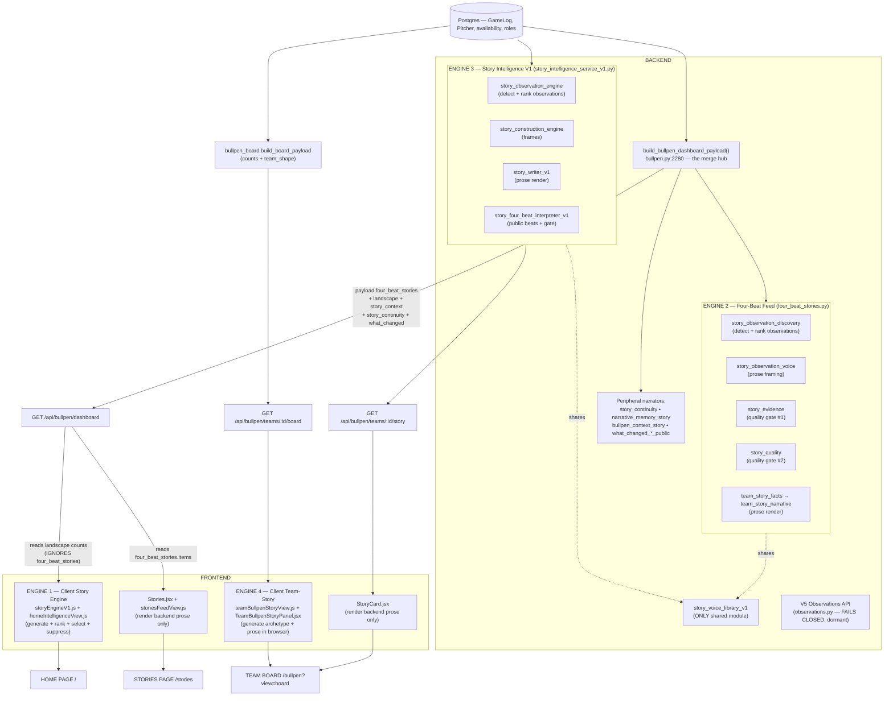
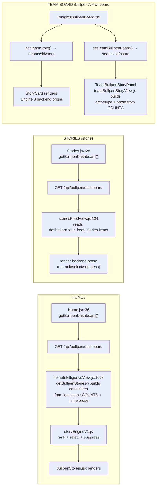
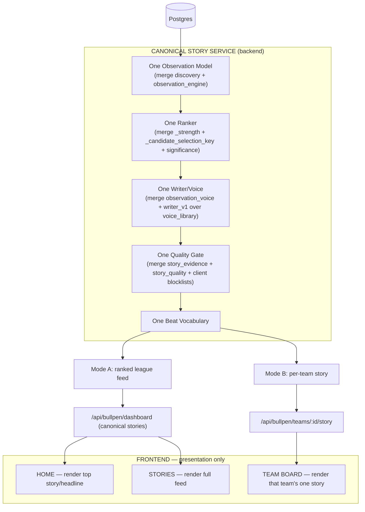

# BaseballOS Story Architecture Audit — June 2026

**Type:** Read-only architecture audit
**Scope:** Every system that generates, ranks, filters, or presents bullpen stories
**Status of the June 2026 claim** — *"BaseballOS contains three parallel story systems that produce overlapping or conflicting narratives"*: **VALIDATED (and an undercount).**

---

## 1. Verdict

The claim is confirmed. BaseballOS does not have one storytelling system — it has **four independent narrative generators** feeding **three pages**, sharing almost no selection, ranking, or quality authority. The "three" in the original claim counts *surfaces* (Home, Stories, Team Board); at the *engine* level there are four generators, because the Team Board renders two stories at once — one from the backend and one built in the browser.

| # | Story generator | Where it runs | Surface it feeds |
|---|---|---|---|
| 1 | **Client Story Engine** (`storyEngineV1.js` + `homeIntelligenceView.js`) | Browser | Home (`/`) |
| 2 | **Four-Beat Feed** (`four_beat_stories.py` pipeline) | Backend | Stories (`/stories`) |
| 3 | **Story Intelligence V1** (`story_intelligence_service_v1.py` pipeline) | Backend | Team Board `StoryCard` (`/bullpen?view=board`) |
| 4 | **Client Team-Story Generator** (`teamBullpenStoryView.js` + `TeamBullpenStoryPanel.jsx`) | Browser | Team Board panel (same screen as #3) |

Plus a constellation of overlapping peripheral narrators (two "story continuity" systems, two "what changed" narrators, a context-note adapter) and one **dormant** parallel observation API (V5 Observations) that is wired to nothing.

**The same club on the same day can be described up to four different ways**, each with its own headline, archetype taxonomy, ranking, and quality gate. None of the four share a common story source.

---

## 2. Current Architecture

**Key structural facts (verified):**
- `build_bullpen_dashboard_payload` emits `four_beat_stories` (`bullpen.py:2415`) **and** the raw slices Home rebuilds from — `story_context` (`:2407`), `what_changed_since_yesterday` (`:2452`), `story_continuity` (`:2463`), plus `landscape`. One payload, consumed two incompatible ways.
- Pipeline A and Pipeline B share exactly **one** module: `story_voice_library_v1`. Everything else — observation detection, ranking, prose, quality gating, beat vocabulary — is independently re-implemented.
- The Team Board mounts **both** the backend story (`StoryCard`, `TonightsBullpenBoard.jsx:177`) and the browser-built story (`TeamBullpenStoryPanel` via `BullpenBoardView.jsx:451`) on the same screen.

---

## 3. Story Flow — The Three Pages Traced

**The collision, stated plainly:** Home and Stories call the *same endpoint* (`/api/bullpen/dashboard`) and read *different fields*. Stories renders the backend's authored four-beat story for a team; Home throws that story away and re-derives its own from the raw availability counts in the same payload (`homeIntelligenceView.js:1069` → `landscapeLists(...)`, never reads `four_beat_stories`). The Team Board then renders a third (backend Engine 3) and fourth (client Engine 4) story for that same team, side by side.

---

## 4. System Inventory

Each system documented against the nine required attributes. **Gen** = generates narrative, **Rank** = ranks stories, **Sel** = selects stories, **Sup** = suppresses stories.

### 4.1 The four narrative engines

#### Engine 1 — Client Story Engine *(Home)*
- **Files:** `frontend/src/components/home/storyEngineV1.js` (1,430 lines), `homeIntelligenceView.js` (1,273 lines)
- **Purpose:** Build, rank, select, and quality-gate the Home page's bullpen stories entirely in the browser.
- **Inputs:** `/api/bullpen/dashboard` payload — `landscape` availability counts (`homeIntelligenceView.js:1069`), `story_context`, `story_continuity` (`:624`), `what_changed`. Candidate objects are hand-built with inline prose (`:1092, :1114, :1135, :1156`).
- **Outputs:** Decorated story objects with engine-rewritten `title`/`body`/`whyItMatters`, `tier`, `significance`, `archetype_key` (`storyEngineV1.js` returns `{items, suppressed, suppressionReasons}`).
- **Consumed by:** Home (`/`).
- **Gen:** ✅ 15-archetype template bank, `STORY_NARRATIVE_TEMPLATES` (`storyEngineV1.js:241-502`). **Rank:** ✅ `scoreStorySignificance` 7-factor scorer (`:1120-1139`). **Sel:** ✅ `selectStoryCandidates` / `selectLeadStory` top-N + dedupe (`:1367, :1428`). **Sup:** ✅ `getStorySuppressionReasons` + `MECHANICAL_LANGUAGE_PATTERNS` (`:508-522, :1148-1191`).
- **Duplicates:** Engines 2/3 (re-implements ranking, selection, suppression, and a parallel archetype taxonomy client-side).

#### Engine 2 — Four-Beat Feed *(Stories)*
- **Files:** `backend/services/four_beat_stories.py` (2,557 lines) + `story_observation_discovery.py`, `story_observation_voice.py`, `story_evidence.py`, `story_quality.py`, `team_story_facts.py`, `team_story_narrative.py`, `story_context_integration.py`, `story_identity_integration.py`
- **Purpose:** Deterministic, fill-only backend engine that fires rules per team, fills fixed sentence skeletons, and ranks/dedupes a league-wide feed.
- **Inputs:** `TeamInputs` (`four_beat_stories.py:373`) — team dict, availability records, game logs, plus per-team season-ERA / capacity / rotation-support / stability / environment maps. Reads DB via sibling services.
- **Outputs:** `build_four_beat_story_feed()` → `{items: [...]}` with `title`, `body`, `narrative`, `beats[]`, `strength`. Embedded in dashboard as `payload['four_beat_stories']` (`bullpen.py:2415`).
- **Consumed by:** Stories (`storiesFeedView.js:134`); offline team share previews (`team_story_previews.py`).
- **Internal beats:** Signal / Evidence / Context / Mechanism / Implication.
- **Gen:** ✅ skeleton fill + `team_story_narrative` prose. **Rank:** ✅ `_strength()` + feed sort (`:879, :2453`). **Sel:** ✅ one story per team + lead-dimension marketplace (`:2432, :2435`). **Sup:** ✅ skeleton returns `None` + evidence framework + quality gate (`:2457-2465`).
- **Duplicates:** Engine 3 (a second four-beat engine with a different beat vocabulary).

#### Engine 3 — Story Intelligence V1 *(Team Board StoryCard)*
- **Files:** `backend/services/story_intelligence_service_v1.py` (836 lines) + `story_observation_engine.py`, `story_construction_engine.py`, `story_writer_v1.py`, `story_four_beat_interpreter_v1.py`, `story_audit_preview_v1.py`
- **Purpose:** Newer, versioned per-team story engine: context → observation → construction frame → written prose → public-beat interpretation, producing one deterministic story contract per team (or a neutral payload).
- **Inputs:** `team_id`, `as_of_date`, `team_context` from `bullpen_context`. Reads DB via that dependency.
- **Outputs:** `build_team_story()` → `{written_story, story_type, selection_metadata, state}`. Served at `GET /api/bullpen/teams/<id>/story` (`bullpen.py:1773`).
- **Consumed by:** Team Board `StoryCard` (`TonightsBullpenBoard.jsx:103-106, :177`).
- **Public beats:** Route Change / Coverage Pressure / Depth Constraint / Sustainability Question (`story_four_beat_interpreter_v1.py`).
- **Gen:** ✅ `story_writer_v1` template paragraphs. **Rank:** ✅ `_candidate_selection_key` (`story_intelligence_service_v1.py:233-610`). **Sel:** ✅ `select_service_story_candidate` strongest valid (`:613-675`). **Sup:** ✅ drops on invalid frame / failed validation / banned language → neutral (`:625-657`).
- **Duplicates:** Engine 2 (second four-beat engine); its observation/ranking/prose/gate layers duplicate Pipeline A's equivalents.

#### Engine 4 — Client Team-Story Generator *(Team Board panel)*
- **Files:** `frontend/src/components/bullpen/board/teamBullpenStoryView.js` (878 lines), `TeamBullpenStoryPanel.jsx`
- **Purpose:** Build a *second* team story for the Board, in the browser, from the board's counts — independent of Engine 3's `/story` endpoint.
- **Inputs:** `/api/bullpen/teams/<id>/board` counts (`boardCounts`) + backend `team_shape` labels.
- **Outputs:** Headline / observation / why / watch-item sentences assembled by `getTeamBullpenStoryView` (`:851-878`).
- **Consumed by:** Team Board, rendered by `BullpenBoardView.jsx:451` directly beside Engine 3's `StoryCard`.
- **Gen:** ✅ `deriveTeamStoryArchetype` decision tree + sentence builders (`:509-560, :568-842`). **Rank:** ➖ single team, but orders evidence pitchers (`comparePitchers`). **Sel:** ✅ picks 1 of 14 archetypes + ≤4 evidence pitchers. **Sup:** ➖ `data_limited` fallback + name filters only.
- **Duplicates:** Engine 3 (a second team story on the same screen) and Engine 1 (a second client archetype taxonomy — `TEAM_STORY_ARCHETYPES` 14 keys vs `STORY_ARCHETYPES` 15 keys).

### 4.2 Peripheral / supporting story layers

| System | Purpose | Inputs | Outputs | Consumed by | Gen | Rank | Sel | Sup | Duplicates |
|---|---|---|---|---|:--:|:--:|:--:|:--:|---|
| `story_continuity.py` | Tag the flagship Home story New/Ongoing/Returning vs prior days | current + prior dashboard payloads | continuity items w/ status labels | Home (via dashboard `story_continuity`) | ➖ | ➖ internal | ➖ internal | ❌ | **`narrative_memory_story` continuity** |
| `narrative_memory_story.py` | Story-safe continuity notes from workload history | `narrative_memory` contracts | `build_dashboard_story_continuity` notes | Home (dashboard) | ✅ 1-liner | ❌ | light | ✅ thresholds | **`story_continuity`** + `bullpen_context_story` scaffolding |
| `narrative_memory.py` | Compute workload-continuity contracts from `GameLog` | `GameLog`, `Pitcher` | contract dicts (stats + 1 summary) | `narrative_memory_story`, diagnostic route | ➖ | ❌ | ❌ | gates state | — (misnamed: computes stats, not memories) |
| `bullpen_context_story.py` | Conservative rotation/usage context notes | `bullpen_context` | `build_dashboard_story_context` notes | Home (dashboard `story_context`) | ✅ 1-liner | ❌ | light | ✅ phrase filter | near-twin scaffolding of `narrative_memory_story` |
| `what_changed_since_yesterday_public.py` (+ inline `_dashboard_what_changed_workload_payload`) | League/public "what changed" narrative | dashboard inputs | `what_changed_since_yesterday` | Home (dashboard) | ✅ | ➖ | ➖ | gates copy | **`team_changes.py`** |
| `team_changes.py` | Per-team "what changed since last game" | team_id | `build_team_changes_payload` | `FollowMyTeam` widget (`/teams/:id/changes`) | ✅ | ➖ | ➖ | ➖ | **`what_changed_*_public`** |
| `story_voice_library_v1.py` | Approved opening-line templates + banned-phrase lists for the 4 public beats | beat, slots | rendered opening prose | Engines 2 **and** 3 | ✅ fragments | ❌ | ❌ | exposes gates | — (the one healthy shared module) |
| `team_story_previews.py` | Build-time share/OG HTML per team | dashboard `four_beat_stories` | HTML preview pages | offline export script only | ❌ | ❌ | light | ❌ | reuses Engine 2 output |
| `story_audit_preview_v1.py`, `four_beat_real_quality_audit.py` | Offline QA reports on Engine 3 | story payloads | audit report JSON | scripts/tests only — **no route** | ❌ | sort-for-display | ❌ | ❌ | two QA harnesses, one per engine |
| **V5 Observations** (`api/observations.py`, `observations/api_assembly.py`, `BullpenIntelligencePanel.jsx`) | A structured observation API + panel | request state only | fails closed on GET | **nothing — panel not mounted** | ❌ | ❌ | ❌ | ✅ always closed | **dormant parallel system** |

---

## 5. Determinations

| Question | Finding |
|---|---|
| **Multiple story engines?** | **Yes — four.** Two backend pipelines (Four-Beat Feed; Story Intelligence V1) + two client generators (Home `storyEngineV1`; Board `teamBullpenStoryView`), plus peripheral narrators. |
| **Different narratives for the same team?** | **Yes — verified.** Home builds from raw counts (Engine 1), Stories renders backend four-beat (Engine 2), the Team Board shows both a backend story (Engine 3) and a browser-built story (Engine 4). Four authors, four headlines, for one club on one day. |
| **Operating independently?** | **Yes.** Pipelines A and B share only `story_voice_library_v1`; the two client engines share nothing with the backend but the data. There is no common selection, ranking, or quality authority. |
| **Duplicated business logic?** | **Yes.** Observation detection (`story_observation_discovery` vs `story_observation_engine`), archetype classification (3 taxonomies), and evidence assembly are independently re-implemented. |
| **Duplicated ranking logic?** | **Yes — three independent rankers.** `scoreStorySignificance` (client), `_strength()` (Engine 2), `_candidate_selection_key` (Engine 3). |
| **Duplicated quality-gating logic?** | **Yes — five+ gates.** `story_evidence` **and** `story_quality` (Engine 2; the latter's docstring admits it "refines and complements" the former), writer/interpreter validation (Engine 3), client `MECHANICAL_LANGUAGE_PATTERNS` / `storyCardHasBannedLanguage` / name filters, and the `api.js` governance gate. |

---

## 6. Duplication Inventory

**Backend**
1. **Two four-beat story engines** — Engine 2 (`four_beat_stories`) vs Engine 3 (`story_intelligence_service_v1`); two beat vocabularies (Signal/Evidence/Context/Mechanism/Implication vs Route Change/Coverage Pressure/Depth Constraint/Sustainability Question); two endpoints. Share only the voice library.
2. **Two observation detectors** — `story_observation_discovery` (A) vs `story_observation_engine` (B); different taxonomies, same job.
3. **Two ranking/selection layers** — discovery `rank`+`differentiate` (A) vs `_selection_key`/`_candidate_selection_key` (B).
4. **Two prose generators** — `story_observation_voice` (A) vs `story_writer_v1` (B).
5. **Two quality gates inside Engine 2 alone** — `story_evidence` + `story_quality`; Engine 3 adds a third validation path.
6. **Two "story continuity" systems** — `story_continuity` vs `narrative_memory_story.build_dashboard_story_continuity`, both merged into the dashboard.
7. **Two context-note adapters with near-identical scaffolding** — `bullpen_context_story` vs `narrative_memory_story` (same `_safe_note` + `FORBIDDEN_NOTE_PHRASES` + `MIN_*` + `{capability, teams}` shape).
8. **Two "what changed" narrators** — `what_changed_since_yesterday_public` (+ inline workload payload) vs `team_changes`.
9. **Two sustainability-evidence computations** — `story_intelligence_service_v1._sustainability_evidence` vs `story_audit_preview_v1._context_sustainability_evidence` (same thresholds, copied).
10. **Dormant parallel observation system** — V5 Observations API fails closed; its panel is never mounted.

**Frontend**
11. **A whole story engine in the browser** — `storyEngineV1` re-implements ranking/selection/suppression the backend already performs.
12. **Two client archetype taxonomies** — `STORY_ARCHETYPES` (15) vs `TEAM_STORY_ARCHETYPES` (14).
13. **Three client narrative banks** — `storyEngineV1` templates, `homeIntelligenceView` inline strings, `teamBullpenStoryView` builders (overlapping sentences like "thin late-inning margin", "more ways through the late innings").
14. **Three client language blocklists** — `MECHANICAL_LANGUAGE_PATTERNS`, `storyCardHasBannedLanguage`, `NON_PLAYER_NAME_PHRASES`.

**Most expensive duplication:** Engine 2 computes a real per-team four-beat story for every club and ships it in the dashboard payload — and **Home discards it** to regenerate its own from counts (Engine 1). The product pays to author each team's story twice and then shows the cheaper, count-derived version on its primary page.

---

## 7. Risks

| # | Risk | Severity | Why |
|---|---|---|---|
| R1 | **Conflicting public narratives for one team** | High | Home, Stories, and the Team Board can headline the same club differently on the same day; the Team Board contradicts itself with two stories in one view. Erodes product credibility. |
| R2 | **Inconsistent quality/suppression** | High | Five+ independent gates with separate blocklists mean a phrase suppressed on the Stories feed can still ship on Home or the Board. Governance is not enforced once. |
| R3 | **Editorial drift between archetype taxonomies** | Med | 15- vs 14- vs 9-key archetype sets evolve separately; a concept renamed in one is stale in the others. |
| R4 | **Client-side engine is unversioned and untrusted** | Med | Engine 1 generates narrative in the browser, outside backend tests, governance contracts, and the `_v1` versioning the backend engines carry — the least auditable surface produces the most-viewed page. |
| R5 | **Maintenance cost & change amplification** | Med | A copy change or new gate must be made in up to four places; the two "context note" adapters and two "what changed" narrators double the surface for bugs. |
| R6 | **Dead parallel system rot** | Low | V5 Observations and the unmounted `BullpenIntelligencePanel` invite accidental revival or confusion about which observation system is authoritative. |
| R7 | **Naming confusion** | Low | `narrative_memory*` computes workload stats, not memories; multiple `_v1` suffixes obscure which is canonical. |

---

## 8. Recommended Target Architecture

**One canonical Story Service on the backend; the client only presents.**

One observation model → one ranker → one writer → one quality gate → one beat vocabulary, exposed in **two output modes** (ranked feed + per-team story) from **one service**. Home renders the top of the canonical feed, Stories renders the whole feed, the Team Board renders that team's canonical story. **No generation, ranking, or suppression in the browser.**

---

## 9. The Most Important Question

> *If we wanted ONE canonical BaseballOS storytelling system, what would need to be removed, merged, or retained?*

### RETAIN
- **One backend engine as the foundation.** Recommend building the canonical service on **Engine 3 / Story Intelligence V1** as the *structural* base — it is the newer, versioned, deterministic stack with a clean coordinator, explicit selection/suppression, a public-beat vocabulary, and an existing QA harness — **then port Engine 2's feed capabilities onto it** (multi-team ranking, dedupe, and league-wide diversification, which Engine 3 lacks today). *(If feed maturity is judged more valuable than Engine 3's structure, the inverse — keep Engine 2 and add a per-team mode — is the fallback; the non-negotiable is that exactly one survives.)*
- `story_voice_library_v1` — the single shared voice/template library. Keep it as the one place phrasing lives.
- `narrative_memory.py` as a **compute** layer (workload contracts), feeding the one continuity path.
- The presentation components: `StoryCard`, `BullpenStories`, `storiesFeedView`, the Board shell — as **dumb renderers**.
- The QA harnesses, re-pointed at the single engine.

### MERGE
- `story_observation_discovery` + `story_observation_engine` → **one observation model, one taxonomy**.
- `story_observation_voice` + `story_writer_v1` → **one writer/voice renderer** over the voice library.
- `story_evidence` + `story_quality` → **one quality gate** (one scorecard, one threshold) — also absorbing the client blocklists so governance runs once.
- `story_continuity` + `narrative_memory_story` (continuity) → **one continuity service**.
- `bullpen_context_story` + `narrative_memory_story` (note scaffolding) → **one context-note adapter**.
- `what_changed_since_yesterday_public` + `team_changes` → **one "what changed" narrator** with feed and per-team modes.
- The two beat vocabularies → **one public beat set**.

### REMOVE (from the runtime path)
- **Engine 1 — the client story engine** (`storyEngineV1.js`) and the inline narrative bank in `homeIntelligenceView.js`. Home must consume the canonical backend feed, not regenerate stories from counts. This is the highest-leverage removal: it deletes the most-viewed yet least-governed narrative source.
- **Engine 4 — the client team-story generator** (`teamBullpenStoryView.js` + `TeamBullpenStoryPanel.jsx`). The Board renders the canonical `/story` (one `StoryCard`) only — no second, browser-built story on the same screen.
- **Whichever backend four-beat engine is not chosen** in RETAIN (Engine 2 or Engine 3), once its capabilities are merged into the survivor.
- **The dormant V5 Observations API** and the unmounted `BullpenIntelligencePanel` — delete, or deliberately revive as part of the canonical engine; do not leave as a dead parallel system.
- The duplicated client archetype taxonomies and language blocklists (folded into the one backend gate above).

### Net target
Four narrative generators and 5+ quality gates collapse to **one Story Service** (one observation model, one ranker, one writer, one gate, one beat vocabulary) with two output modes. All three pages render the **same** canonical stories; the browser does presentation only. A team is described **once**, the same way, everywhere.

---

*Prepared June 2026 · read-only audit · no application code modified.*
